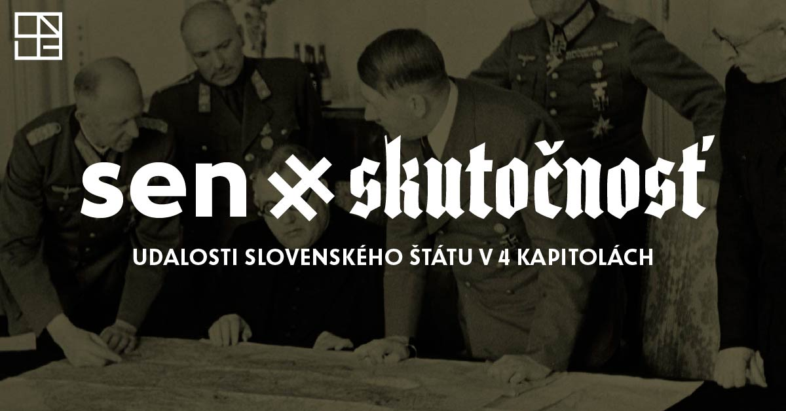

# sen x skutočnosť
## Events of the slovak state in 4 chapters

This microsite accompanies the exhibition "Dream × Reality: Art and Propaganda 1939 - 1945" by adding historical context illustrated with multimedia content. 

[Read more about the exhibition.](http://www.sng.sk/sk/vystavy/728_sen-utf215-skutocnost-umenie-propaganda-1939-1945)

## Development

The site runs on [Grav](https://getgrav.org/), a open-source flat-file CMS without the need of a database.

Check the [Grav repo](https://github.com/getgrav/grav) or [excellent documentation](https://learn.getgrav.org/) for how to get started and how to (super easily) deploy.

### Theming

The theme 'longread' makes extensive use of [Sass](http://sass-lang.com/). Sass files in `/user/themes/longread/scss/` should be compiled to `/user/themes/longread/css/`, e.g. by using:

    scss --watch user/themes/longread/scss:user/themes/longread/css