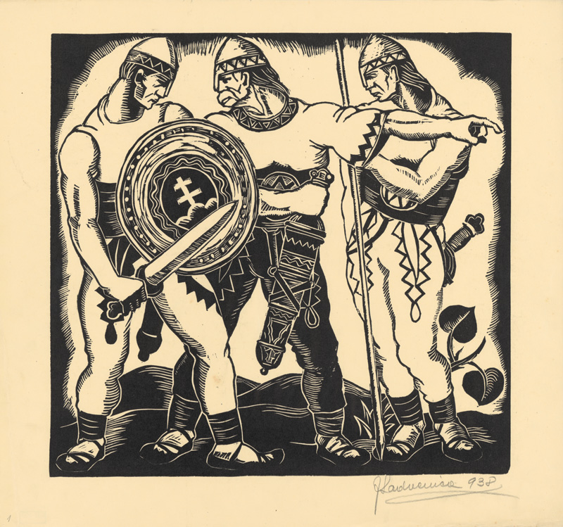

Slovenská krajina sa 7. októbra 1938 stáva autonómnou republikou v štátnom útvare nazývanom Česko-Slovenská republika. Autonómia (z gréckeho autonomos – majúci vlastné zákony) zaručuje autonómnemu územiu právo na vlastné normy a vlastné orgány, ktorých prostredníctvom bude riešiť samostatné otázky v rámci vyššieho celku. Slovensko tak zakladá vlastnú vládu, na jej čele stojí predseda Jozef Tiso, zostavuje vlastný ústavný zákon aj vlastný snem, ktorý prvýkrát zasadá v januári 1939. V tom čase už je HSĽS zlúčená s menšími slovenskými stranami, stáva sa jediným formálnym reprezentantom slovenského národa a okrem nej je povolená činnosť len menšinovej nemeckej a maďarskej strane. 