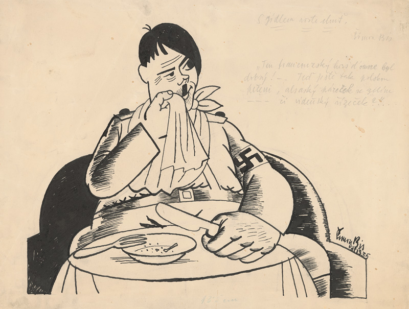
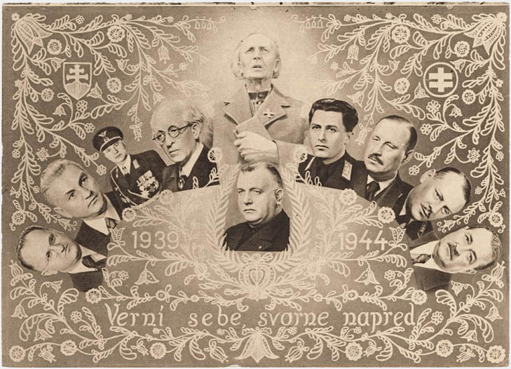
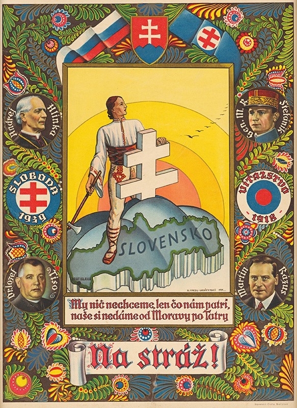
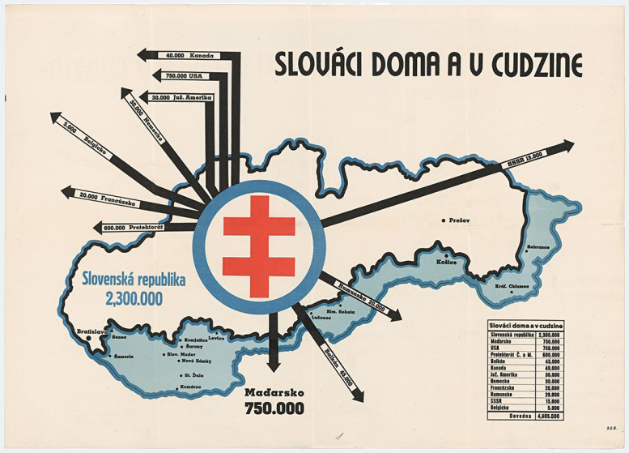
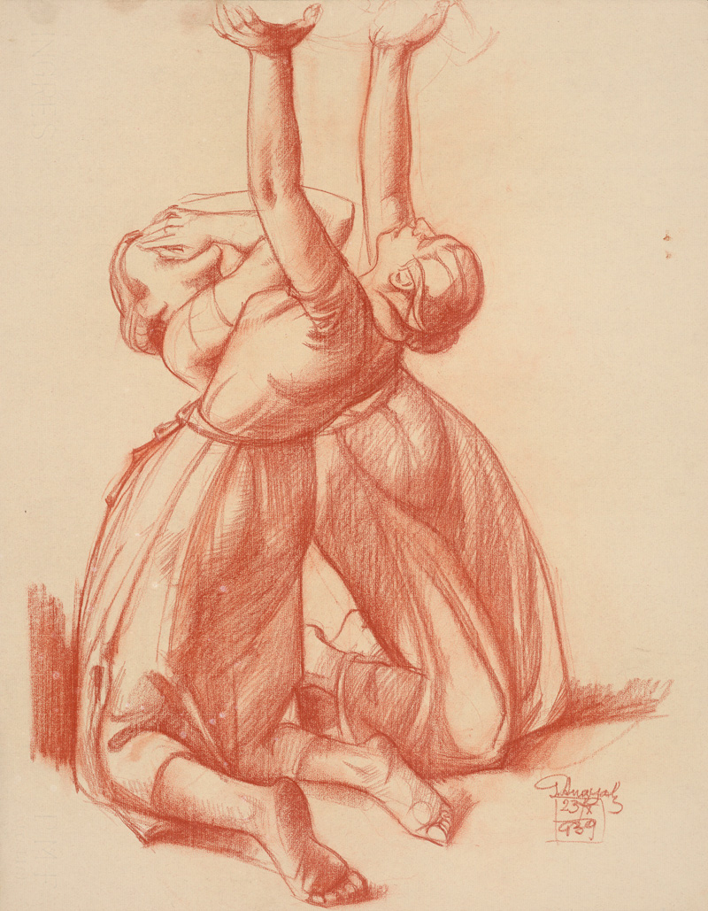
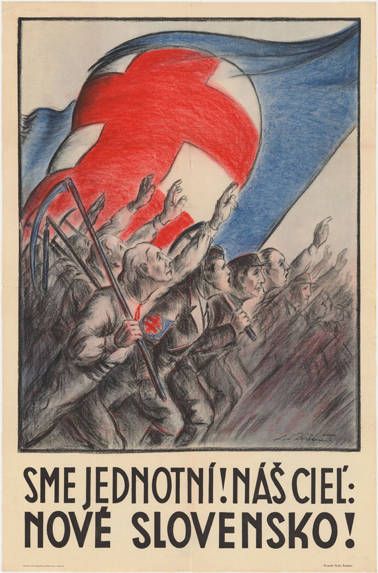
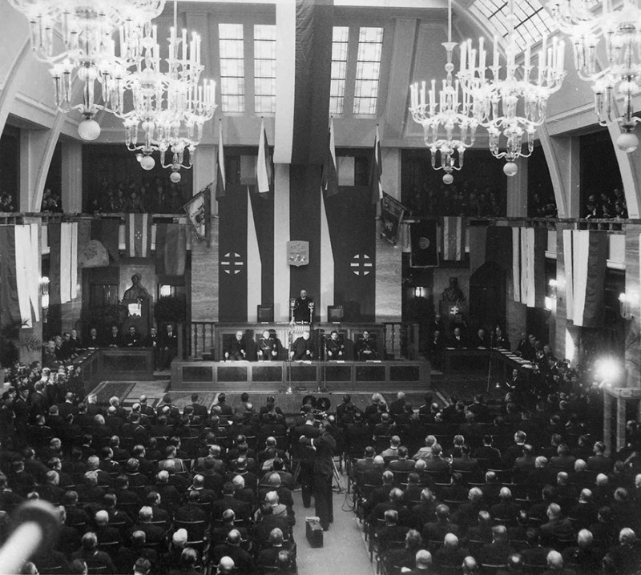
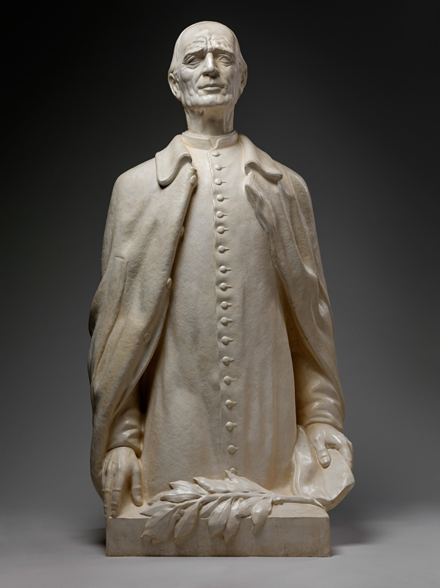
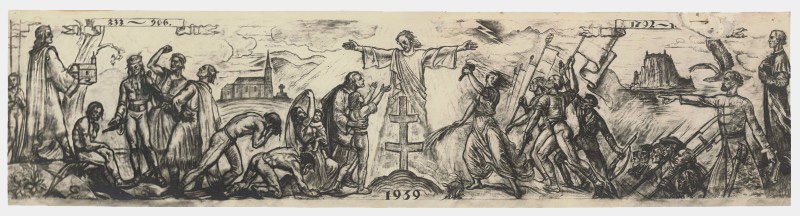
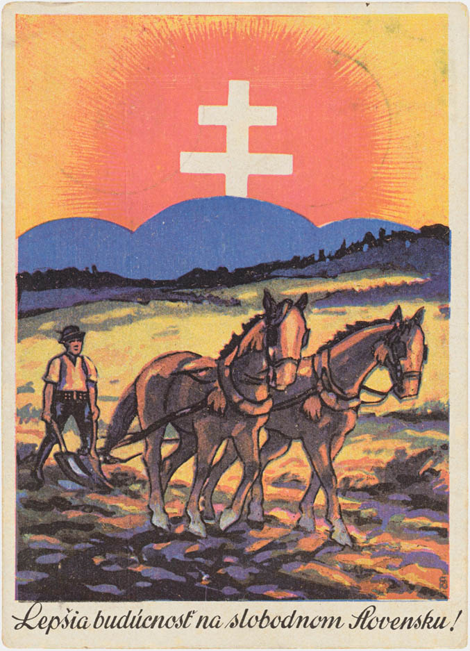

## Mníchovská dohoda
### 29. 9. 1938 {.title-date}

Prvá svetová vojna zmenila usporiadanie Európy a po rozpade Rakúsko-Uhorska vznikla na našom území v roku 1918 prvá Československá republika. Slovensko sa ako jej súčasť zviechalo najprv z následkov vojny, neskôr aj z následkov svetovej hospodárskej krízy, ktorá začala pádom newyorskej burzy v roku 1929 a vyostrila vnútropolitické konflikty aj na našom kontinente. V roku 1933 sa aj vďaka nej dostala moc v Nemecku do rúk Adolfa Hitlera, novozvoleného ríšskeho kancelára, ktorý sa na niekoľko ďalších rokov stal ústredným hýbateľom európskych dejín.

Píše sa rok 1938, keď si nacistické Nemecko tzv. anšlusom násilne pripája Rakúsko. Hitler sa zároveň netají snahami zlikvidovať susedné Československo.

Hitler sa snaží ČSR, ktoré ako demokratická krajina poskytovala útočisko odporcom nacizmu a voči ktorej vznášal územné nároky, rozbiť – či už medzinárodnopolitickou aktivitou alebo vojensky. Rozhodne sa preto „použiť kartu“ nemeckého obyvateľstva, žijúceho a údajnou diskrimináciou trpiaceho za hranicami Nemecka, teda podobnú zámienku, akú použil v prípade pripojenia Rakúska. Vyhovuje mu aj fakt, že na územie Slovenska (pre Hitlera v tom čase pomerne nezaujímavej krajiny) si robia „zálusk“ Maďarsko s Poľskom. V hre sú tentoraz Sudety, pohraničné československé oblasti, obývané v prevažnej miere etnickými Nemcami.

<figure class="audio" markdown="1">

<figcaption>Prejav Adolfa Hitlera na zjazde NSDAP v Norimbergu 12.9.1938, kde ostro zaútočil na Československo a prezidenta Eduarda Beneša.</figcaption>
</figure>

Nemecko, Taliansko, Veľká Británia a Francúzsko zvolajú na 29. 9. 1938 konferenciu v Mníchove, na ktorej rozhodnú o ďalšom osude Československa bez jeho účasti. Republika má podľa ich rozhodnutia odstúpiť Nemecku sudetské pohraničie. Československá vláda je zaskočená najmä postojom svojich vtedajších spojencov, Francúzska a Veľkej Británie, možností však mnoho nemá. O deň neskôr, 30. 9. 1938 prijíma rozhodnutie, ktoré sa zapisuje do dejín ako Mníchovská dohoda, alebo aj explicitnejšie – mníchovský diktát. Je jednou z predzvestí blížiacej sa druhej svetovej vojny, pred ktorou však Slovensko čaká niekoľko výrazných politických zmien. Do dejín mu vstupuje Hitler. 

<figure class="video">    
<iframe src="https://player.vimeo.com/video/190295173?title=0&byline=0&portrait=0" width="800" height="450" frameborder="0" webkitallowfullscreen mozallowfullscreen allowfullscreen></iframe>
<figcaption><a href="http://www.webumenia.sk/dielo/SVK:TMP.114?collection=82">Imro Weiner-Kráľ: Bude vojna. 1938. GMB, Bratislava</a></figcaption>
</figure>

---
## Hlinkova slovenská ľudová strana

V čase podpisu Mníchovskej dohody je najsilnejšou politickou stranou na Slovensku Hlinkova slovenská ľudová strana, ktorá roku 1935 vo volebnej koalícii so SNS získala 30 %. Založená bola ako Slovenská ľudová strana v roku 1905, potom obnovená katolíckym kňazom a národovcom Andrejom Hlinkom. Stála na kresťanskom konzervatívnom základe a postupom času v nej čoraz silnejšie rezonovala myšlienka autonomizmu – samostatnejšieho postavenia Slovenska v rámci Československej republiky.  

Postupnou radikalizácou dospela HSĽS k totalitne znejúcemu heslu: „Jeden národ, jedna strana, jeden vodca.“ 

Začiatkom októbra 1938 prevzala HSĽS iniciatívu pri riešení štátnoprávneho postavenia Slovenska a prihlásila sa k jeho autonómii. Vo vnútri strany na seba narážajú dva prúdy – tzv. umiernené krídlo (reprezentované najmä Jozefom Tisom, Jozefom Sivákom a Martinom Sokolom) a krídlo radikálne (na čele s Vojtechom Tukom, Ferdinandom Ďurčanským a Alexandrom Machom). Líšia sa v náhľade na rýchlosť smerovania k samostatnosti a podobne rozdielne budú neskôr pristupovať aj k protižidovskej politike. Ako sa k naliehavým otázkam postaví „jeden národ, jedna strana a jeden vodca“, ktorým sa už onedlho má stať Jozef Tiso?

{% include 'partials/subobjects.html.twig' with {
    'title': 'Zistite viac o postavách HSĽS ',
    'subobjects': [
        {
            'name':'Andrej Hlinka', 
            'thumbnail': page.media['Andrej_Hlinka.jpg'],
            'href': '1/hlinka'
        },
        {
            'name':'Jozef Tiso', 
            'thumbnail': page.media['Jozef_Tiso.jpg'],
            'href': '1/tiso'
        },
        {
            'name':'Karol Sidor', 
            'thumbnail': page.media['Karol_Sidor.jpg'],
            'href': '1/sidor'
        },
                {
            'name':'Vojtech Tuka', 
            'thumbnail': page.media['Vojtech_Tuka.jpg'],
            'href': '1/tuka'
        },
                {
            'name':'Alexander Mach', 
            'thumbnail': page.media['mach_nahlad.jpg'],
            'href': '1/mach'
        }
    ]
}%}

---
## Vyhlásenie autonómie Slovenska
### 6. 10. 1938 {.title-date}

Priamym následkom Mníchovskej dohody sú okamžité spoločensko-politické zmeny na území strednej a východnej Európy. Podľa nemeckej analýzy, ktorú si necháva ešte v októbri vypracovať Adolf Hitler, majú Slováci 4 možnosti: 

- osamostatniť sa a založiť vlastný štát,
- vyhlásiť autonómiu v rámci Československej republiky,
- vyhlásiť autonómiu s orientáciou na Maďarsko a prípadným spojením so svojím južným susedom,
- vyhlásiť autonómiu s orientáciou na svojho severného suseda, Poľsko. 

Dňa 6. októbra sa v Žiline stretnú predstavitelia HSĽS s predstaviteľmi menších politických strán, aby im predstavili svoj návrh autonómie Slovenska v rámci Československej republiky. V dokumentoch, ktoré na žilinskej konferencii HSĽS prezentuje, sa Slovensko hlási k „mierovému riešeniu sporov v duchu Mníchovskej dohody". V Manifeste strana privítala Mníchovskú dohodu a zároveň zdôraznila, že “vytrváme po boku národov bojujúcich proti marxisticko-židovskej ideológii rozvratu a násilia”. Žiadala tiež “okamžité prevzatie výkonnej a vládnej moci na Slovensku Slovákmi”, pričom skoro sa ukázalo, že v ponímaní politikov HSĽS bola Slovákov oprávnená reprezentovať len ich strana. 

7. októbra 1938 československá vláda prijíma návrh HSĽS. Jozefa Tisa vyhlasuje za predsedu vlády autonómnej Slovenskej krajiny.

Národné zhromaždenie 19. novembra 1938 potvrdzuje autonómiu ústavným zákonom. Československu do názvu pribúda spojovník a oficiálne sa stáva Česko-Slovenskou republikou. V tom momente už štát čelí ďalšej významnej výzve – stupňujúcim sa požiadavkám zo strany Maďarska a Poľska. Na rokovaniach v Komárne sa česko-slovenská strana pod Tisovým vedením bez jasnej stratégie púšťa do rokovaní s Maďarskom. Tie vedú v novembri toho istého roku do tzv. Viedenskej arbitráže, ktorou Slovensko stráca časť svojho územia.



---
## Viedenská arbitráž
### 2. 11. 1938  {.title-date}

<figure class="audio" markdown="1">

<figcaption>Prejav predsedu slovenskej autonómnej vlády J.Tisa – 28.11.1938. RTVS</figcaption>
</figure>

Mníchovský diktát pripravil Československú republiku o územia obývané nemeckým obyvateľstvom a keďže dodatok k Mníchovskej dohode hovoril o vyriešení problému maďarskej a poľskej menšiny do 3 mesiacov, začína byť jasné, že nároky Maďarska na územie obývané príslušníkmi a príslušníčkami svojho národa na seba nenechajú dlho čakať. V hre je takmer pätina rozlohy Slovenska, vrátane oblasti Podkarpatskej Rusi, ktorá mu prináleží, 854 218 obyvateľov tohto územia, z nich 272 145 osôb slovenskej a českej národnosti.

Oficiálne rokovania medzi česko-slovenskou a maďarskou stranou však nevedú k rozhodnutiu, obe krajiny sa obrátia na signatárov Mníchova a rozsiahle územia Slovenska si tzv. Viedenskou arbitrážou pripojí Maďarsko.

Svoj kus zeme si však na základe mníchovského princípu nárokuje aj Poľsko, ku ktorému sú pripojené viaceré obce Oravy, Kysúc a Spiša.
V novonadobudnutej časti Maďarska sa slovenské obyvateľstvo, ktoré zostalo obývať svoje domovy, stáva takmer okamžite obeťou prenasledovania, ponižovania, násilia či otvorených perzekúcií. Štát dokáže evakuovať a poskytnúť nové pôsobisko pre 50 000 Slovákov a Sloveniek. Z ďalších osôb, ktoré kvôli zlým podmienkam utekajú na slovenské územie, sa stávajú utečenci. Podľa niektorých odhadov je to v rokoch 1938 – 1943 až 100 000 osôb, ktoré sú po úteku z maďarského na slovenské územie odkázané na charitatívnu pomoc a nízke núdzové dávky od štátu. Počet vysťahovalcov zo Slovenska do Maďarska je výrazne nižší, keďže na zvyšku slovenského územia ich žijú len veľmi malé počty, dochádza však aj k takým prípadom. Na podnet HSĽS je po vyhlásení autonómie vysťahovaných z územia Slovenska aj vyše 9 000 českých štátnych zamestnancov a učiteľov, z veľkej časti tých, ktorí prišli svojho času pomôcť krajine, keď nemala dosť vlastných kapacít. 

Krátko po vyhlásení autonómie sa začínajú stupňovať verbálne útoky na židovské obvyvateľstvo a od 4. novembra ľudácky režim realizuje deportáciu vyše 7500 osôb zo Slovenska na arbitrážne územie. Začína sa i s prípravou protižidovských právnych noriem, ktorou vláda poveruje komisiu pod vedením Karola Sidora. 

<figure class="audio" markdown="1">

<figcaption>Fragmenty prejavov A. Macha – 14.3.1939, 28.9.1942. RTVS</figcaption>
</figure>

---
## Voľby do autonómneho Snemu Slovenskej krajiny
### 18. 12. 1938 {.title-date}

<figure class="audio" markdown="1">

<figcaption>Reportáž z volieb dr. J. Tisu za prezidenta Slovenskej republiky – 26.10.1939. RTVS</figcaption>
</figure>

Autonómna vláda vyhlasuje voľby do Snemu novovzniknutej Slovenskej krajiny v sobotu 26. 11. 1938 s dátumom konania 18. 12. 1938. Kandidátne listiny je nevyhnutné podať 3 týždne pred dňom konania volieb, teda najneskôr v nedeľu 27. 11. 1938. HSĽS si tak poisťuje, že jedinou uznanou kandidátnou listinou bude listina HSĽS - Strany slovenskej národnej jednoty. Na kandidátke figurujú v malom počte tiež zástupcovia menších spojených strán a národnostných menšín, okrem nežiadúcej českej a židovskej minority. Na základe potreby „jednoty národa“ sa začína potláčať sloboda tlače a zhromažďovania.

Krátko pred voľbami vydáva ministerstvo vnútra tajnú inštrukciu pre okresné úrady, podľa ktorej majú národnostne zmiešané územia vytvoriť osobitné volebné miestnosti pre rôzne národnosti, aby mohli jednoduchšie zistiť, ako volia ich príslušníci. 

Vo voľbách, kde nemôžu vybrať politickú stranu, iba prijať, či odmietnuť predloženú kandidátnu listinu, odpovedá 97,3% voličov a voličiek kladne na sugestívnu otázku: „Chceš nové a šťastné Slovensko?“

---
## Vznik slovenského štátu
### 14. 3. 1939  {.title-date}

<figure class="audio" markdown="1">

<figcaption>Vianočný rozhlasový príhovor J.Tisu – 24.12.1938. RTVS</figcaption>
</figure>

Hoci stál Adolf Hitler v pozadí udalostí, ktoré sa na slovenskom území udiali v roku 1938, jeho konečným cieľom nebolo ani odtrhnutie českého pohraničia, ani slovenská autonómia. Ďalším krokom má byť rozdelenie Česko-Slovenska a pripojenie Čiech a Moravy k Veľkonemeckej ríši. Nemôže k nemu dôjsť násilnou cestou, keďže sa Nemecko Mníchovskou dohodou zaviazalo garantovať oklieštenému Česko-Slovensku bezpečnosť a celistvosť. Ak však Slovensko vyhlási samostatnosť a Česko-Slovenská republika prestane existovať, nebudú na ňu platiť podmienky dohody a Nemecko bude môcť vytúžené územia obsadiť bez toho, aby riskovalo konflikt s ostatnými mocnosťami. Pomôcť mu v tom má HSĽS...

Radikálne krídlo HSĽS, zastúpené Tukom, Machom a Ferdinandom Ďurčanským, jedným z ministrov autonómnej vlády, sa na prelome rokov 1938 a 1939 viackrát stretá s nemeckými predstaviteľmi a bez vedomia slovenskej vlády prezentuje myšlienku vyhlásenia samostatnosti ako bezproblémovú.

Tuka počas návštevy u Hitlera otvorene vyhlasuje: „Môj vodca, osud svojho národa vkladám do vašich rúk. Môj národ od vás očakáva oslobodenie.“

Doma však vláda, snem i vedenie HSĽS odmieta návrhy radikálov a k samostatnému štátu chce naďalej dospieť vo vzdialenej budúcnosti prirodzeným vývojom, teda evolúciou namiesto revolúcie podľa Tukových predstáv. V súlade s Hitlerovým záujmom sa česko-slovenská vláda v Prahe dozvedá o slovenských tendenciách osamostatniť sa a 9. marca na ne reaguje vojensko-policajným zásahom. Na území Slovenska je po ňom vyhlásená vojenská diktatúra, Jozef Tiso je odvolaný z funkcie predsedu vlády a do tejto funkcie je menovaný Tisov stranícky kolega Karol Sidor.

Po tom, čo Sidor odmietne na nátlak nacistov vyhlásiť samostatnosť, Hitler pozve do Berlína Jozefa Tisa, kde ho v podstate varuje, že ak Slovensko nevyhlási (v priebehu niekoľkých hodín) samostatnosť, „prenechá osud Slovenska napospas udalostiam“. Spomenutým osudom mohlo byť rozdelenie slovenského územia medzi trojicu susedov – Nemecko, Poľsko a Maďarsko, ktorého jednotky sa už údajne presúvajú k hraniciam. Hoci Jozef Tiso v tej chvíli nie je oficiálnym predstaviteľom Slovenska, vďaka Hitlerovej podpore môže požiadať prezidenta Emila Háchu o zvolanie snemu na <a href="http://www.psp.cz/eknih/1939ssr/stenprot/001schuz/s001001.htm">14. marca 1939. Snem Slovenskej krajiny</a> na svojom zasadnutí vyhlási vytvorenie samostatného slovenského štátu a Hitlerove vojská hneď nasledujúci deň vstúpia na české územie, aby ho vyhlásili za Protektorát Čechy a Morava, začlenený do Nemeckej ríše. Novovzniknutý slovenský štát čaká 5 rokov existencie poznačenej druhou svetovou vojnou.



---
**Všetky diela v tejto kapitole nájdete aj v kolekcii na Webe umenia: [Na polceste k slovenskému štátu](http://www.webumenia.sk/kolekcia/82 "Na polceste k slovenskému štátu").**