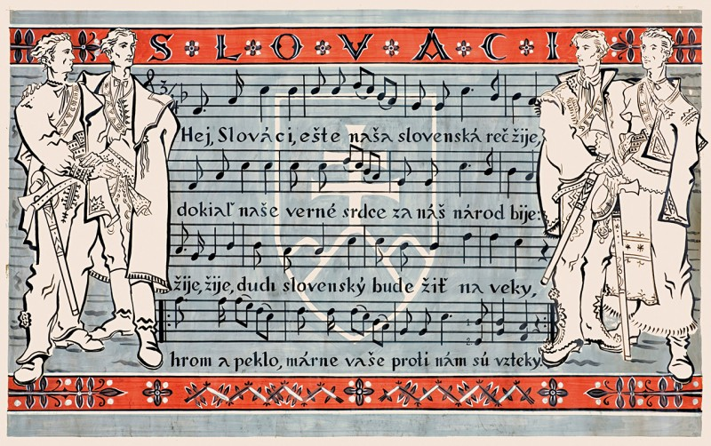
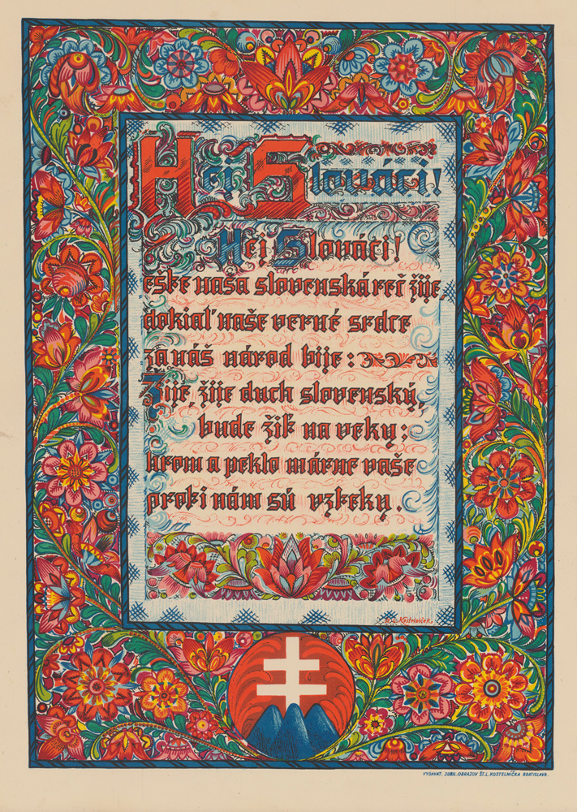

Evanjelický kňaz, básnik a historik Samuel Tomášik napísal hymnickú pieseň s názvom Hej, Slováci ešte v roku 1834, keď ho rozhorčilo, že v uliciach Prahy počuje nemeckú reč viac ako tú českú. U nás je známa najmä ako oficiálna hymna Slovenskej republiky (1939 – 1945), no okrem toho, že jej vznik inšpiroval pomer češtiny a nemčiny, jej nápev vychádza z poľského hudobného podkladu a hymnou sa neskôr stala aj v Juhoslávii, Srbsku či v Čiernej Hore.

Text:

Hej, Slováci, ešte naša 
slovenská reč žije, 
Dokiaľ naše verné srdce 
za náš národ bije. 
 
Žije, žije, duch slovenský, 
bude žiť naveky, 
Hrom a peklo, márne vaše 
proti nám sú vzteky! 
 
Jazyka dar zveril nám Boh, 
Boh náš hromovládny, 
Nesmie nám ho teda vyrvať 
na tom svete žiadny; 
 
I nechže je koľko ľudí, 
toľko čertov v svete; 
Boh je s nami: kto proti nám, 
toho Parom zmetie. 
 
A nechže sa i nad nami 
hrozná búrka vznesie, 
Skala puká, dub sa láme 
a zem nech sa trasie; 
 
My stojíme stále pevne, 
ako múry hradné. 
Čierna zem pohltí toho, 
kto odstúpi zradne!

## Other Media
