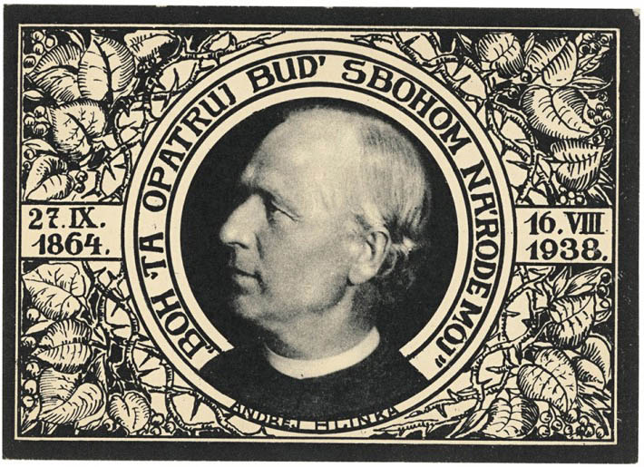
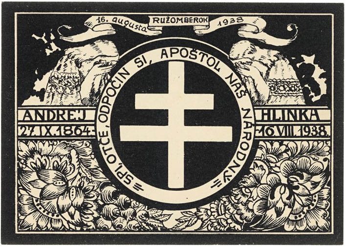
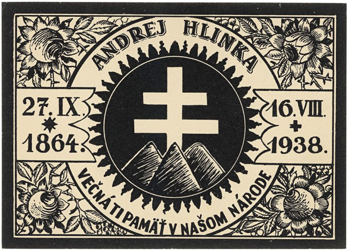

Andrej Hlinka sa do slovenských dejín zapísal ako kňaz, politik, publicista, prekladateľ a národovec. Narodil sa ako jeden z deviatich súrodencov v robotníckej rodine a vyštudoval teológiu v seminári v Spišskej Kapitule. Dokázal osloviť farníkov a neskôr aj získať si hlasy voličov, najmä národne orientovaných a konfesionálne vyhranených voličov. Najprv pôsobil v Uhorskej ľudovej strane, ktorá však jeho politické ambície nenapĺňala. Výrazne akcentoval potrebu riešenia otázky nemaďarských národov Uhorska, medzi ktoré v tom čase Slováci patrili.

Po krátkom pôsobení v Slovenskej národnej strane sa stal spoluzakladateľom novej Slovenskej ľudovej strany, a neskôr v dobách najväčšieho rozmachu v medzivojnovom období aj jej predsedom. Bol horlivým zástancom autonómie Slovenska. V období od roku 1918 bol členom Slovenskej národnej rady v Martine, zakladateľom slovenskej kníhtlačiarne Lev, členom výboru Matice slovenskej, predsedom Spolku svätého Vojtecha, nositeľom titulu pápežský komorník a apoštolským protonotárom. Zomrel v lete 1938. Na predsedníckom poste ho v strane roku 1939 nahradil Jozef Tiso.

## Ďalšie médiá

