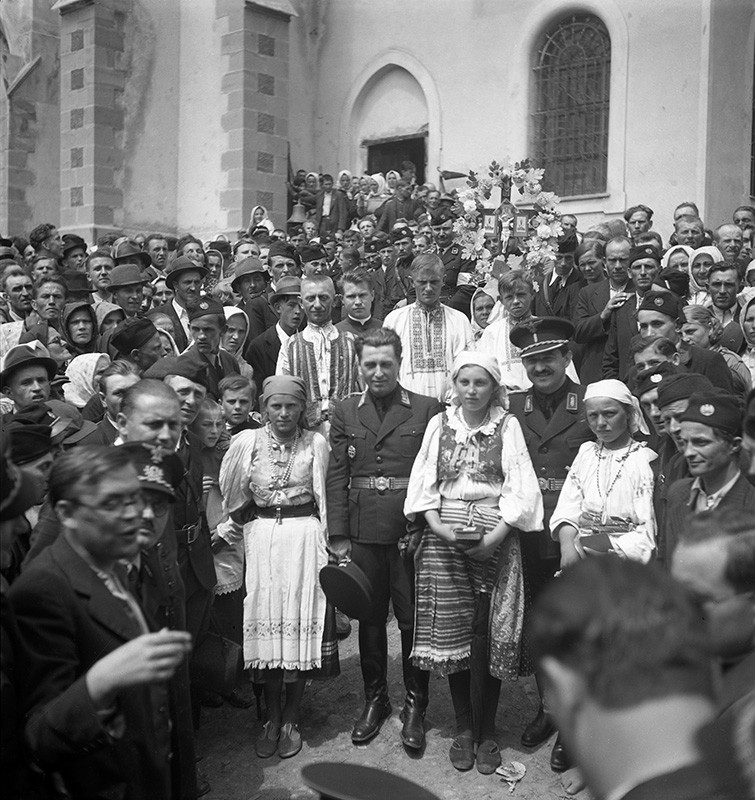

Alexander (Šaňo) Mach vyštudoval bohoslovectvo, no kňazom sa nikdy nestal. Ako veľmi mladý začal byť politicky činným a v roku 1922 vstúpil do Slovenskej ľudovej strany (neskoršej HSĽS). V HSĽS sa jeho postoje radikalizovali a na jeseň roku 1938 už patril medzi stúpencov vyhlásenia slovenskej samostatnosti. Spolu so svojím „mentorom“ Vojtechom Tukom bol vnímaný ako vedúci predstaviteľ radikálneho krídla v strane. Okrem politickej kariéry je v roku 1938 Mach tiež úspešným straníckym žurnalistom. Stal sa vedúcim Úradu propagandy, ktorý kontroloval tlač a jej cenzúru. Vo svojich verejných vystúpeniach sa dožadoval radikálneho postupu proti Židom a Čechom žijúcim na Slovensku.

Má to byť práve on, kto už onedlho oznámi v rozhlasovom vysielaní osamostatnenie slovenského štátu a stane sa hlavným veliteľom Hlinkovej gardy. Vďaka svojej antisemitskej rétorike a konaniu sa stal aj hlavnou postavou dobovej riekanky: „Od Žiliny ide vlak, sedí na ňom Šaňo Mach. Všetci Židia utekajú, majú veľký strach."