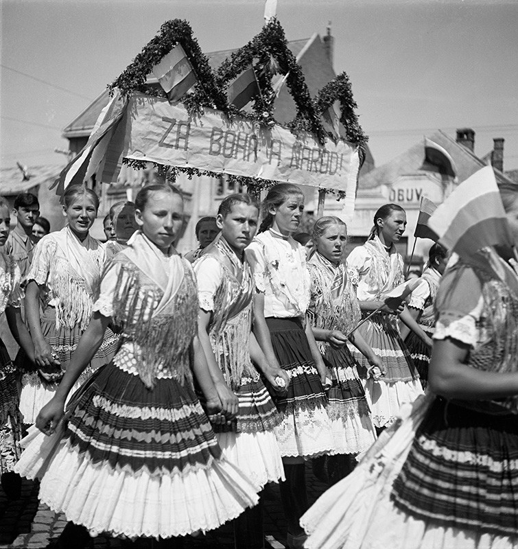
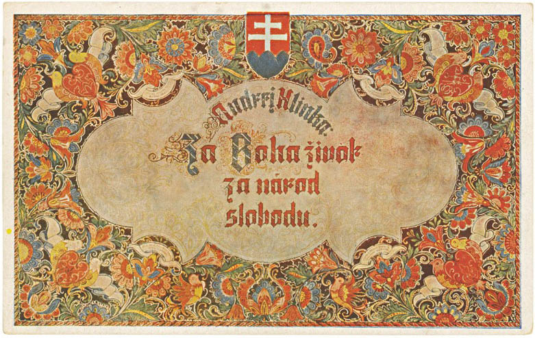

Pojmom národ sa označuje spoločenstvo osôb, ktoré sa najčastejšie identifikuje prostredníctvom spoločného územia, kodifikovaného jazyka, spoločnou kultúrou, náboženstvom a hodnotami. Koncept moderného slovenského národa vzniká na prelome 18. a 19. storočia, rozšírenou je však aj nepodložená teória, podľa ktorej môžeme o národnom povedomí hovoriť prakticky od čias Veľkomoravskej ríše a za vyvrcholenie snáh o národný štát považovať práve snahy autonomistov. Heslo „Za Boha život, za národ slobodu“, ktorého autorstvo býva často pripisované Andrejovi Hlinkovi, vystihuje hodnotové nastavenie vedúcich ľudáckych politických predstaviteľov v časoch autonómie, ktorého základnými piliermi sú práve národnosť a kresťanská viera. 

## Ďalšie médiá

