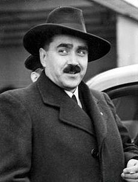

Journalist Karol Sidor became a member of the party as a 19-year old. Until 1938, he was the editor of the newspaper "Slovak," then he became the head of the printing companies of the HSPP and the Commander of the Hlinka Guard. Together with Tiso, he was considered to be one of Hlinka's successors for the post of the chairman. Despite the fact that Slovak independence was in Karol Sidor's political programme, he rejected the Nazi pressure to declare independence in March 1939, which had a very negative effect on his political career. He was removed from the political life in Slovakia and became an ambassador to Vatican.