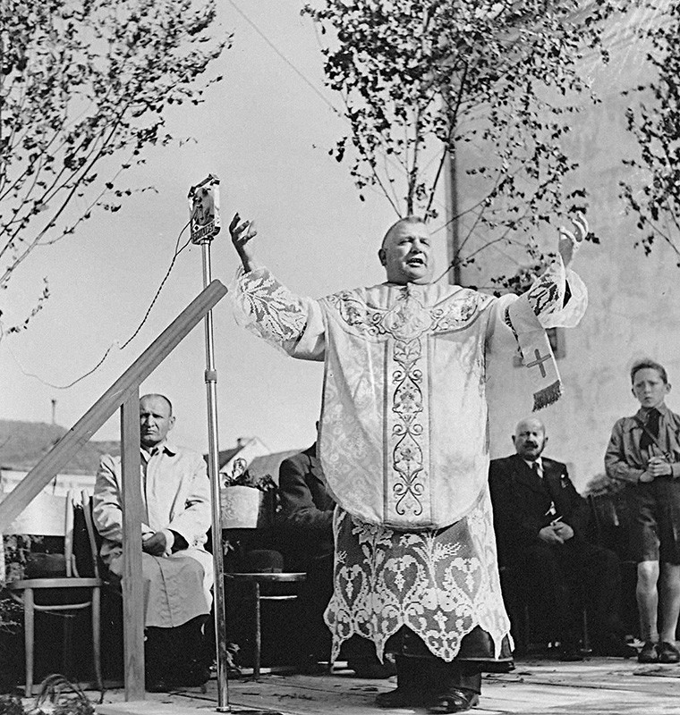
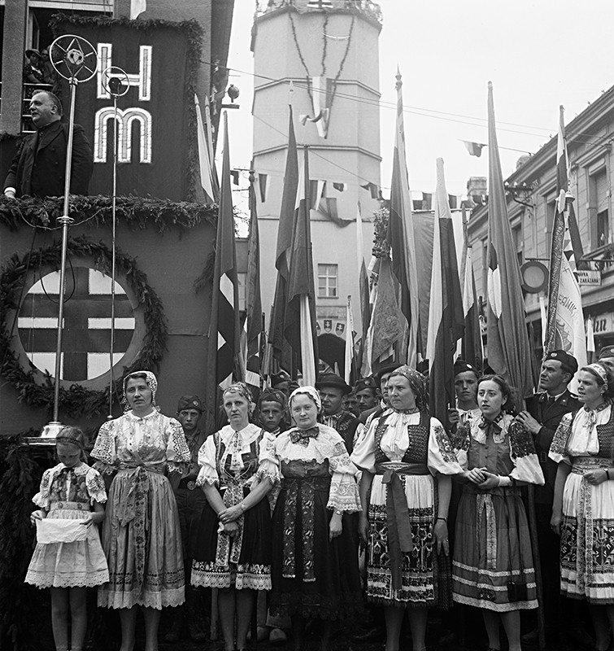

Jozef Tiso, sa narodil v rodine mäsiara Jozefa Gašpara Tisa. Vysokoškolské štúdium zakončil doktorátom teológie a za kňaza bol vysvätený na základe výnimky, ešte predtým než dosiahol požadovaný vek 24 rokov. Do politiky vstúpil už ako cirkevný hodnostár, v roku 1910 sa stal členom promaďarsky orientovanej Katolíckej ľudovej strany. V roku 1918 však pôsobisko zmenil a stal sa členom výboru Slovenskej ľudovej strany (od roku 1925 nesúcej meno Hlinkova slovenská ľudová strana). V novembri 1925 sa stal poslancom Národného zhromaždenia Československa a onedlho aj predsedom poslaneckého klubu HSĽS, ministrom zdravotníctva a telovýchovy. Patril teda k špičkám straníckeho vedenia.

Po smrti Andreja Hlinku sa stáva Tiso predsedom HSĽS. Má vtedy za sebou okrem rokov politických skúseností aj skúsenosť učiteľa, vojenského kňaza, dlhoročné pôsobenie ako farár v Bánovciach nad Bebravou, ktorého sa nevzdáva napriek pôsobeniu v politike, a množstvo sociálne prospešných aktivít. Ako katolíckemu konzervatívnemu politikovi mu na rozdiel od niektorých spolustraníkov nebol blízky radikalizmus. Jeho štýl politiky je však s demokraciou tažko zlúčiteľný – HSĽS označuje za jedinú stranu, ktorá môže hovoriť v mene Slovákov. V čase Andreja Hlinku však Tiso zrejme netuší, že naplnenie autonomistického programu, ba dokonca aj osamostatnenie Slovenska je bližšie, než by si ktokoľvek trúfol odhadnúť, a že sa udeje aj s jeho výrazným pričinením. 

## Ďalšie médiá
