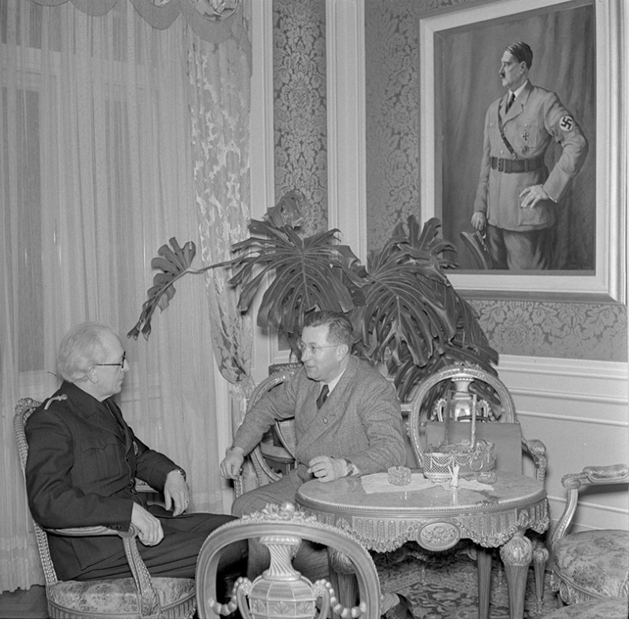
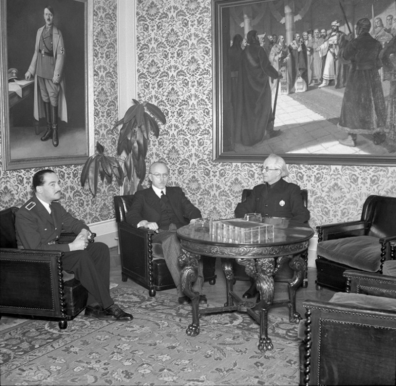

Ako syn z učiteľskej rodiny mal Vojtech Tuka možnosť študovať právo v Budapešti, Paríži i v Berlíne. V 20. rokoch 20. storočia sa stal zakladateľom a hlavným veliteľom polovojenskej organizácie v HSĽS Rodobrana. Za HSĽS bol poslancom Národného zhromaždenia. V roku 1929 bol odsúdený pre vlastizradnú činnosť a špionáž v prospech Maďarska. Do politiky sa vracia po vyhlásení autonómie Slovenska na jeseň 1938. Bol reprezentantom radikálneho krídla v HSĽS, spolu s Alexandrom Machom a Ferdinandom Ďurčanským. Bol iniciatívnym zastáncom samostatnosti Slovenska a aj v predstavách Adolfa Hiltera bol na začiatku roka 1939 vhodnou osobou, ktorá by mohla vyhlásiť jeho samostatnosť. Pred sebou mal najúspešnejšie roky politickej kariéry, počas ktorých sa stal predsedom vlády, ministrom zahraničia, ale aj jedným z hlavných organizátorov protižidovskej politiky v krajine. 

## Dalšie médiá

