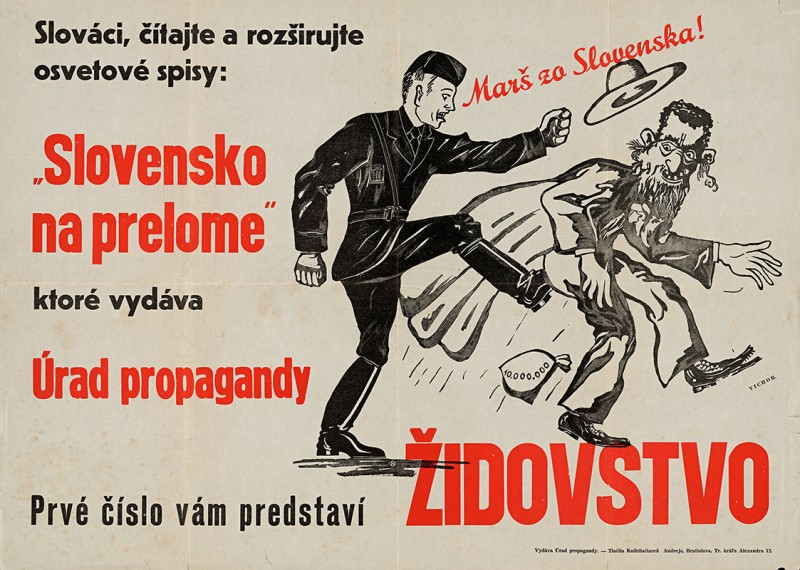
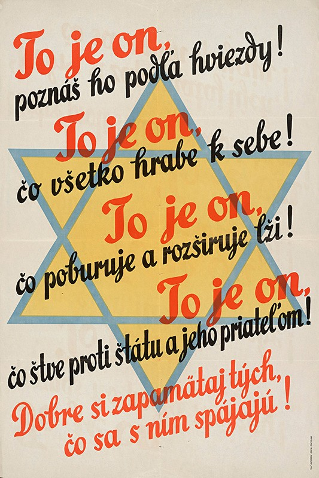
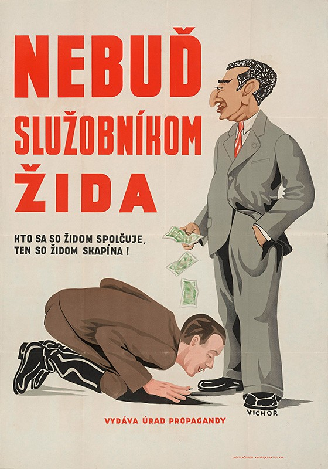
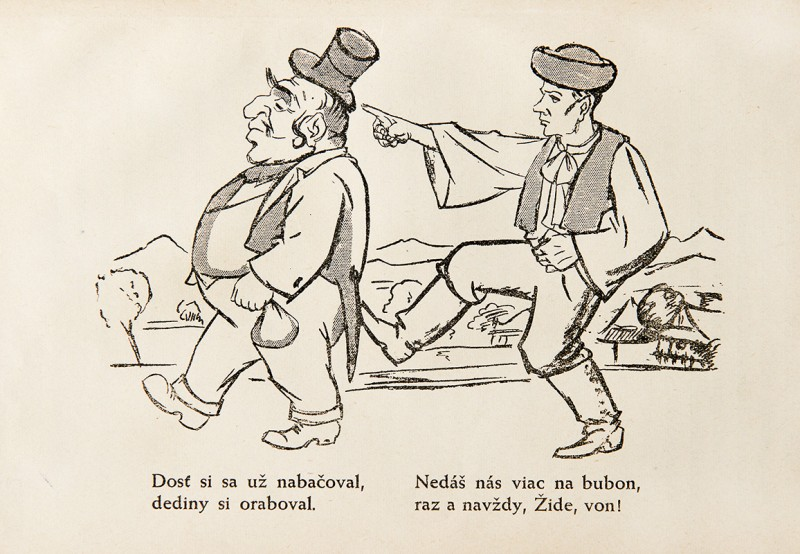

The transfer of Jewish property into "Christian" hands, so-called aryanisation, was planned since March 1939, when the state was founded. This government-sanctioned theft was presented as "an exclusion of Jews from economic and social life". The initial regulations allowed the government to remove Jews from their enterprises or appoint 'temporary administrators' in cases where there were objections against the owner because of "unreliability, public interest or social reasons".

During the spring and summer of 1940, aryanisation of agricultural properties and business began. In the phase after the Salzburg negotiations, aryanisation increased and was regulated by the newly created Central Economic Office. By the end of 1940, legislation allowed confiscation of all Jewish property - agricultural, corporate, residential as well as material items and bank deposits. Aryanisation, characterised by clientelism and corruption, culminated in 1941 and 1942.

During the aryanisation process, property valued at 4 billion Slovak crowns was confiscated from the Jewish population in Slovakia. As a consequence, the majority of Jews living in Slovakia lost the ability to earn a living. Stripped of their livelihood, they were now regarded as a ‘burden’ by the state apparatus.

**Anti-Semitic Caricatures from the Humour Magazine Tomcat (Kocúr)**
{% include 'partials/carousel.html.twig' with {
	'images': [
    	{
   	 	'title':'Tomcat Magazine Cover',
        	'src': 'http://www.webumenia.sk/images/diela/TMP/72/SVK_TMP.199/SVK_TMP.199.jpeg',
        	'href': 'http://www.webumenia.sk/dielo/SVK:TMP.199?collection=83'
    	},
    	{
   	 	'title':'Aryanisation Springs Have Dried Up...',
        	'src': 'http://www.webumenia.sk/images/diela/TMP/69/SVK_TMP.196/SVK_TMP.196.jpeg',
        	'href': 'http://www.webumenia.sk/dielo/SVK:TMP.196?collection=83'
    	},
    	{
        	'title':'Deport, Deport, Deport...',
        	'src': 'http://www.webumenia.sk/images/diela/TMP/71/SVK_TMP.198/SVK_TMP.198.jpeg',
        	'href': 'http://www.webumenia.sk/dielo/SVK:TMP.198?collection=83'
    	},
   	 {
        	'title':'Claming Benefits from Jewish Proporety...',
        	'src': 'http://www.webumenia.sk/images/diela/TMP/70/SVK_TMP.197/SVK_TMP.197.jpeg',
        	'href': 'http://www.webumenia.sk/dielo/SVK:TMP.197?collection=83'
    	},
   	 {
        	'title':'The Last Unbaptised...',
        	'src': 'http://www.webumenia.sk/images/diela/TMP/48/SVK_TMP.203/SVK_TMP.203.jpeg',
        	'href': 'http://www.webumenia.sk/dielo/SVK:TMP.203'
    	}
	]
}%}

## Other Media

