Podmienky, za ktorých vzniká samostatný <a target="_blank" href="http://senxskutocnost.sng.sk/chapters/1-na-polceste-k-slovenskemu-statu#vznik-slovenskho-ttu">"Slovenský štát"</a>, nedávajú informovaným občanom dôvod na optimizmus. Ľudácka propaganda preto kolaboráciu s Hitlerom a podriadenie sa jeho plánom ospravedlňuje masívne medializovanými tvrdeniami, že samostatná republika je zavŕšením „tisícročných snáh slovenského národa o vlastnú štátnosť“. 
## Ochranná zmluva
### 18. 3. 1939 {.title-date}

Realitu „samostatnosti“ vystihuje už Zmluva o ochrannom pomere, ktorú predstavitelia "Slovenského štátu" podpisujú s Treťou ríšou 18. a 23. marca 1939 vo Viedni a v Berlíne. V nej sa nacistické Nemecko zaväzuje chrániť integritu slovenského územia výmenou za podriadenosť zahraničnej politiky, za budovanie armády „v zhode s nemeckou brannou mocou“ a za zosúladenie hospodárskych záujmov Slovenska s nemeckými, vrátane poľnohospodárstva, priemyslu a výstavby dopravnej komunikačnej siete. Hoci verejnosť je o uzavretí zmluvy informovaná, sprievodné protokoly ostávajú tajné. Nemci preberajú priamu kontrolu nad slovenskými zbrojovkami na Považí, kde vytvárajú tzv. ochranné pásmo, Schutzzone.

[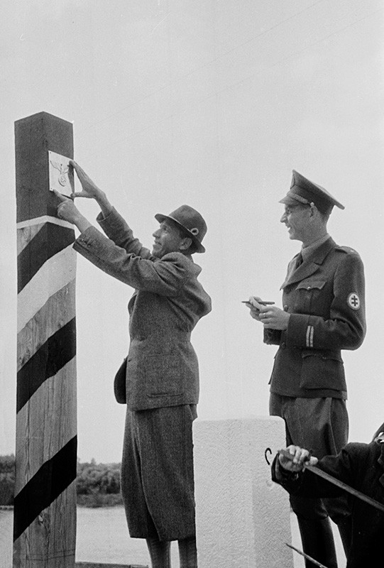](http://www.webumenia.sk/dielo/SVK:TMP.144?collection=83)
[Adolf Hitler](http://www.webumenia.sk/dielo/SVK:TMP.209?collection=83) sa síce netají svojím opovržlivým postojom k slovanským národom, ktoré považuje za menejcenné, no pre ďalšie plánované expanzie zatiaľ uprednostňuje na území Slovenska zdržanlivý prístup. 

Slovensko sa má stať príkladom pre krajiny juhovýchodnej Európy a má ukázať, že pod Hitlerovou „ochranou“ môže národ pokojne žiť.

[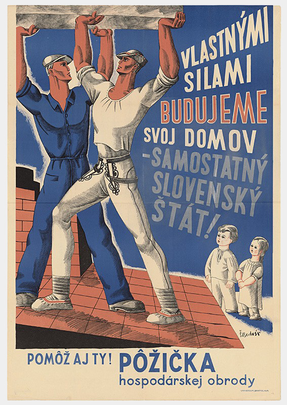](http://www.webumenia.sk/dielo/SVK:TMP.185?collection=83)

---

## Prijatie Ústavy Slovenskej republiky
### 21. 7. 1939 {.title-date}

Po decembrových voľbách 1938 <a target="_blank" href="http://senxskutocnost.sng.sk/chapters/1-na-polceste-k-slovenskemu-statu#hlinkova-slovensk-udov-strana">"Hlinkova slovenská ľudová strana - Strana slovenskej národnej jednoty (HSĽS-SSNJ)"</a> nielen stabilizuje svoje vládne pozície, ale agresívnym obsadzovaním postov v štátnej a vo verejnej správe priamo presadzuje svoj vplyv na hospodársky a spoločenský život v krajine. Likviduje napríklad voľby do obecných samospráv, obce majú riadiť menovaní „vládni komisári“. Toto vedúce postavenie jedinej politickej strany potvrdzuje aj ústava, ktorú snem prijíma 21. júla 1939. Podľa jej preambuly (predhovoru) vychádza všetka moc a právo od Boha, no jej text potvrdzuje autoritársku politickú prax HSĽS, ktorá otvorene odmieta demokratické zásady, na aké boli občania zvyknutí z medzivojnového obdobia.

Z HSĽS sa stáva „štátostrana“ – prisvojuje si nárok ako jediná „zastupovať záujmy štátotvorného národa“ a naopak Slováci sa môžu zúčastňovať na politickej moci len „jej prostredníctvom“. 

[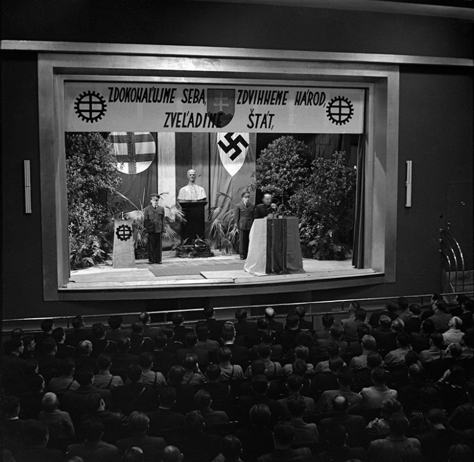](http://www.webumenia.sk/dielo/SVK:TMP.206?collection=83)

Z ostatných strán legálne fungujú len dve režimové etnické strany, formálne zastupujúce nemeckú a maďarskú menšinu. Ľudácka ideológia tvrdo podriaďuje záujmy jednotlivca svojim potrebám, ktoré prezentuje ako potreby „národného celku“. A v takom celku niet miesta pre tých, ktorých vláda označí za jeho nepriateľov. Tí už od jari 1939 končia v koncentračnom tábore v Ilave.



---

## Začiatok druhej svetovej vojny
### 1. 9. 1939 {.title-date}

Hitler vydáva ešte v apríli 1939 príkaz vypracovať plán vojenského ťaženia proti Poľsku, ktorého územia chcel pripojiť k Nemeckej ríši. Územie Slovenska má byť jedným z nástupných priestorov nemeckej armády. V auguste mu vládni predstavitelia sľubujú, že v prípade vojnového konfliktu dostane nemecké vojenské veliteľstvo právomoci nad slovenskými cestnými, železničnými a riečnymi komunikáciami. Na konci augusta sa začína aj mobilizácia slovenskej armády. 

[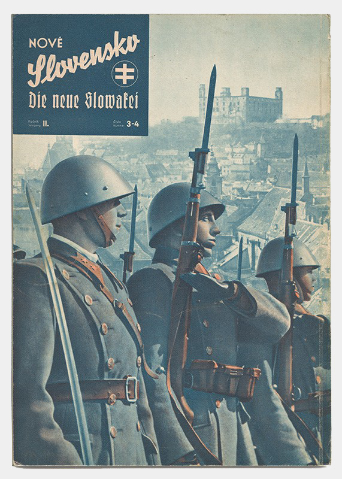](http://www.webumenia.sk/dielo/SVK:TMP.146?collection=83)

#### Dňa 1. septembra 1939 nemecké vojská vstupujú na územie Poľska a oficiálne začína druhá svetová vojna. Pre Slovensko, ktoré je zahraničím vnímané ako satelit Tretej ríše, a účasťou svojej armády na nacistickom vpáde do Poľska túto pozíciu otvorene potvrdilo, znamená tento akt okamžité prerušenie diplomatických stykov so západnými veľmocami. 

Ako motív účasti v tomto ťažení po boku Nemecka je slovenskej verejnosti v médiách predkladané najmä prinavrátenie území o rozlohe 770 km2 s 32 obcami a osadami, ktoré zabralo Poľsko po Mníchovskej dohode. Francúzsko a Veľká Británia ako poľskí spojenci vyhlasujú Nemecku vojnu. Zmenou politickej situácie sa vracajú k svojim predmníchovským spojeneckým záväzkom voči Československu. Slovensko rátajú k ďalším, nacistami postupne okupovaným krajinám.

[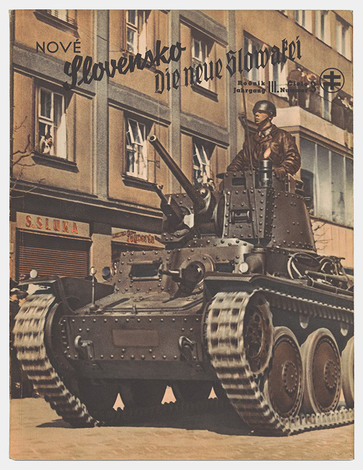](http://www.webumenia.sk/dielo/SVK:TMP.145?collection=83)

---

## Jozef Tiso zvolený za prezidenta 
### 26. 10. 1939 {.title-date} 

Ústava z júla 1939 vymedzuje rozsiahle funkcie prezidentovi, ktorého Slovenská republika zatiaľ nemá. Volený má byť na sedem rokov, nezodpovedá sa vláde ani parlamentu, stíhať ho môže len Štátna rada, aj to len za vlastizradu. Je najvyšším veliteľom armády aj Hlinkovej gardy, menuje ministrov, vysokoškolských profesorov a sudcov. Má právo sa zúčastňovať zasadnutí vlády aj Štátnej rady, vyhlasuje stav brannej pohotovosti a so súhlasom snemu môže vypovedať vojnu či uzatvoriť mier. 

<figure class="audio" markdown="1">

<figcaption>Audiokoláž z prejavov Jozefa Tisa</figcaption>
</figure>

Dňa 26. októbra 1939 sa prezidentom Slovenskej republiky stáva <a target="_blank" href="http://senxskutocnost.sng.sk/chapters/1/tiso">"Jozef Tiso"</a>. Jeho doterajší post predsedu vlády preberá <a target="_blank" href="http://senxskutocnost.sng.sk/chapters/1/tuka">"Vojtech Tuka"</a>. 

**Podobizne Jozefa Tisa s titulom prvý prezident Slovenskej republiky**
{% include 'partials/carousel.html.twig' with {
    'images': [
        {
            'title':'Štefan Bednár', 
            'src': 'http://www.webumenia.sk/images/diela/TMP/24/SVK_TMP.119/SVK_TMP.119.jpeg',
            'href': 'http://www.webumenia.sk/dielo/SVK:TMP.119?collection=83'
        },
		{
            'title':'Vincek Hochštetský', 
			'src': 'http://www.webumenia.sk/images/diela/TMP/17/SVK_TMP.149/SVK_TMP.149.jpeg',
            'href': 'http://www.webumenia.sk/dielo/SVK:TMP.149?collection=83'
        },
        {
            'title':'Vincek Hochštetský', 
			'src': 'http://www.webumenia.sk/images/diela/TMP/16/SVK_TMP.148/SVK_TMP.148.jpeg',
            'href': 'http://www.webumenia.sk/dielo/SVK:TMP.148?collection=83'
        },
        {
            'title':'Vincek Hochštetský', 
            'src': 'http://www.webumenia.sk/images/diela/TMP/46/SVK_TMP.120/SVK_TMP.120.jpeg',
            'href': 'http://www.webumenia.sk/dielo/SVK:TMP.120?collection=83'
        }
    ]
}%}

{% include 'partials/subobjects.html.twig' with {
    'title': 'Zistite viac o pojmoch',
    'subobjects': [
        {
            'name':'Štátna rada', 
            'thumbnail': page.media['statna_rada.jpg'],
            'href': '2/statna-rada'
        },
        {
            'name':'Hlinkova garda', 
            'thumbnail': page.media['garda_thumb.jpg'],
            'href': '2/hlinkova-garda'
        },
        {
            'name':'Hlinkova mládež', 
            'thumbnail': page.media['Hlinkova_mladez.jpg'],
            'href': '2/hlinkova-mladez'
        }
    ]
}%}

---

## Salzburské rokovania
### 27. - 28. 7. 1940 {.title-date}

Samostatný slovenský štát vznikol ako vedľajší produkt presadzovania nemeckých záujmov v strednej Európe a podpísaním ochrannej zmluvy sa definitívne stal satelitom Tretej ríše. Predstavy slovenského ministra zahraničných vecí (a ministra vnútra) Ferdinanda Ďurčanského o akejsi nezávislej zahraničnej politike Slovenska sa ukázali byť absolútne naivné. Nacistické Nemecko vnímalo jeho občasné pokusy o presadzovanie vlastných nápadov ako zradu ríšskych záujmov. 

[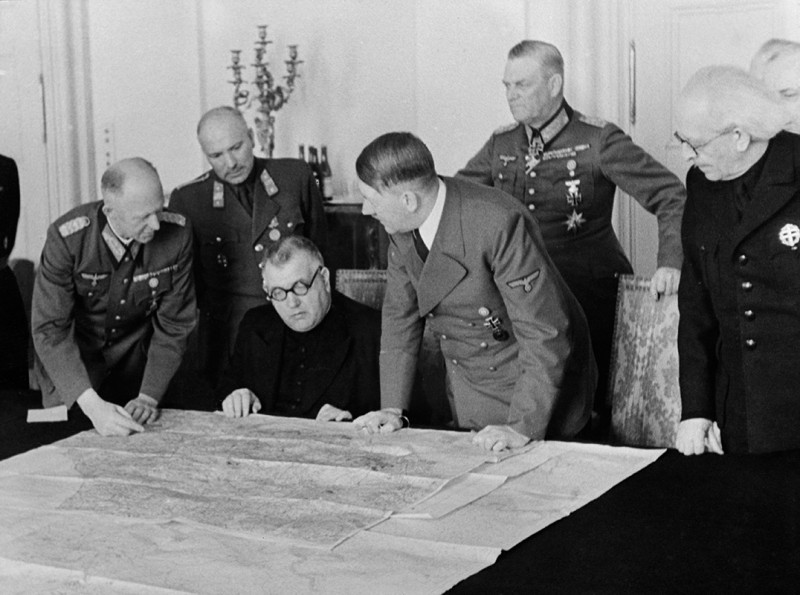](http://www.webumenia.sk/dielo/SVK:TMP.164?collection=83)

Na konci júla 1940 si Hitler po viacerých varovaniach necháva zavolať prezidenta Tisa do Salzburgu, aby definitívne ukázal Slovákom, kde sú mantinely ich samostatnosti. V Salzburgu Nemci presadia odstránenie Ferdinanda Ďurčanského zo všetkých postov a nadiktujú zmeny v slovenskej vláde. Kreslo ministra zahraničia obsadzuje predseda vlády Vojtech Tuka, horlivý zástanca nacionálneho socializmu na Slovensku. Tuka mal byť zárukou, že nedôjde k žiadnym odchýlkam od zahranično-politickej línie Nemecka. Post ministra vnútra pripadol Alexandrovi Machovi, ďalšiemu ľudáckemu radikálovi.

[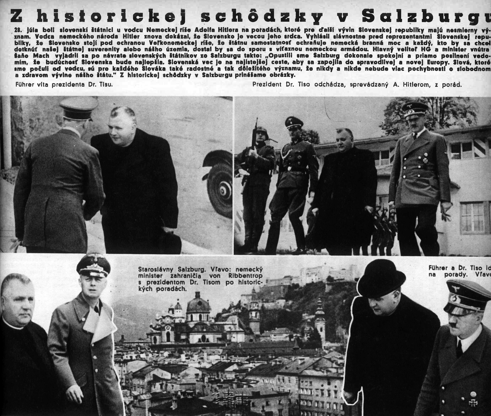](http://digitalna.kniznica.info/zoom/28339/view?page=3&p=separate&view=0,0,2808,4041)

Slovensko má podľa predstáv nacistov priamo preberať myšlienky a metódy ich vlastného nacionálneho socializmu. 

Na kľúčové slovenské ministerstvá a úrady, ako aj do mocenských štruktúr režimu navyše po Salzburgu prichádzajú ďalší nemeckí poradcovia. Ich úlohou je kontrolovať chod týchto inštitúcií a zložiek, dbať na lojalitu voči Nemecku a dodržiavanie záväzkov ochrannej zmluvy. 

[ - Franz Karmasin pri prejave")](http://www.webumenia.sk/dielo/SVK:TMP.204?collection=83)

---

## Lomnický manifest
### 31. 8. 1940 {.title-date}

Ani výtvarné umenie neobchádzajú následky politických zmien, ktoré na Slovensku prebehli. V októbri 1939 zaniká progresívna Škola umeleckých remesiel a akousi jej náhradou má byť Oddelenie kreslenia a maľovania na Slovenskej vysokej škole technickej v Bratislave, ktoré však nie je školou akademického zamerania a vzdeláva najmä učiteľov výtvarnej výchovy. Všetky medzivojnové výtvarné spolky nahrádza pod tlakom zjednotený Spolok slovenských výtvarných umelcov. 

[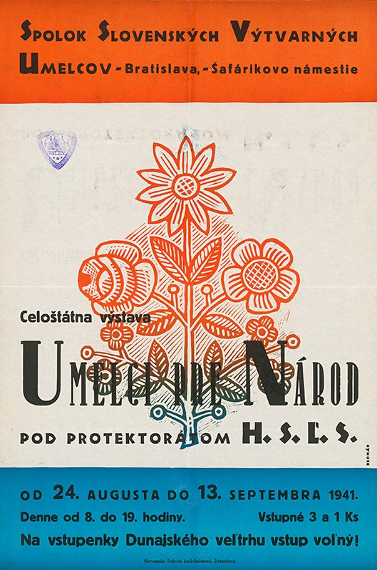](http://www.webumenia.sk/dielo/SVK:TMP.167?collection=83)

Po salzburských rokovaniach sa aj v slovenskom umení začína presadzovať národno-socialistická ideológia a práve o nej sa hovorí na konferencii kultúrnych pracovníkov v Tatranskej Lomnici. Slovenský národný socializmus sa má podľa stanoviska zúčastnených aktívne presadzovať do verejného života, vrátane oblasti kultúry a školstva. 

Program budovania národno-socialistickej kultúry sa vyznačuje najmä návratom k tzv. svojrázu, pretláčaniu ľudových, folklórnych motívov, s cieľom posilniť národný charakter slovenského umenia a ilúziu naplnených tisícročných snáh Slovákov o samostatnosť. 

**Martin Benka - Séria strážcovia a ochrankyne Slovenska (1940 - 1942)**
{% include 'partials/carousel.html.twig' with {
   'images': [
       {
           'title':'Strážca Tatier',
            'src': 'http://www.webumenia.sk/images/diela/TMP/9/SVK_TMP.178/SVK_TMP.178.jpeg',
           'href': 'http://www.webumenia.sk/dielo/SVK:TMP.178?collection=83'
       },
       {
           'title':'Ochrankyňa vrchov',
            'src': 'http://www.webumenia.sk/images/diela/TMP/4/SVK_TMP.173/SVK_TMP.173.jpeg',
           'href': 'http://www.webumenia.sk/dielo/SVK:TMP.173?collection=83'
       },
       {
           'title':'Strážca Považia', 
           'src': 'http://www.webumenia.sk/images/diela/TMP/8/SVK_TMP.177/SVK_TMP.177.jpeg',
           'href': 'http://www.webumenia.sk/dielo/SVK:TMP.177?collection=83'
       },
        {
           'title':'Ochrankyňa tvorivej práce', 
           'src': 'http://www.webumenia.sk/images/diela/TMP/2/SVK_TMP.171/SVK_TMP.171.jpeg',
           'href': 'http://www.webumenia.sk/dielo/SVK:TMP.171?collection=83'
       },
        {
           'title':'Strážca na západe', 
           'src': 'http://www.webumenia.sk/images/diela/TMP/6/SVK_TMP.175/SVK_TMP.175.jpeg',
           'href': 'http://www.webumenia.sk/dielo/SVK:TMP.175?collection=83'
       },
        {
           'title':'Ochrankyňa umenia', 
           'src': 'http://www.webumenia.sk/images/diela/TMP/3/SVK_TMP.172/SVK_TMP.172.jpeg',
           'href': 'http://www.webumenia.sk/dielo/SVK:TMP.172?collection=83'
       },
        {
           'title':'Strážca okolia čachtického', 
           'src': 'http://www.webumenia.sk/images/diela/TMP/7/SVK_TMP.176/SVK_TMP.176.jpeg',
           'href': 'http://www.webumenia.sk/dielo/SVK:TMP.176?collection=83'
       },
        {
           'title':'Ochrankyňa ducha', 
           'src': 'http://www.webumenia.sk/images/diela/TMP/79/SVK_TMP.169/SVK_TMP.169.jpeg',
           'href': 'http://www.webumenia.sk/dielo/SVK:TMP.169?collection=83'
       },
        {
           'title':'Strážca Detvy', 
           'src': 'http://www.webumenia.sk/images/diela/TMP/5/SVK_TMP.174/SVK_TMP.174.jpeg',
           'href': 'http://www.webumenia.sk/dielo/SVK:TMP.174?collection=83'
       },
        {
           'title':'Ochrankyňa čistoty', 
           'src': 'http://www.webumenia.sk/images/diela/TMP/78/SVK_TMP.168/SVK_TMP.168.jpeg',
           'href': 'http://www.webumenia.sk/dielo/SVK:TMP.168?collection=83'
       },
        {
           'title':'Strážca východu', 
           'src': 'http://www.webumenia.sk/images/diela/TMP/10/SVK_TMP.179/SVK_TMP.179.jpeg',
           'href': 'http://www.webumenia.sk/dielo/SVK:TMP.179?collection=83'
       },
        {
           'title':'Ochrankyňa liturgie', 
           'src': 'http://www.webumenia.sk/images/diela/TMP/1/SVK_TMP.170/SVK_TMP.170.jpeg',
           'href': 'http://www.webumenia.sk/dielo/SVK:TMP.170?collection=83'
       }
   ]
}%}

Pseudoromantický, idealistický výklad národného mýtu vedie k idylickému návratu k predkom a k výberovému vytváraniu martýria hrdinov minulosti (Pribina, Svätopluk, staroslovanská a cyrilo-metodská tradícia). Zdôrazňuje sa starobylosť národa, zrodeného z „prastarého ducha ľudu“ a nemennosť spôsobu života, pretrvávajúceho stáročia.

**Diela zobrazujúce ikony národnej pospolitosti a slovenský "svojráz"**
{% include 'partials/carousel.html.twig' with {
    'images': [
        {
		    'title':'Ján Ladvenica - Kráľ Svätopluk', 
            'src': 'http://www.webumenia.sk/images/diela/GMB/89/SVK_GMB.A_3475/SVK_GMB.A_3475.jpeg',
            'href': 'http://www.webumenia.sk/dielo/SVK:GMB.A_3475?collection=83'
        },
        {
		    'title':'Ján Ladvenica - Kráľ Svätopluk so synmi', 
            'src': 'http://www.webumenia.sk/images/diela/GMB/91/SVK_GMB.A_3477/SVK_GMB.A_3477.jpeg',
            'href': 'http://www.webumenia.sk/dielo/SVK:GMB.A_3477?collection=83'
        },
        {
            'title':'Ján Ladvenica - Zo Ždiaru', 
            'src': 'http://www.webumenia.sk/images/diela/SNG/11/SVK_SNG.O_1978/SVK_SNG.O_1978.jpeg',
            'href': 'http://www.webumenia.sk/dielo/SVK:SNG.O_1978?collection=83'
        },
		{
            'title':'Ján Ladvenica - Oslobodené územie', 
            'src': 'http://www.webumenia.sk/images/diela/SNG/12/SVK_SNG.O_1977/SVK_SNG.O_1977.jpeg',
            'href': 'http://www.webumenia.sk/dielo/SVK:SNG.O_1977?collection=83'
        },
		{
            'title':'Štefan Bednár - Jánošíkova smrť', 
            'src': 'http://www.webumenia.sk/images/diela/TMP/76/SVK_TMP.166/SVK_TMP.166.jpeg',
            'href': 'http://www.webumenia.sk/dielo/SVK:TMP.166?collection=83'
        },
		{
            'title':'Janko Alexy - Mojmírova smrť II.', 
            'src': 'http://www.webumenia.sk/images/diela/SNG/39/SVK_SNG.K_3477/SVK_SNG.K_3477.jpeg',
            'href': 'http://www.webumenia.sk/dielo/SVK:SNG.K_3477?collection=83'
        }
    ]
}%}

Aj vďaka tomu, že oficiálne predstavy o tom, aké má byť umenie v „nových“ pomeroch, boli neurčité a rozporné, sieť [„deravej totality“](https://sk.wikipedia.org/wiki/Vladim%C3%ADr_Clementis) dokázala miestami prepustiť nové umelecké iniciatívy. Mladá generácia umelcov väčšmi artikulovala antiklerikálne, antifašistické a protivojnové postoje. Platformou pre nové vedecké, literárne a umelecké názory sa stalo vydávanie nadrealistických zborníkov: Áno a Nie (1938), Sen a skutočnosť (1940), Vo dne a v noci (1941) a Pozdrav (1942). V ich okruhu sa stretali a vzájomne konfrontovali výtvarné názory viacerých príslušníkov Generácie 1909 ([C. Majerník](http://www.webumenia.sk/autor/6151), [J. Mudroch](http://www.webumenia.sk/autor/6948), [P. Matejka](http://www.webumenia.sk/autor/6393), [J. Kostka](http://www.webumenia.sk/autor/5187), [E. Nevan](http://www.webumenia.sk/autor/7258), [J. Želibský](http://www.webumenia.sk/autor/12214), [B. Hoffstädter](http://www.webumenia.sk/autor/3953) a i.), ale i mladších, neskôr nazvaných tiež Generácia druhej svetovej vojny ([V. Hložník](http://www.webumenia.sk/autor/3886), [L. Guderna](http://www.webumenia.sk/autor/3380), [V. Chmel](http://www.webumenia.sk/autor/4278), [E. Semian](http://www.webumenia.sk/autor/8998), [O. Dubay](http://www.webumenia.sk/autor/2167), [E. Zmeták](http://www.webumenia.sk/autor/12162)). 

Diela týchto autorov sa často vyznačovali básnickou invenciou a imagináciou, poetickosťou, fragmentárnosťou (náčrtkovitosťou), inotajnými náznakmi „nevysloveného obsahu" a námetmi, ktoré umožnili, aby „sa výtvarné dielo cítilo ako znak skutočnosti“, „prevrátený symbol doby“. Non-konformný postoj k oficiálnym umeleckým požiadavkam zaujali aj autori, zachovávajúci kontinuitu moderny ako [M. A. Bazovský](http://www.webumenia.sk/autor/582), alebo [A. P. Weisz-Kubínčan](http://www.webumenia.sk/autor/11709), ktorého židovský pôvod bol dôvodom neustáleho prenasledovania s tragickým koncom.

**Príklady diel autorov neoficiálneho umenia**

{% include 'partials/carousel.html.twig' with {
   'images': [
       {
           'title':'Ján Mudroch - Návrh na obálku zborníka',
            'src': 'http://www.webumenia.sk/images/diela/SNG/39/SVK_SNG.O_4364/SVK_SNG.O_4364.jpeg',
           'href': 'http://www.webumenia.sk/dielo/SVK:SNG.O_4364'
       },
       {
           'title':'Ján Mudroch - Prekvapenie',
            'src': 'http://www.webumenia.sk/images/diela/SNG/26/SVK_SNG.O_1667/SVK_SNG.O_1667.jpeg',
           'href': 'http://www.webumenia.sk/dielo/SVK:SNG.O_1667'
       },
       {
           'title':'Peter Matejka - Pred zrkadlom', 
           'src': 'http://www.webumenia.sk/images/diela/SNG/25/SVK_SNG.O_1749/SVK_SNG.O_1749.jpeg',
           'href': 'http://www.webumenia.sk/dielo/SVK:SNG.O_1749'
       },
        {
           'title':'Cyprián Majerník - Utečenci', 
           'src': 'http://www.webumenia.sk/images/diela/SNG/24/SVK_SNG.O_2479/SVK_SNG.O_2479.jpeg',
           'href': 'http://www.webumenia.sk/dielo/SVK:SNG.O_2479'
       },
        {
           'title':'Cyprián Majerník - Milosrdný samaritán', 
           'src': 'http://www.webumenia.sk/images/diela/SNG/25/SVK_SNG.O_2478/SVK_SNG.O_2478.jpeg',
           'href': 'http://www.webumenia.sk/dielo/SVK:SNG.O_2478'
       },
        {
           'title':'Ervín Semian - Červený a čierny koník', 
           'src': 'http://www.webumenia.sk/images/diela/SNG/44/SVK_SNG.O_6592/SVK_SNG.O_6592.jpeg',
           'href': 'http://www.webumenia.sk/dielo/SVK:SNG.O_6592'
       },
        {
           'title':'František Kudláč - Tragéd', 
           'src': 'http://www.webumenia.sk/images/diela/SNG/96/SVK_SNG.O_1144/SVK_SNG.O_1144.jpeg',
           'href': 'http://www.webumenia.sk/dielo/SVK:SNG.O_1144'
       },
        {
           'title':'Dezider Milly - Blúdiaca', 
           'src': 'http://www.webumenia.sk/images/diela/SNG/4/SVK_SNG.O_6655/SVK_SNG.O_6655.jpeg',
           'href': 'http://www.webumenia.sk/dielo/SVK:SNG.O_6655'
       },
        {
           'title':'Jozef Šturdík - Zátišie II.', 
           'src': 'http://www.webumenia.sk/images/diela/SNG/59/SVK_SNG.O_4409/SVK_SNG.O_4409.jpeg',
           'href': 'http://www.webumenia.sk/dielo/SVK:SNG.O_4409'
       },
        {
           'title':'Ladislav Čemický - Vojna', 
           'src': 'http://www.webumenia.sk/images/diela/SNG/20/SVK_SNG.O_1717/SVK_SNG.O_1717.jpeg',
           'href': 'http://www.webumenia.sk/dielo/SVK:SNG.O_1717'
       },
        {
           'title':'Ester Šimerová-Martinčeková - Tri grácie', 
           'src': 'http://www.webumenia.sk/images/diela/SNG/12/SVK_SNG.O_220/SVK_SNG.O_220.jpeg',
           'href': 'http://www.webumenia.sk/dielo/SVK:SNG.O_220'
       },
	   {
           'title':'Vincent Hložník - Mŕtvy', 
           'src': 'http://www.webumenia.sk/images/diela/SNG/20/SVK_SNG.O_5371/SVK_SNG.O_5371.jpeg',
           'href': 'http://www.webumenia.sk/dielo/SVK:SNG.O_5371'
       },
       {
           'title':'Ján Želibský - Po nálete', 
           'src': 'http://www.webumenia.sk/images/diela/SNG/37/SVK_SNG.O_6067/SVK_SNG.O_6067.jpeg',
           'href': 'http://www.webumenia.sk/dielo/SVK:SNG.O_6067'
       },
       {
           'title':'Arnold Peter Weisz-Kubínčan - Sedliačka', 
           'src': 'http://www.webumenia.sk/images/diela/SNG/13/SVK_SNG.O_2948/SVK_SNG.O_2948.jpeg',
           'href': 'http://www.webumenia.sk/dielo/SVK:SNG.O_2948'
       },
	   {
           'title':'Jozef Kostka - Poézia I.', 
           'src': 'http://www.webumenia.sk/images/diela/SNG/59/SVK_SNG.P_64/SVK_SNG.P_64.jpeg',
           'href': 'http://www.webumenia.sk/dielo/SVK:SNG.P_64'
       },
	   {
           'title':'Jozef Kostka - Žiaľ', 
           'src': 'http://www.webumenia.sk/images/diela/SNG/84/SVK_SNG.P_227/SVK_SNG.P_227.jpeg',
           'href': 'http://www.webumenia.sk/dielo/SVK:SNG.P_227'
       },
	   {
           'title':'Rudolf Pribiš - Dnešok', 
           'src': 'http://www.webumenia.sk/images/diela/SNG/27/SVK_SNG.P_198/SVK_SNG.P_198.jpeg',
           'href': 'http://www.webumenia.sk/dielo/SVK:SNG.P_198'
       },
	   {
           'title':'Bedrich Hoffstädter - V električke', 
           'src': 'http://www.webumenia.sk/images/diela/SNG/23/SVK_SNG.K_1475/SVK_SNG.K_1475.jpeg',
           'href': 'http://www.webumenia.sk/dielo/SVK:SNG.K_1475'
       },
       {
           'title':'Miloš Alexander Bazovský - Mier', 
           'src': 'http://www.webumenia.sk/images/diela/SNG/76/SVK_SNG.O_6699/SVK_SNG.O_6699.jpeg',
           'href': 'http://www.webumenia.sk/dielo/SVK:SNG.O_6699'
       },
        {
           'title':'Eugen Nevan - Medúza', 
           'src': 'http://www.webumenia.sk/images/diela/SNG/65/SVK_SNG.O_3549/SVK_SNG.O_3549.jpeg',
           'href': 'http://www.webumenia.sk/dielo/SVK:SNG.O_3549'
       },
       {
           'title':'Eugen Nevan - Übermensch', 
           'src': 'http://www.webumenia.sk/images/diela/SNG/50/SVK_SNG.K_6833/SVK_SNG.K_6833.jpeg',
           'href': 'http://www.webumenia.sk/dielo/SVK:SNG.K_6833'
       }
   ]
}%}

---

## Život na „Novom Slovensku“ 

Dobová propaganda využíva ovládnuté médiá na šírenie obrazu Slovenska ako mierovej, budujúcej a prosperujúcej krajiny. V porovnaní s Protektorátom či dokonca s Poľskom je na Slovensku spočiatku podstatne menej cítiť priamy vplyv Tretej ríše. Až do salzburských rokovaní sa darí navonok udržiavať obraz „samostatnosti“, čo u časti populácie pomáha vláde získať a udržať si popularitu. Vláda si osvojuje sociálnu rétoriku a aj investuje do viacerých sociálnych projektov. Zavádza aj niektoré sociálne benefity, ako prídavky na nezaopatrené deti. 

[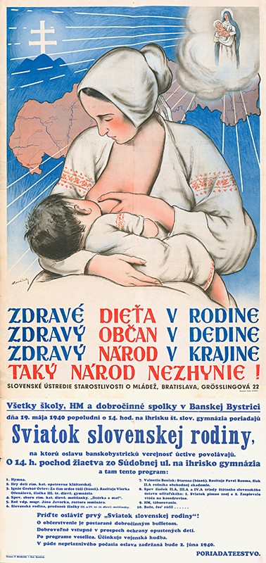](http://www.webumenia.sk/dielo/SVK:TMP.187?collection=83)

Vojnová výroba, mobilizácia mužov do armády a tiež ich umiestňovanie na práce v Nemecku pomáhajú znižovať nezamestnanosť. Relatívne veľké skupiny obyvateľstva ťažia, alebo aspoň majú nádej, že budú ťažiť, z rozdávania arizovaného majetku, od podnikovej úrovne až po vybavenie zo židovských domácností.


S prehlbovaním vojnového konfliktu sa v ekonomike prejavujú negatívne krízové javy. Už od roku 1940 a najmä od vypuknutia vojny so Sovietskym zväzom v júni 1941 sa rýchlo zhoršuje zásobovanie. V lete 1941 nastáva vážna kríza v zásobovaní múkou. Dlhodobo sa prejavuje aj nedostatok tukov. Šíri sa čierny trh s niekoľkonásobne vyššími cenami než na štátom kontrolovanom trhu. Aby sa vláda vyhla nepopulárnemu lístkovému systému zásobovania obyvateľstva, zaviedla tzv. odberné knižky.

{% include 'partials/carousel.html.twig' with {
    'images': [
        {
		    'title':'Plagát od neznámeho autora', 
            'src': 'http://www.webumenia.sk/images/diela/TMP/33/SVK_TMP.181/SVK_TMP.181.jpeg',
            'href': 'http://www.webumenia.sk/dielo/SVK:TMP.181?collection=83'
        },
        {
		    'title':'Plagát pravdepodobne od Edmunda Massányi', 
            'src': 'http://www.webumenia.sk/images/diela/TMP/41/SVK_TMP.189/SVK_TMP.189.jpeg',
            'href': 'http://www.webumenia.sk/dielo/SVK:TMP.189?collection=83'
        },
		{
            'title':'Plagát od neznámeho autora', 
            'src': 'http://www.webumenia.sk/images/diela/TMP/34/SVK_TMP.182/SVK_TMP.182.jpeg',
            'href': 'http://www.webumenia.sk/dielo/SVK:TMP.182?collection=83'
        },
        {
            'title':'Jozef Cincík - Slovensko na prelome', 
            'src': 'http://www.webumenia.sk/images/diela/TMP/38/SVK_TMP.186/SVK_TMP.186.jpeg',
            'href': 'http://www.webumenia.sk/dielo/SVK:TMP.186?collection=83'
        }
    ]
}%}

Pripojením juhu krajiny k Maďarsku stratilo Slovensko poľnohospodársky dôležitú oblasť s viacerými centrami baníckeho, kožiarskeho či polygrafického priemyslu. Narušená je dopravná a telekomunikačná štruktúra, ale aj systém elektrických vedení. V snahe zlepšiť situáciu vyhlasuje vláda vo februári 1939 pôžičku hospodárskej obnovy Slovenska. 

Keďže pre Nemecko je krajina významným zdrojom nerastných surovín, poľnohospodárskych výrobkov a strategickej zbrojárskej výroby, a neustáva ani využívanie jeho komunikačnej siete, v istých sférach prejavuje vlastný záujem o ich rozvoj. Vláda si osvojuje aj viacero medzivojnových projektov, ktoré prezentuje ako svoje vlastné. Pokračuje budovanie nových železničných spojení, pribúdajú cesty s pevným povrchom, elektrické a telefónne siete - to všetko dôsledne využité vo filmových týždenníkoch ako dôkaz správnosti novej nastúpenej cesty. Odvrátenú stranu rozmachu hospodárskeho rastu čiastočne prekrývajú propagandistické kampane ako „Usmievavé Slovensko“ či „Radosť z práce“. 

[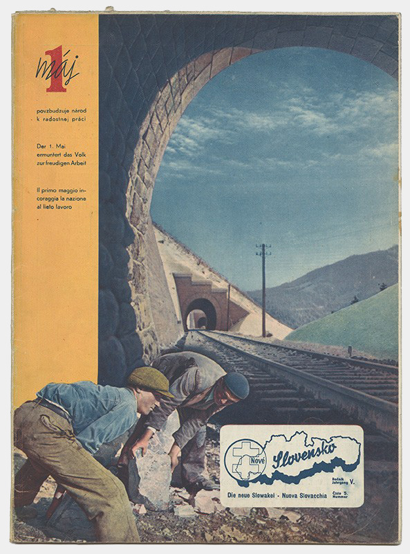](http://www.webumenia.sk/dielo/SVK:TMP.183?collection=83)

Kľúčové pozície v slovenských podnikoch ovládajú nemecké banky a združenia a značná časť priemyslu je natoľko naviazaná na vojnové potreby Nemecka, že je v prípade neúspechu Hitlera vo vojne naďalej neudržateľná.

**Attilio a Ernesto La Paluda - Súťažný návrh na Univerzitné mesto v Bratislave (1940-1941):**
{% include 'partials/carousel.html.twig' with {
    'images': [
        {
		    'title':'Súťažný návrh na Univerzitné mesto v Bratislave', 
            'src': 'http://www.webumenia.sk/images/diela/TMP/76/SVK_TMP.210/SVK_TMP.210.jpeg',
            'href': 'http://www.webumenia.sk/dielo/SVK:TMP.210?collection=83'
        },
        {
		    'title':'Perspektívny pohľad návrhu', 
            'src': 'http://www.webumenia.sk/images/diela/TMP/48/SVK_TMP.76/SVK_TMP.76.jpeg',
            'href': 'http://www.webumenia.sk/dielo/SVK:TMP.76?collection=83'
        },
        {
            'title':'Celková situácia návrhu', 
            'src': 'http://www.webumenia.sk/images/diela/TMP/47/SVK_TMP.75/SVK_TMP.75.jpeg',
            'href': 'http://www.webumenia.sk/dielo/SVK:TMP.75'
        },
		{
            'title':'Model návrhu', 
            'src': 'http://www.webumenia.sk/images/diela/TMP/46/SVK_TMP.74/SVK_TMP.74.jpeg',
            'href': 'http://www.webumenia.sk/dielo/SVK:TMP.74'
        }
    ]
}%}

---

## Začiatok nemecko-sovietskej vojny
### 22. 6. 1941 {.title-date}

Pri svojich plánoch vojensky napadnúť Zväz sovietskych socialistických republík (ZSSR) počíta Nemecko aj s účasťou vojsk svojich spojencov. Na konci apríla 1941 je podpísaná dohoda o prechode a pobyte nemeckých vojsk na slovenskom území a začiatkom júna zavádza aj slovenská armáda mimoriadne cvičenia. 

Dňa 22. júna 1941 zaútočia na sovietske územie nemecké, rumunské a fínske vojská. Zapojenie Slovenska ako slovanského štátu do bojov má posilniť dojem, že ide o „boj proti boľševizmu“, nie o vojnu voči civilnému obyvateľstvu. Skutočným dôvodom invázie sú však nemecké mocenské zámery - získanie „životného priestoru" (tzv. „lebensraum") a germanizácia východnej európy. 

[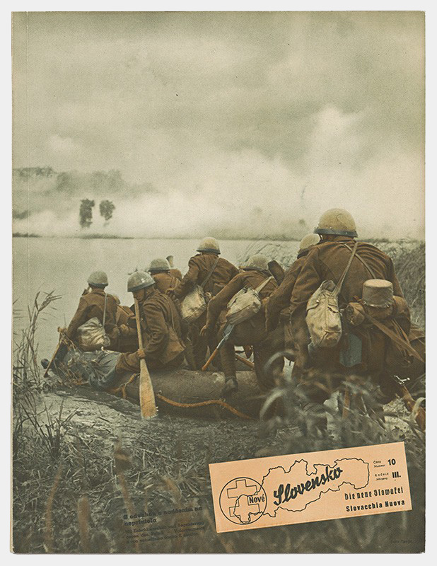](http://www.webumenia.sk/dielo/SVK:TMP.147?collection=83)

Politické špičky slovenského štátu súhlasia s Hitlerovou požiadavkou, aby sa Slováci zúčastnili vojenských operácií. 

Svojou ochotou bojovať po boku Tretej ríše súperia aj o nemeckú priazeň s Maďarskom v nádeji na možnú budúcu revíziu Viedenskej arbitráže. Tuka oznamuje prerušenie diplomatických stykov so ZSSR a vypovedanie vojny. O vstupe Slovenska do vojny však nerokoval snem. 

[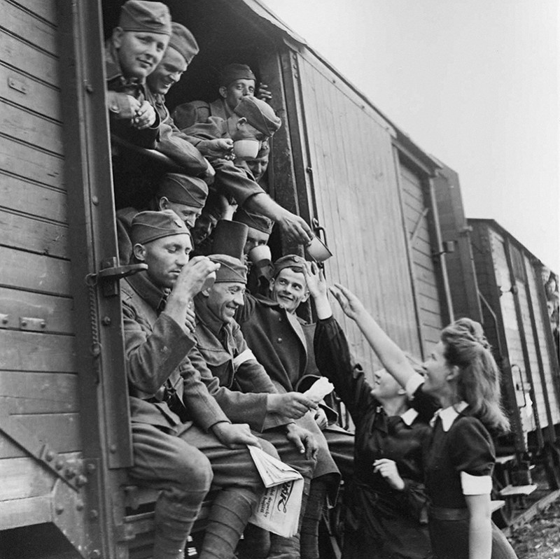](http://www.webumenia.sk/dielo/SVK:TMP.202?collection=83)

**Ukážky z časopisu Nový svet (august 1941) o slovákoch na východnom fronte**

{% include 'partials/carousel.html.twig' with {
    'images': [
        {
            'src': 'http://isg.cedvu.sk/share/sen-skutocnost/Novy_Svet/novysvet-vojaci_dievcata-teslik.jpg',
            'href': 'http://digitalna.kniznica.info/zoom/28261/view?page=1&p=separate&view=0,0,2789,3909'
        },
		{
            'src': 'http://isg.cedvu.sk/share/sen-skutocnost/Novy_Svet/Vojak_na_fronte.jpg',
            'href': 'http://digitalna.kniznica.info/zoom/28261/view?page=3&p=separate&view=0,0,2794,3894'
        },
        {
            'src': 'http://isg.cedvu.sk/share/sen-skutocnost/Novy_Svet/Boj_na_zivot.jpg',
            'href': 'http://digitalna.kniznica.info/zoom/28261/view?page=4&p=separate&view=0,0,2789,3874'
        },
        {
            'src': 'http://isg.cedvu.sk/share/sen-skutocnost/Novy_Svet/na_krvacajucom_vychode.jpg',
            'href': 'http://digitalna.kniznica.info/zoom/28261/view?page=5&p=separate&view=0,0,2819,3879'
        },
		{
            'src': 'http://isg.cedvu.sk/share/sen-skutocnost/Novy_Svet/hrdinske_boje_letcov.jpg',
            'href': 'http://digitalna.kniznica.info/zoom/28261/view?page=6&p=separate&view=0,0,2749,3884'
        }
    ]
}%}

Nemecká a slovenská armáda svojimi presunmi natoľko zahlcujú komunikácie, že civilná doprava, najmä vlaková, je často výrazne obmedzená. Slovenské vojská, sformované do tzv. Rýchlej skupiny (neskôr Rýchlej brigády), prekračujú 24. júna Dukliansky priesmyk a za hranicami sa pridávajú k nemeckej armáde. 

Druhá svetová vojna začne od tejto chvíle Slovensku prinášať čoraz výraznejšie straty... 

[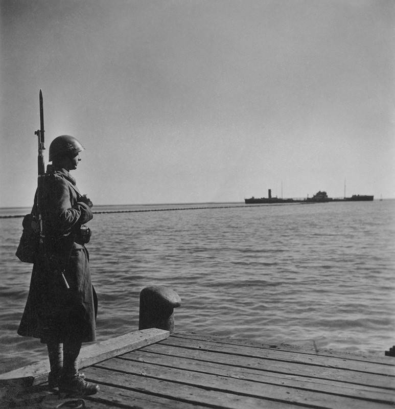](http://www.webumenia.sk/dielo/SVK:TMP.201?collection=83)

**Diela a fotografie z tejto kapitoly nájdete aj v kolekcii na Webe umenia: [Jeden národ, jedna strana, jeden vodca](http://www.webumenia.sk/kolekcia/83 "Kolekcia Jeden národ, jedna strana, jeden vodca")**