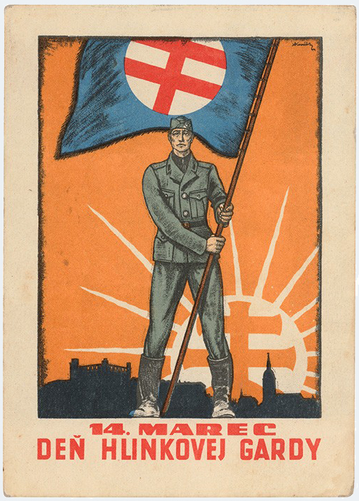
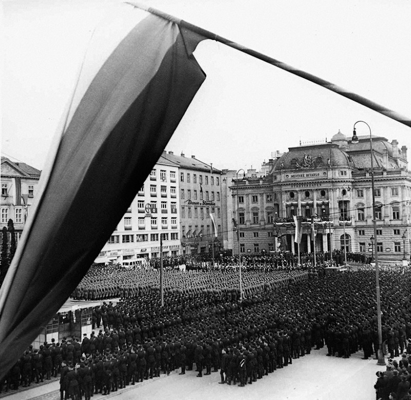
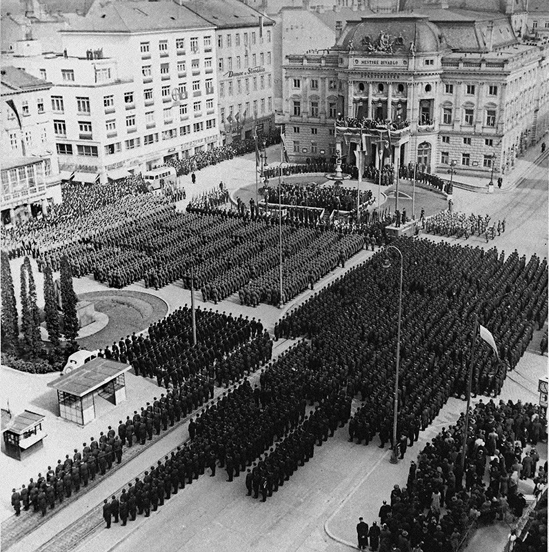
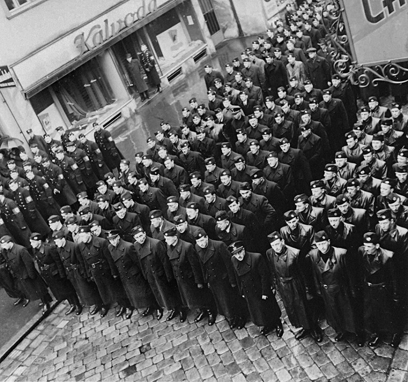
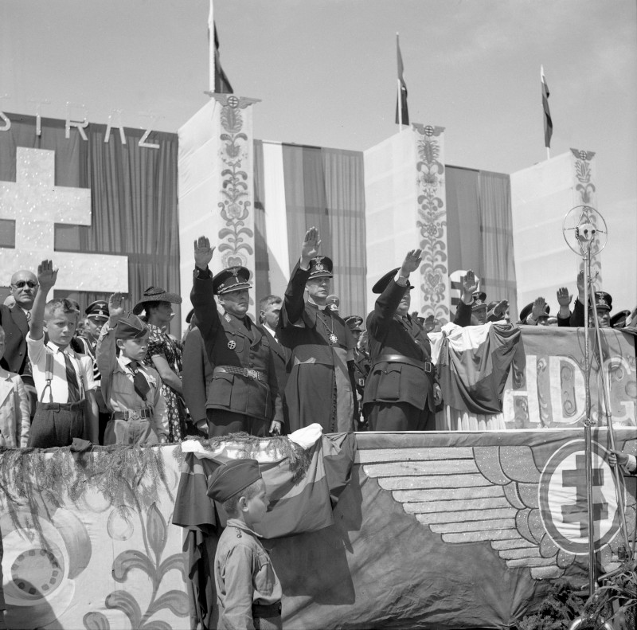

Based on the Nazi example, the paramilitary organisation Hlinka Guard was the most important supporting power behind the regime and part of its repressive-security apparatus. Compulsory membership for all men between 6 and 60 years was dropped after negative responses from the public. The proudly declared "duty to protect the country" included denouncing and interning political opponents, active disseminating of anti-Semitic and anti-Czech propaganda and often brutal actions that were against the law.

After the creation of the Slovak State, Alexander Mach was the Chief Commander of the Hlinka Guard. As a leader of the party, Jozef Tiso was the High Commander. The Hlinka Guard played an important part in the persecution of Jews and also partisans during the Slovak National Uprising. They also participated in the mass murder of Jewish citizens during 1944 and 1945.

## Other Media

