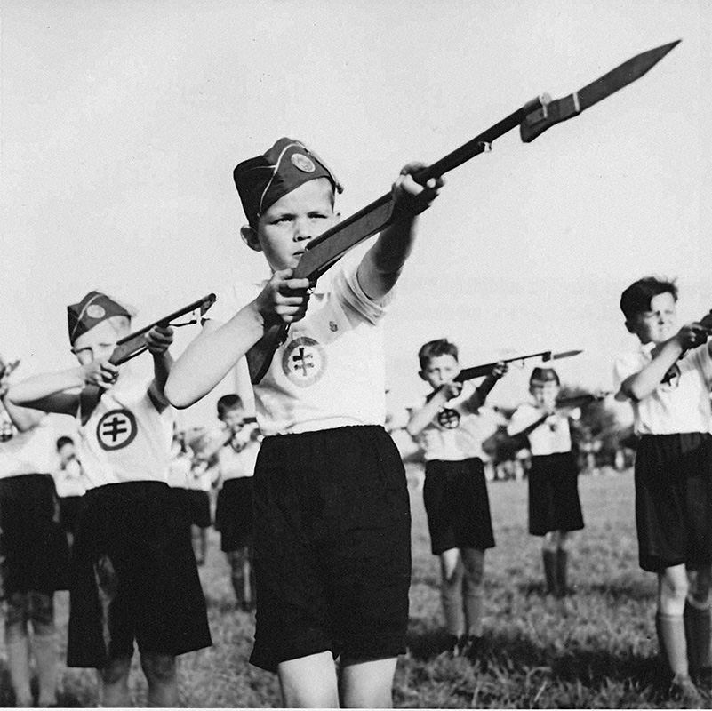
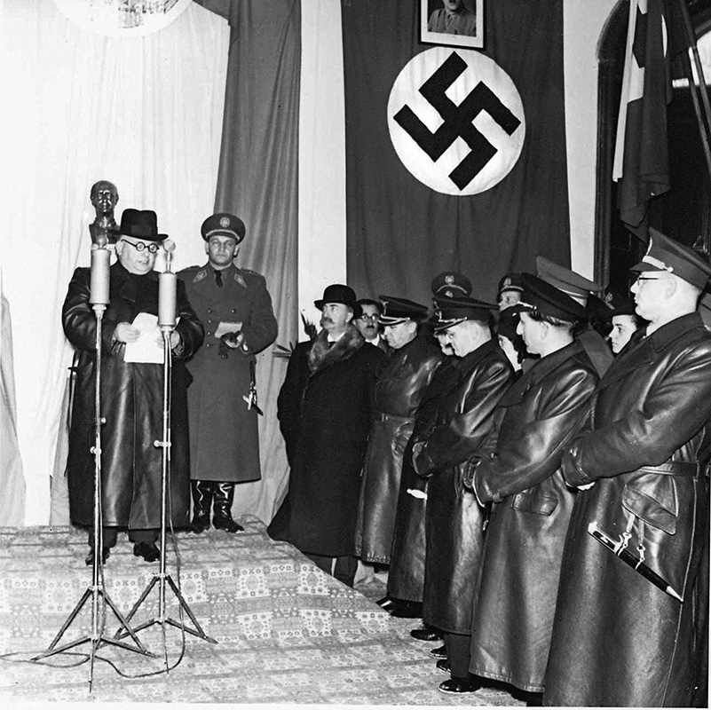
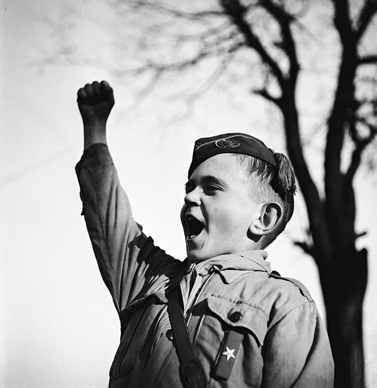
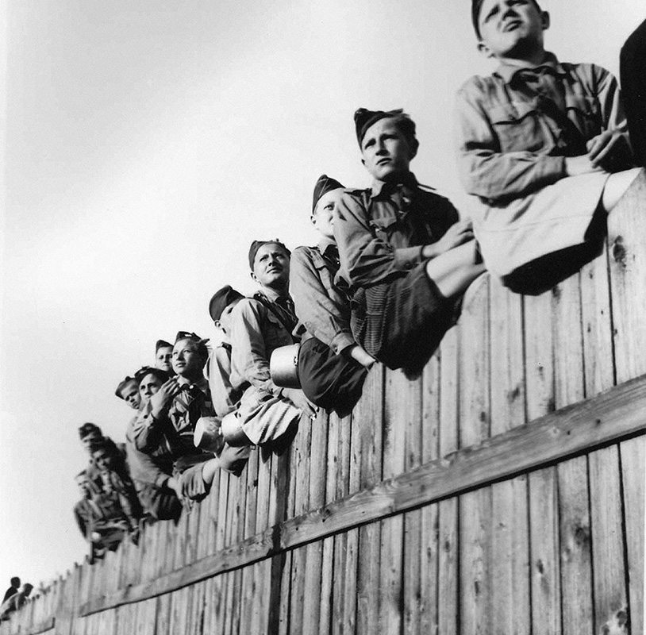
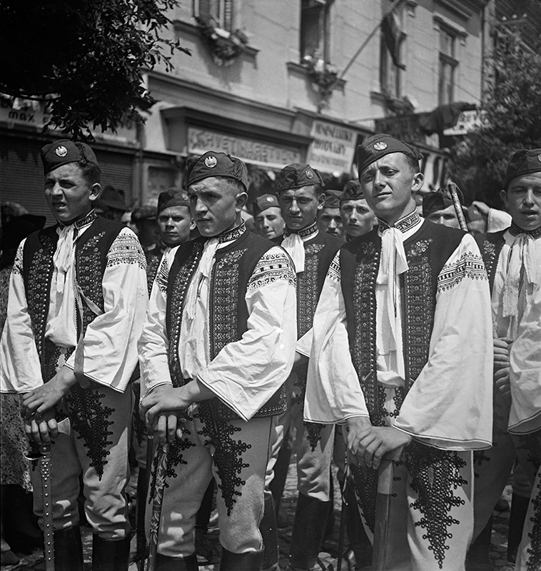
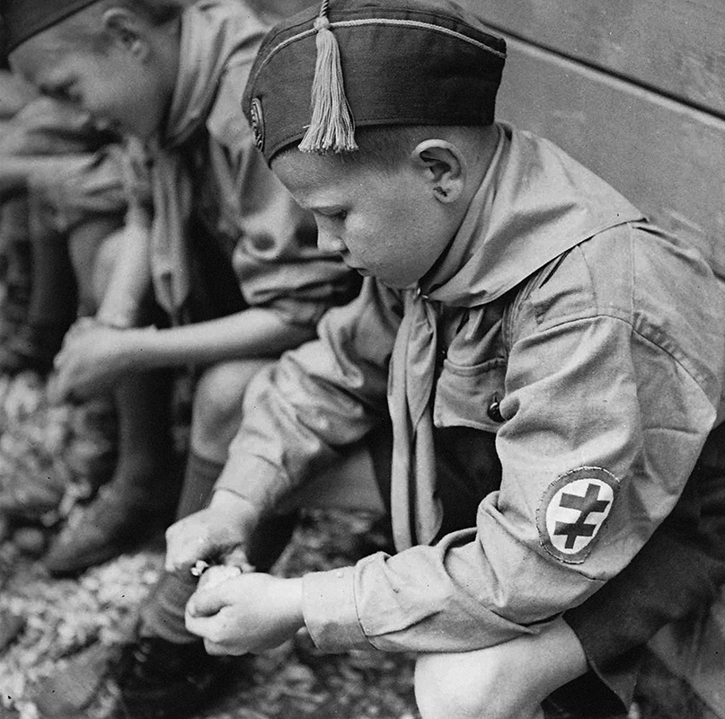
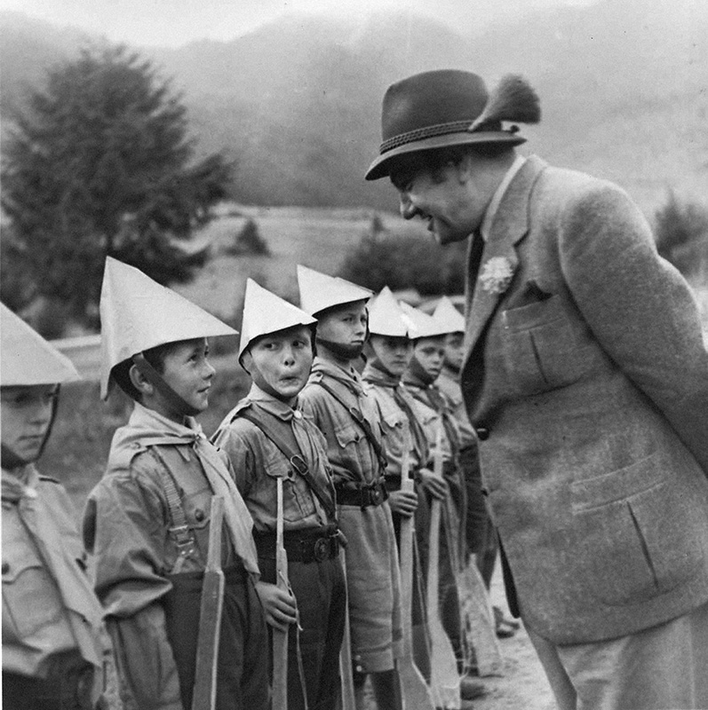
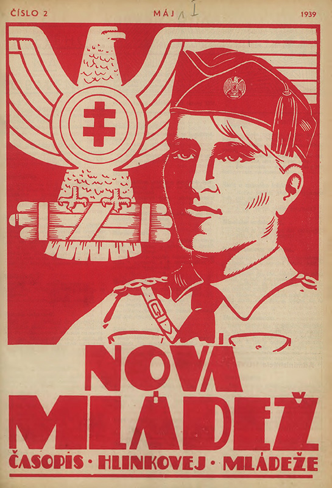

Similarly to Hlinka Guard, Hlinka Youth was also an organisation subordinated to the HSPP. It was formed as a single nationwide organisation after dissolution and reconstitution of youth associations and organisations in 1938. Initially, it was an organisation just for boys, but later there was also a chapter for girls. Symbolically, the high commander was Jozef Tiso, but the chief commander between 1940 and 1945 was  Alojz Macek.

Membership in Hlinka Youth was officially voluntary, but the organisation was responsible for defence and pre-military education for all Slovak citizens between 6 and 20 years (since 1940).

**Hlinka Youth Day in Bánovce nad Bebravou, 1941**
{% include 'partials/carousel.html.twig' with {
	'images': [
    	{
        	'src': 'http://www.webumenia.sk/images/diela/TMP/42/SVK_TMP.153/SVK_TMP.153.jpeg',
        	'href': 'http://www.webumenia.sk/dielo/SVK:TMP.153?collection=83'
    	},
   	 {
        	'src': 'http://www.webumenia.sk/images/diela/TMP/46/SVK_TMP.157/SVK_TMP.157.jpeg',
        	'href': 'http://www.webumenia.sk/dielo/SVK:TMP.157?collection=83'
    	},
    	{
        	'src': 'http://www.webumenia.sk/images/diela/TMP/44/SVK_TMP.155/SVK_TMP.155.jpeg',
        	'href': 'http://www.webumenia.sk/dielo/SVK:TMP.155?collection=83'
    	},
    	{
        	'src': 'http://www.webumenia.sk/images/diela/TMP/45/SVK_TMP.156/SVK_TMP.156.jpeg',
        	'href': 'http://www.webumenia.sk/dielo/SVK:TMP.156?collection=83'
    	},
   	 {
        	'src': 'http://www.webumenia.sk/images/diela/TMP/48/SVK_TMP.159/SVK_TMP.159.jpeg',
        	'href': 'http://www.webumenia.sk/dielo/SVK:TMP.159?collection=83'
    	}
	]
}%}

## Other Media

