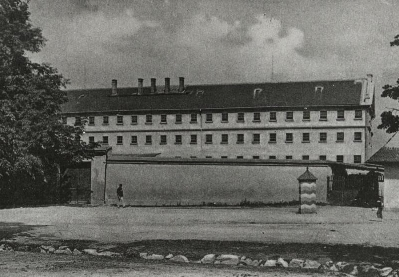

Už krátko po vzniku samostatného štátu, 24. marca 1939, vydáva vláda nariadenie o „zaisťovacom uväznení nepriateľov slovenského štátu“. Za nepriateľov sú označovaní všetci, ktorí by podľa režimu údajne mohli byť „prekážkou v budovaní nového štátu“, teda najmä politickí oponenti – funkcionári rozpustených a zakázaných politických strán aj starí ľudáci nespokojní s novým smerovaním strany, bývalí československí legionári, ale tiež ktokoľvek, kto si na ulici či v krčme dovolil verejnú kritiku štátu, jeho predstaviteľov či spojencov. 

O zaistení v Ilave, kde bol tento tábor zriadený v časti starej väznice, nerozhodoval súd, ale orgány ministerstva vnútra. Obídením súdneho systému väzňom nebolo treba dokazovať vinu, nevedeli, na ako dlho sú zavretí, a nemali sa ani voči čomu a kam odvolať. V rokoch 1939 – 1944 sa do Ilavy dostalo asi 2500-3000 osôb. 

