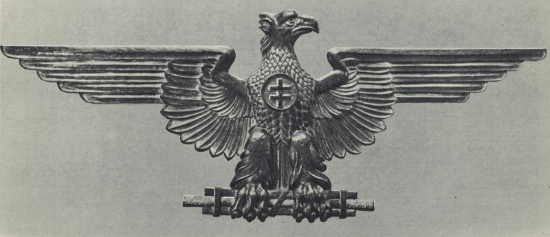

From the declaration of independence in March until the adoption of the constitution, the official name of the country was the “Slovak State”. The 21 July Constitution adopted the name "The Slovak Republic". The phrase "res public" (public affair) implied the political character of a republican establishment, assuming legal rivalry of political powers. The name "Slovak State", however, remained more popular. It was also preferred by the populists, who were proud of having proclaimed an independent state.  

Even nowadays, some writers prefer the name "The First Slovak Republic", emphasising its historical importance and making a direct connection between that state and the contemporary Slovak Republic.

According to international law, between 1918 and 1992 the territory of Slovakia was part of the Czechoslovak Republic and the first independent Slovak Republic was founded in 1993. It inherited borders and international guarantees from Czechoslovakia, a member state of the anti-Hitler coalition. The wartime ‘Slovak State‘ is thus not recognised as a legitimate country. In a similar way, the French do not count Vichy France as an official republic.

