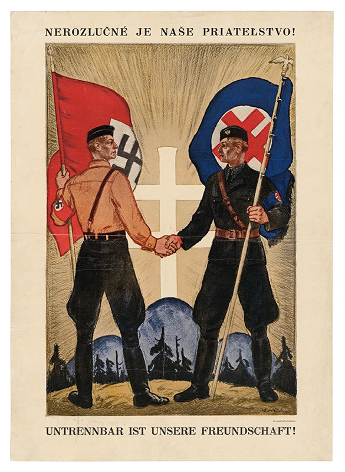

In addition to the legislative diet and the government with eight ministries, the Slovak Constitution also created a new governing body, the State Council of the Slovak Republic. Although according to the original plans, the State Council was supposed to be one of the most important constitutional bodies, the "Upper Chamber" of the Parliament with controlling powers, in the end it functioned more as an advisory body, not binding in any sense.

The members of the State Council were the representatives of political, economic, cultural and clerical elites. They were not elected but appointed - partly by the president, partly by the HSPP - and the representatives of the German minority party, Deutsche Partei, were also included.

