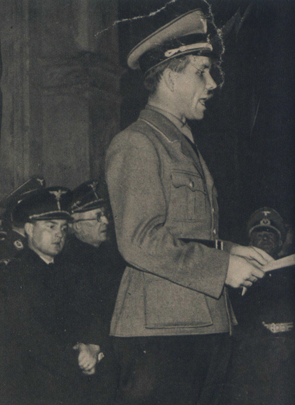
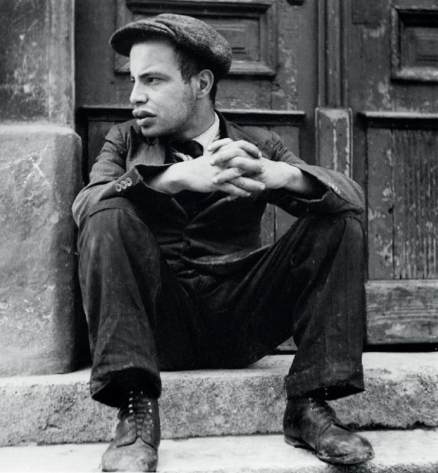
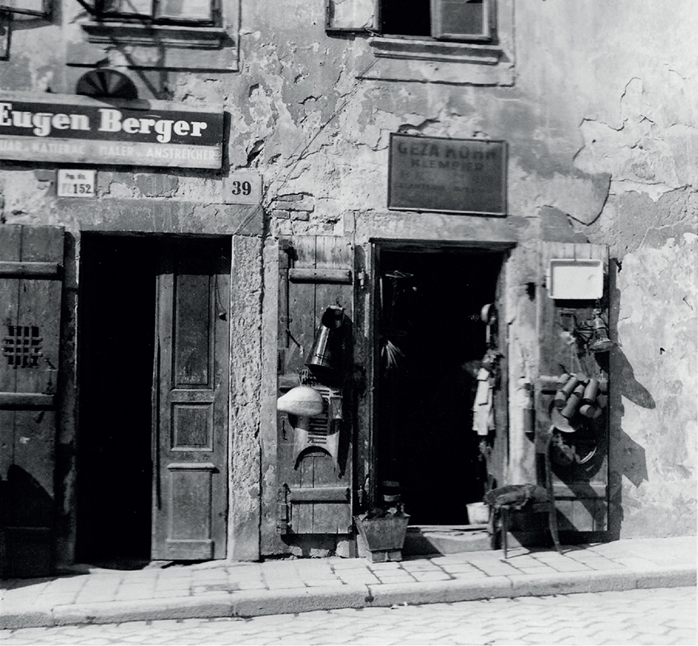
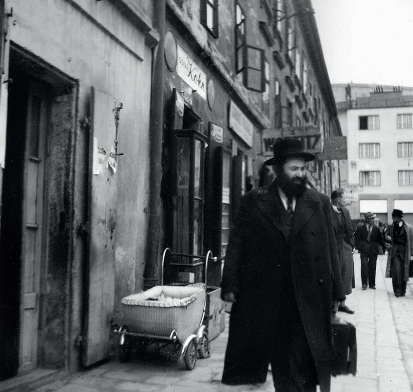
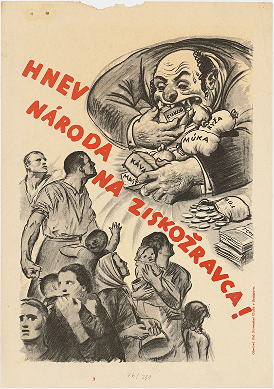
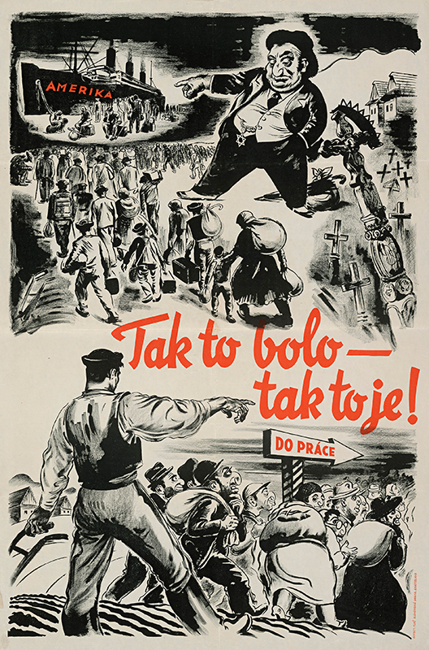
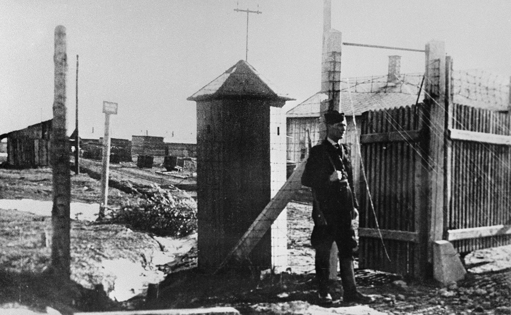
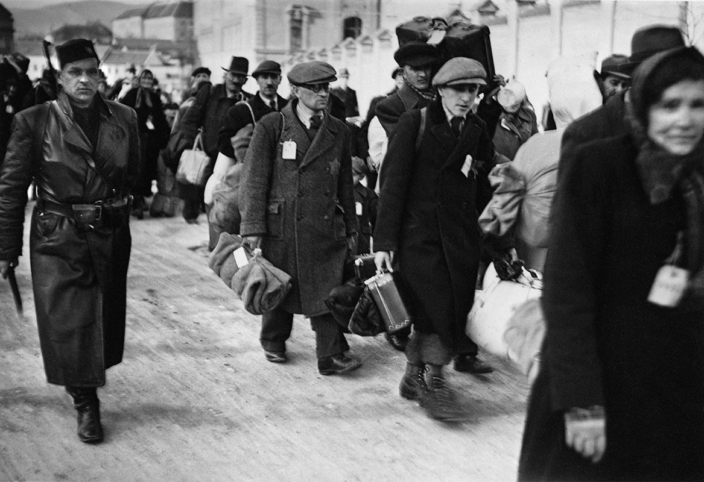
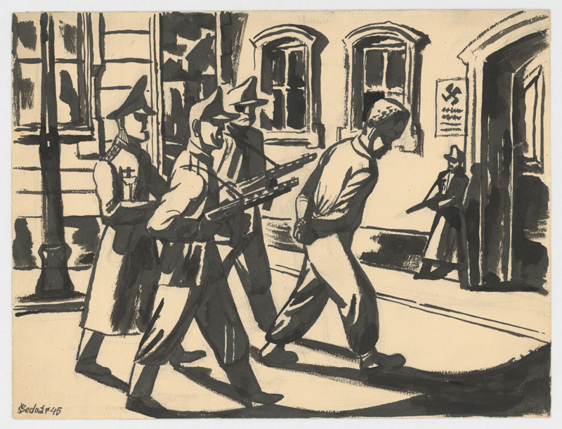
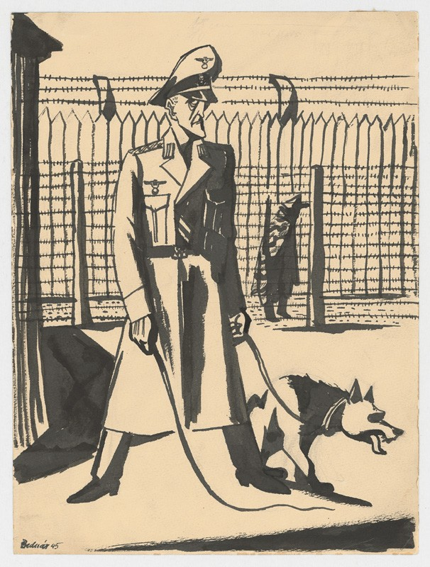

## National Minorities in the Slovak State

The territory of Slovakia has been inhabited by various ethnicities during all of recorded history. When the HSPP gained power in the autumn of 1938, their ideas about the role and the rights of minorities were vastly different from the status quo.

The German minority, for obvious reasons, was granted a privileged position by the regime, including those people who "discovered" their German heritage only after the Munich Agreement. Germans who lived in Slovakia were represented by their own political party (Deutsche Partei) with a paramilitary force, they were represented in the Diet and the State Council, and they also established their own State Secretariat for German Minority Affairs. The post of state secretary was, unsurprisingly, filled by Ing. Franz Karmasin of the Deutsche Partei.

The Hungarian minority was also forced to consolidate their political activities under one party. Despite the reluctance of the Slovak nationalists, some Hungarian schools, cultural, youth and sports associations remained active. The Third Reich was not interested in escalating the Slovak-Hungarian conflicts. Any mentions of the Slovak territorial claims for the occupied South could only be implied indirectly.

Despite the fact that the Czech minority was the third largest in the state, they lacked even a symbolic political representation. They could not assemble under any circumstances and faced attacks from the press as well as constant threats of forced deportation.

The populists treated the Ruthenians and Ukrainians living in Slovakia with some reservation. The efforts of Ruthenian representatives for their own political party were crushed from the beginning, but other than that there was no clear policy towards them. The situation was made even more difficult by the fact that there was no broader consensus about political representation. The mutual accusations about Slovakisation or Magyarisation continued to persist, as well as attempts to influence the standing of the Greek Orthodox Church. One of the results of these internal conflicts was coopting of two representatives from the districts with significant Ruthenian population.

The Romanis found themselves in a very specific situation. In the past, the Roma people in Slovakia supported themselves by traditional crafts, horse trade and their own skills (music) and continued their nomadic way of life. However, due to population growth as well as the increasing industrialization, the opportunities for livelihood as a blacksmith, travelling salesman or musician were few and far between.



The target of the strongest persecution was the Jewish minority. The populist regime started persecuting them during the days of autonomy and shortly after the creation of the independent state, Jews became number one target of hostile government regulations.

---

## The History of Jews in Slovakia

Historical sources show Jewish presence in Slovakia since the Middle Ages, but the Jewish community has only been established here by the Jews in Moravia, Austria and Galicia that moved to Slovakia in the 17th and 18th centuries. At the end of the 18th century, thanks to the reforms of Joseph II., they gained access to secular education and several vocations. They won the right to settle in towns (with exception of mining towns) and the right to own land only in 1840.

This meant that during the 1840s, Jewish population migrated into towns and cities, where they found employment as tradesmen. In 1860, they gained complete freedom of movement and various economic rights, including residing and working in previously forbidden territories such as Spiš. In 1867, they gained complete civil emancipation.

The Jewish community was diverse, including various religious affiliations, with different education and political opinions, speaking various languages (German, Hungarian, Slovak and Yiddish). Both individually and collectively, they faced antisemitism in various forms - religious - since they were accused of being "murderers of Christ" - as well as nationalistic and economic - based on the accusation that they were unfair competition for non-Jewish businesses.

In the 1930s, after the Nazis gained power in Germany, antisemitism was on the rise in Czechoslovakia too, inflamed by several right-wing parties.

---

## Jewish Codex
### 9. 9. 1941 {.title-date}

In April 1939, the legislation of the Slovak State introduced the term "Jew" and subsequently restricted "Jews" in their economic and social lives. Government trustees and temporary administrators were appointed into companies owned by Jews, the state withdrew thousands of business licences and restricted the number of Jews that could works as lawyers, doctors, pharmacists or journalists. In the spring of 1940, the Diet of the Slovak Republic adopted new laws on expropriation and transfer of Jewish agricultural and business property into ownership of non-Jews (Aryanisation).

The major breakthrough in the so-called "Final Solution to the Jewish Question" happened in Slovakia after the Salzburg Negotiations at the end of July 1940. The republic was then even more closely tied to Germany and the radical wing of the HSPP cemented its position in the government. In September, the government set up the Central Economic Office, which was supposed to speed up aryanisation, with the exception of agricultural property that was handled by the Land Office.

Within one year, the Central Economic Office liquidated more than 10,000 companies owned by Jewish citizens and a further 2,200 were aryanised by the Slovaks, Germans and Ruthenians.

 
Bank accounts, objects made from precious metals and other valuables owned by Jews were blocked and their houses and apartments managed by the state-appointed temporary administrators. Since they could not find employment because of government regulations, the majority of Jewish population in Slovakia lost the ability to support themselves.

Basic human rights were also denied to the Jewish population - they were prohibited from residing in central parts of the city, visiting public parks, cinemas or swimming pools or even shopping at the markets during certain times.

In September 1941, the government ratified the Regulation on the Legal Status of Jews: the Jewish Codex. It summarised all the previously existing anti-Semitic legislation and redefined the term "Jew".

The Slovak politicians boasted that the Codex was even more severe than the Nazis' Nuremberg Laws.

From September 1941, all Jews had to wear a visible yellow badge in the form of a Star of David.

[")](http://www.webumenia.sk/dielo/SVK:TMP.268?collection=86)

The Codex allowed the president to grant exemptions from the anti-Semitic measures to individuals. Tiso, until the end of his tenure, granted about 1100 exemptions, costing the grantees significant sums of money. In July 1942, Christian families, attempting to save children from deportation, were prohibited by law from adopting Jewish children.



---

## Deportations of the Slovak Jews
### 25. 3. 1942 {.title-date}

As a consequence of the anti-Semitic legislation, the vast majority of the Jews were unable to survive without social welfare system by the end of 1941. The solution was supposed to be the creation of [labour camps](http://www.minv.sk/?ZPT) where they could produce scarce goods. These camps were at first built in Nováky and [Sereď](http://www.muzeum.sk/?obj=muzeum&ix=mhol_mzk_snm), later in Vyhne. It soon became clear that the construction of these camps was costly and time-consuming.   

Therefore, at the start of 1942 Slovak representatives made an agreement with the Germans to deport tens of thousands of Jews to German-occupied territories in present-day Poland. Deportations to the concentration and labour camps began on 25 March 1942 and lasted for seven months. More than 57,700 Slovak Jews were "resettled" and "deployed for work" during that time. Between 6000 and 7000 Jewish citizens managed to escape from Slovakia, most of them heading for Hungary.

The Slovak Government paid the Nazis for the deportations - the settlement charge for each Jew was 500 Reichsmarks.

Already in the summer of 1941, word of the mass murder of Jews by the Germans was circulating in Slovakia, thanks to [soldiers from the Eastern Front](http://www.webumenia.sk/dielo/SVK:TMP.319). The Nazis were murdering Soviet Jews irrespective of their age or gender. Neither this news, nor warnings from the Vatican that the deportations may end deadly, deterred the Slovak Government from carrying on.

**Staged Photography of the Jewish Population in Labour Camps**
{% include 'partials/carousel.html.twig' with {
    'images': [
        {
            'title':'Inmate Dalma',
            'src': 'http://www.webumenia.sk/images/diela/TMP/73/SVK_TMP.244/SVK_TMP.244.jpeg',
            'href': 'http://www.webumenia.sk/dielo/SVK:TMP.244?collection=86'
        },
        {
            'title':'In Their New Home in the East',
         'src': 'http://www.webumenia.sk/images/diela/TMP/46/SVK_TMP.238/SVK_TMP.238.jpeg',
            'href': 'http://www.webumenia.sk/dielo/SVK:TMP.238?collection=86'
        },
        {
            'title':'A Group of Boys',
            'src': 'http://www.webumenia.sk/images/diela/TMP/70/SVK_TMP.241/SVK_TMP.241.jpeg',
            'href': 'http://www.webumenia.sk/dielo/SVK:TMP.241?collection=86'
        },
        {
            'title':'Working Inmates in a Sewing Shop',
            'src': 'http://www.webumenia.sk/images/diela/TMP/71/SVK_TMP.242/SVK_TMP.242.jpeg',
            'href': 'http://www.webumenia.sk/dielo/SVK:TMP.242?collection=86'
        }
    ]
}%}

Later, in the summer of 1942, news of the murder of the deported Jews in ghettos, concentration and extermination camps reached Slovakia. The deportations however did not stop until October of that year. Although the Minister of Interior Alexander Mach declared in February 1943 that the deportations would continue, they did not because of the changed social atmosphere. There was a tangibly negative response from clerics and ordinary citizens, even the ones who had previously witnessed the aryanisation and drastic deportations of their neighbours. The changing situation on the front also played a role. After the Stalingrad defeat, some people started to fear for their future.  

{% include 'partials/subobjects.html.twig' with {
    'title': 'Learn More',
    'subobjects': [
        {
            'name':'Holocaust',
            'thumbnail': page.media['SVK_SNG.O_977.jpg'],
            'href': '3/holokaust'
        },
        {
            'name':"Jozef Tiso's Speech from August 1942",
            'thumbnail': page.media['1.jpg'],
            'href': '3/tiso-prihovor'
        },
        {
            'name':'The Auschwitz Protocols',
            'thumbnail': page.media['SVK_SNG.K_2311thumbFINAL.jpg'],
            'href': '3/sprava-osviencim'
        }
    ]
}%}

---

## The Final Chapter of the Holocaust in Slovakia

Since August 29th, 1944, the country was occupied by German forces and the Slovak National Uprising began. The Germans demanded unconditional removal of all Jews from Slovakia. In this new wave of deportations, from September 1944 until March 1945, a further 13,500 people were deported from Slovakia. Under the German occupation, all exemptions were cancelled and the only way for a Jew to survive was with the help of non-Jewish population willing to risk their lives by helping.

**Drawings from the Arbeit Macht Frei Album**
{% include 'partials/carousel.html.twig' with {
    'images': [
        {
            'title':'Cover of the Arbeit Macht Frei Album',
            'src': 'http://www.webumenia.sk/images/diela/TMP/78/SVK_TMP.249/SVK_TMP.249.jpeg',
            'href': 'http://www.webumenia.sk/dielo/SVK:TMP.249?collection=86'
        },
     {
            'title':'First Strike',
         'src': 'http://www.webumenia.sk/images/diela/TMP/0/SVK_TMP.250/SVK_TMP.250.jpeg',
            'href': 'http://www.webumenia.sk/dielo/SVK:TMP.250?collection=86'
        },
     {
            'title':'Together',
         'src': 'http://www.webumenia.sk/images/diela/TMP/1/SVK_TMP.251/SVK_TMP.251.jpeg',
            'href': 'http://www.webumenia.sk/dielo/SVK:TMP.251?collection=86'
            },
     {
            'title':'Arrow Cross Help',
         'src': 'http://www.webumenia.sk/images/diela/TMP/2/SVK_TMP.252/SVK_TMP.252.jpeg',
            'href': 'http://www.webumenia.sk/dielo/SVK:TMP.252?collection=86'
            },
     {
            'title':'In a Wagon',
         'src': 'http://www.webumenia.sk/images/diela/TMP/3/SVK_TMP.253/SVK_TMP.253.jpeg',
            'href': 'http://www.webumenia.sk/dielo/SVK:TMP.253?collection=86'
            },
     {
            'title':"Get Out!",
         'src': 'http://www.webumenia.sk/images/diela/TMP/4/SVK_TMP.254/SVK_TMP.254.jpeg',
            'href': 'http://www.webumenia.sk/dielo/SVK:TMP.254?collection=86'
            },
     {
            'title':'Liberating Gas',
         'src': 'http://www.webumenia.sk/images/diela/TMP/5/SVK_TMP.255/SVK_TMP.255.jpeg',
            'href': 'http://www.webumenia.sk/dielo/SVK:TMP.255?collection=86'
            },
     {
            'title':'In a Barrack',
         'src': 'http://www.webumenia.sk/images/diela/TMP/6/SVK_TMP.256/SVK_TMP.256.jpeg',
            'href': 'http://www.webumenia.sk/dielo/SVK:TMP.256?collection=86'
            },
     {
            'title':"Appel!",
         'src': 'http://www.webumenia.sk/images/diela/TMP/7/SVK_TMP.257/SVK_TMP.257.jpeg',
            'href': 'http://www.webumenia.sk/dielo/SVK:TMP.257?collection=86'
            },
     {
            'title':"Work!",
         'src': 'http://www.webumenia.sk/images/diela/TMP/8/SVK_TMP.258/SVK_TMP.258.jpeg',
            'href': 'http://www.webumenia.sk/dielo/SVK:TMP.258?collection=86'
            },
     {
            'title':'Small Clearing',
         'src': 'http://www.webumenia.sk/images/diela/TMP/9/SVK_TMP.259/SVK_TMP.259.jpeg',
            'href': 'http://www.webumenia.sk/dielo/SVK:TMP.259?collection=86'
            },
     {
            'title':'On the Wire',
         'src': 'http://www.webumenia.sk/images/diela/TMP/31/SVK_TMP.260/SVK_TMP.260.jpeg',
            'href': 'http://www.webumenia.sk/dielo/SVK:TMP.260?collection=86'
            },
     {
            'title':'Warsaw',
         'src': 'http://www.webumenia.sk/images/diela/TMP/32/SVK_TMP.261/SVK_TMP.261.jpeg',
            'href': 'http://www.webumenia.sk/dielo/SVK:TMP.261?collection=86'
            },
     {
            'title':'Respect for the Partisans',
         'src': 'http://www.webumenia.sk/images/diela/TMP/33/SVK_TMP.262/SVK_TMP.262.jpeg',
            'href': 'http://www.webumenia.sk/dielo/SVK:TMP.262?collection=86'
            },
     {
            'title':'Together Again',
         'src': 'http://www.webumenia.sk/images/diela/TMP/34/SVK_TMP.263/SVK_TMP.263.jpeg',
            'href': 'http://www.webumenia.sk/dielo/SVK:TMP.263?collection=86'
            },
     {
            'title':'Evacuation',
         'src': 'http://www.webumenia.sk/images/diela/TMP/35/SVK_TMP.264/SVK_TMP.264.jpeg',
            'href': 'http://www.webumenia.sk/dielo/SVK:TMP.264?collection=86'
        }
    ]
}%}

The former Jewish labour camp in Sereď started functioning as a concentration camp under the leadership of Alois Brunner, an SS officer who spent years "solving issues" connected with Jewish deportations. He was also known by the name "Jew Hunter". Under his leadership, 11 more transports left Sereď. They headed to Auschwitz-Birkenau, Theresienstadt, Sachsenhausen and Ravensbrück. Several transports were also dispatched from various other Slovak cities.

During the occupation, approximately 1000 Jews were murdered by the German commandos and shock troopers of the Hlinka Guard. After defeating the Slovak National Uprising militarily, the Nazi forces together with their Slovak collaborators escalated the brutality of the attacks. Elimination of the Jewish population was one of their top priorities. Members of the Uprising, Romani people and individuals suspected of supporting the resistance were also arrested, deported or murdered.

102 villages were burned down in retaliation for the Uprising, and the majority of the executed people were unsurprisingly Jewish.

The most significant locations of mass executions are Kremnička and Nemecká, the Jewish cemetery in Zvolen and the field „Krtičná“ near Brezno. The number of Slovak Jews fallen victim to the Holocaust is approximately 70,000.

**All artworks in this chapter can also be found in the collection on Web umenia: [70,000 Victims](http://www.webumenia.sk/kolekcia/86 "70,000 Victims")**
