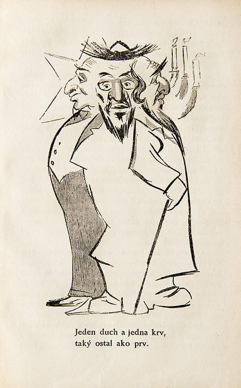

Pojem „Žid“ je v právnom poriadku slovenského štátu po prvýkrát definovaný v apríli roku 1939, vo vládnom nariadení č. 63/1939 Sl.z. . Vymedzenie pojmu potom ľudáci definujú nanovo v tzv. Židovskom kódexe v septembri 1941. Tentoraz už podľa rasových princípov. 

#### Kódex určil, že:

Za Žida podľa tohto nariadenia sa bez ohľadu na pohlavie pokladá:

a.) kto pochádza najmenej od troch podľa rasy židovských starých rodičov;

b.) židovský miešanec, ktorý pochádza od dvoch podľa rasy židovských starých rodičov [§ 2, písm. a)], ak 
- dňa 20. apríla 1939 bol alebo po tomto dni sa stal príslušníkom izraelitského (židovského) vyznania,  
- po 20. apríli 1939 vstúpil do manželstva so Židom [písm. a)], 
- pochádza z manželstva so Židom [písm. a)], uzavretého po 20. apríli 1939, 
- pochádza z nemanželského styku so Židom [písm. a)] a narodil sa ako nemanželské dieťa po 20. februári 1940. 

