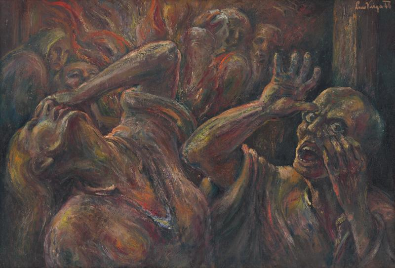

Holocaust (from the Greek 'holokauston' meaning 'sacrifice by fire') is a common term for the systematic, bureaucratic, state-sponsored persecution and murder of six million Jews by the Nazi regime and its collaborators. The victims of the Nazi genocide also included other groups considered subhuman by this ideology - mentally and physically disabled people, homosexuals,[Romani](http://senxskutocnost.sng.sk/chapters/3-70000-obeti/romovia) as well as millions of Slavic people.

**Viliam Malík - From the Repatriates Series**
{% include 'partials/carousel.html.twig' with {
	'images': [
    	{
        	'src': 'http://www.webumenia.sk/images/diela/TMP/77/SVK_TMP.248/SVK_TMP.248.jpeg',
        	'href': 'http://www.webumenia.sk/dielo/SVK:TMP.248?collection=86'
    	},
   	 {
   		 'src': 'http://www.webumenia.sk/images/diela/TMP/75/SVK_TMP.246/SVK_TMP.246.jpeg',
        	'href': 'http://www.webumenia.sk/dielo/SVK:TMP.246?collection=86'
    	},
   	 {
   		 'src': 'http://www.webumenia.sk/images/diela/TMP/76/SVK_TMP.247/SVK_TMP.247.jpeg',
        	'href': 'http://www.webumenia.sk/dielo/SVK:TMP.247?collection=86'
    	}
	]
}%}

(Source: [Introduction To Holocaust](https://www.ushmm.org/wlc/en/article.php?ModuleId=10005143), United States Holocaust Memorial Museum)