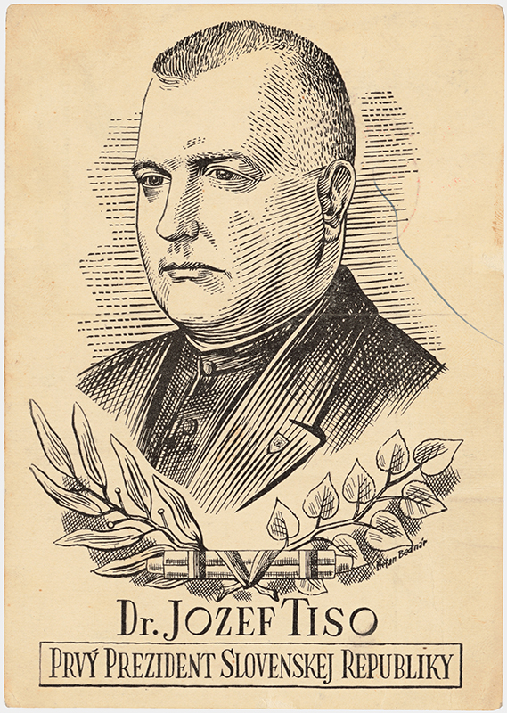

„(...) I would like to talk about one more often mentioned question, namely the Jewish question. People ask if what is happening now is Christian. Is it humane? Is it not just looting? But I ask: Is it not Christian when the Slovak nation wants to defeat an eternal enemy, the Jew? Is that not Christian? Loving thyself is a commandment of God, and that love commands me to remove everything that harms me, that threatens my life. And for the Slovak people, the Jewish element has always been such a threat, a threat to our life, and I don't think I need to convince anyone of that fact.(...)“
  J. Tiso at a harvest festival in Holíč in August 1942

„(...) This needs to be spread and publicised, because there are many negative opinions among people against this action. The people are not sufficiently informed. I would like to ask to have booklets printed(...) The Jews tried to elicit sympathy and pity. People hid them because apparently what was done to the Jews was inhumane. The Jews thought that every Jew that left, God knows what happened to him. They don't know the good that is done in the camps.(...)“
  Bishop J. Vojtaššák at the meeting of the State Council, 3 February 1943.
