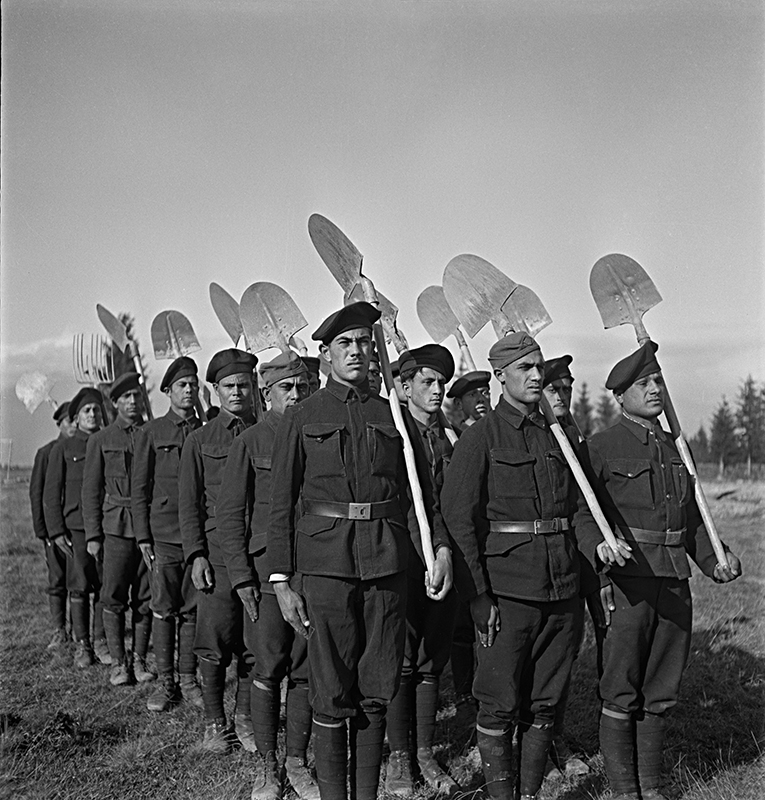

After the creation of the state, the regime started persecuting the Romanis, which it described as "Gypsies", initially focusing on travelling communities that had no permanent residence.

 Already in 1939 the regime denied citizenship to such Romani people. From January 1940 the Romani could not be members of armed forces and instead had to complete their military service in labour units. Later, regulations defined "Gypsy" as anyone who has two Gypsy parents, lives a nomadic lifestyle or avoids proper work. In 1941 the authorities abolished travel documents of the Romani population and forced them to return to their "home villages". New regulations allowed Romani wagons to be confiscated and burned. Many Romani groups involuntarily "settled" on the outskirts of cities and villages.

After 1941, labour units for "asocial" individuals were created and "Gypsies without employment" were forcibly included.  

These units were initially temporary or seasonal, but from 1942 they were established as permanent. They were mostly created in Eastern Slovakia in towns such as Hanušovce nad Topľou, Bystré nad Topľou and Nižný Hrabovec. The Romani men made up roughly half of the 3000 prisoners. Further labour units were created in Dubnica nad Váhom, Ilava, Revúca and Ústie nad Oravou. Regardless of location, these units were ruled harshly.

In the autumn of 1944, The Ministry of Defence established an Internment Camp for Gypsies in Dubnica, where whole Romani families were imprisoned. When an epidemic of typhus broke out in the camp in the winter of 1944/45 because of the appalling hygienic conditions, the sick were massacred by German soldiers.  

From September 1944, the mass murder of the Romani population also spread to other parts of Slovakia. In September, Romanis in Kvetnica were murdered, then Romanis in Tisovec, Čierny Balog, Kremnička, Nemecká, Zvolen and many [other places](http://www.romaholocaust.sk/sk/).