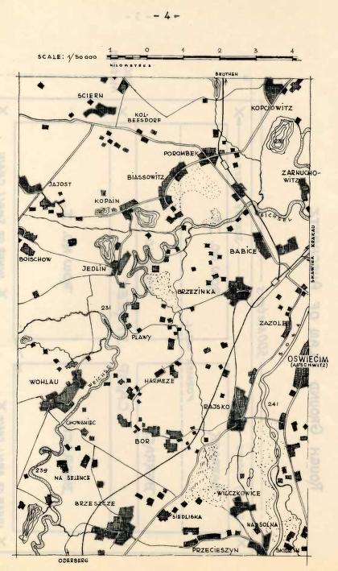
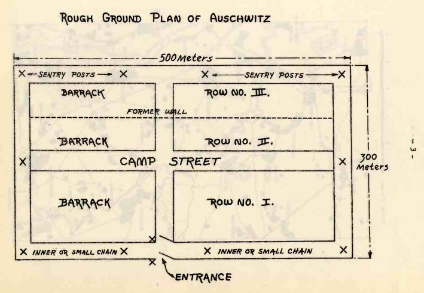
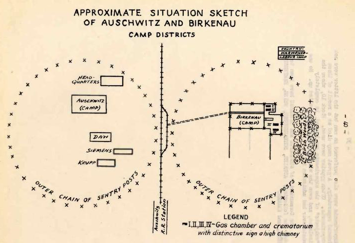

Alfred Wetzler and Rudolf Vrba were two Slovak Jews, who managed to escape from the Auschwitz-Birkenau Camp in April 1944 and inform others about the workings of the camp.  

Excerpt from the Report: 
„(...) The gassing takes place as follows: The unfortunate victims are brought into hall B where they are told to undress. To complete the fiction that they are going to bathe, each person receives a towel and a small piece of soap issued by two men clad in white coats. They are then crowded into the gas chamber in such numbers that there is, of course, only standing room. To compress this crowd into the narrow space, shots are often fired to induce those already at the far end to huddle still closer together.

When everybody is inside, the heavy doors are closed. Then there is a short pause, presumably to allow the room temperature to rise to a certain level, after which 55 men with gas masks climb on the roof, open the traps, and shake down a powder out of tin cans labeled "Zyklon" and "For use against vermin," which is manufactured by a Hamburg concern. It is presumed that this is a "cyanide" mixture of some sort which turns into gas at a certain temperature. After three minutes everyone in the chamber is dead. No one is known to have survived this ordeal, although it was not uncommon to discover signs of life after the primitive measures employed in the Birch Wood. The chamber is then opened, aired, and the "special squad" carts the bodies on flat trucks to the furnace rooms where the burning takes place(...).“

**Vrba Wetzler Memorial** 
[Project Vrba Wetzler Memorial](http://www.vrbawetzler.eu/) is a memorial walk from Auschwitz to Žilina dedicated to Rudolf Vrba and Alfréd Wetzler who risked their lives to warn others. 

**Jozef Fedora: Drawings from a Concentration Camp (1944—1945):**
{% include 'partials/carousel.html.twig' with {
    'images': [
        {
        'title':'Suffering in the Concentration Camp',
            'src': 'http://www.webumenia.sk/images/diela/SNG/83/SVK_SNG.K_2311/SVK_SNG.K_2311.jpeg',
            'href': 'http://www.webumenia.sk/dielo/SVK:SNG.K_2311?collection=86'
        },
     {
        'title':'Man Sitting on a Wooden Bench',
         'src': 'http://www.webumenia.sk/images/diela/SNG/19/SVK_SNG.K_2333/SVK_SNG.K_2333.jpeg',
            'href': 'http://www.webumenia.sk/dielo/SVK:SNG.K_2333?collection=86'
        },
        {
        'title':'On the Floor of the Camp',
         'src': 'http://www.webumenia.sk/images/diela/SNG/76/SVK_SNG.K_2318/SVK_SNG.K_2318.jpeg',
            'href': 'http://www.webumenia.sk/dielo/SVK:SNG.K_2318?collection=86'
        },
        {
        'title':'Exhausted',
            'src': 'http://www.webumenia.sk/images/diela/SNG/65/SVK_SNG.K_13667/SVK_SNG.K_13667.jpeg',
            'href': 'http://www.webumenia.sk/dielo/SVK:SNG.K_13667?collection=86'
            },
        {
        'title':'Exhausted - Backside (Administrative Ticket)',
            'src': 'http://www.webumenia.sk/images/diela/TMP/38/SVK_TMP.267/SVK_TMP.267.jpeg',
            'href': 'http://www.webumenia.sk/dielo/SVK:TMP.267?collection=86'
            },
        {
        'title':'Two Men Sitting on a Bench in the Camp',
            'src': 'http://www.webumenia.sk/images/diela/SNG/78/SVK_SNG.K_2316/SVK_SNG.K_2316.jpeg',
            'href': 'http://www.webumenia.sk/dielo/SVK:SNG.K_2316?collection=86'
                },
        {
        'title':'The Cell of the Concentration Camp',
            'src': 'http://www.webumenia.sk/images/diela/SNG/88/SVK_SNG.K_2299/SVK_SNG.K_2299.jpeg',
            'href': 'http://www.webumenia.sk/dielo/SVK:SNG.K_2299?collection=86'
                },
        {
        'title':'Wooden Bunks in the Concentration Camp',
            'src': 'http://www.webumenia.sk/images/diela/SNG/20/SVK_SNG.K_2332/SVK_SNG.K_2332.jpeg',
            'href': 'http://www.webumenia.sk/dielo/SVK:SNG.K_2332?collection=86'
                        },
        {
        'title':"Man's Head from the Concentration Camp",
            'src': 'http://www.webumenia.sk/images/diela/SNG/80/SVK_SNG.K_2314/SVK_SNG.K_2314.jpeg',
            'href': 'http://www.webumenia.sk/dielo/SVK:SNG.K_2314?collection=86'
                        },
        {
        'title':'In a Bunk',
            'src': 'http://www.webumenia.sk/images/diela/SNG/53/SVK_SNG.K_2320/SVK_SNG.K_2320.jpeg',
            'href': 'http://www.webumenia.sk/dielo/SVK:SNG.K_2320?collection=86'
                },
        {
        'title':'Dead Behind Barbed Wire in the Concentration Camp',
            'src': 'http://www.webumenia.sk/images/diela/SNG/10/SVK_SNG.K_2305/SVK_SNG.K_2305.jpeg',
            'href': 'http://www.webumenia.sk/dielo/SVK:SNG.K_2305?collection=86'
                },
        {
        'title':'Memories of Home',
            'src': 'http://www.webumenia.sk/images/diela/SNG/7/SVK_SNG.K_2308/SVK_SNG.K_2308.jpeg',
            'href': 'http://www.webumenia.sk/dielo/SVK:SNG.K_2308?collection=86'
        },
                {
        'title':'Memories of Home - Backside (Administrative Ticket)',
            'src': 'http://www.webumenia.sk/images/diela/TMP/37/SVK_TMP.266/SVK_TMP.266.jpeg',
            'href': 'http://www.webumenia.sk/dielo/SVK:TMP.266?collection=86'
        }
    ]
}%}