## Turning Tides and the Crisis of the Populist Regime

F rom the beginning of 1943 the situation on the Eastern Front started to deteriorate for the Third Reich and its allies. After months of fighting, the Battle of Stalingrad saw the defeat of Nazi forces.

[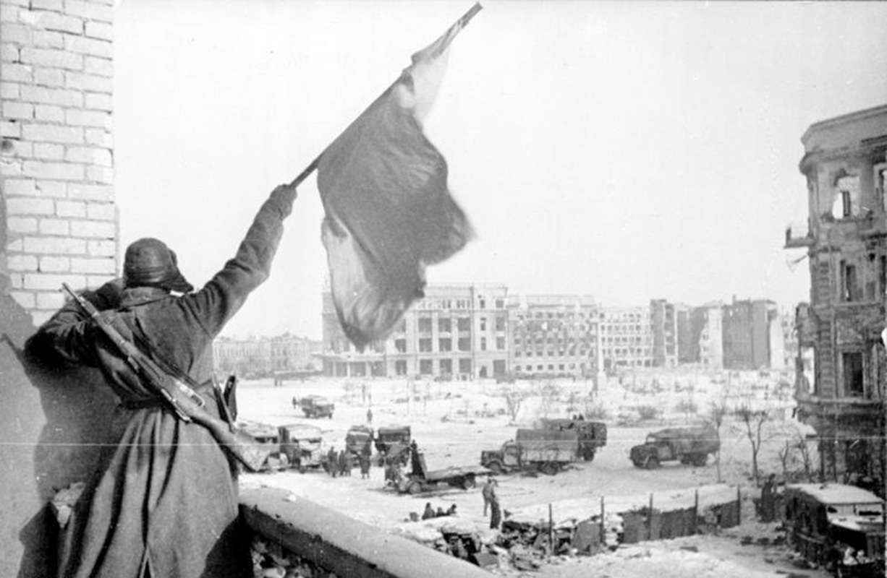](https://upload.wikimedia.org/wikipedia/commons/2/29/Bundesarchiv_Bild_183-W0506-316%2C_Russland%2C_Kampf_um_Stalingrad%2C_Siegesflagge.jpg)

Also the Slovak Rapid Brigade began to retreat from the front. In the process, they lost equipment and materials, effectively losing the character of motorised unit. Slovak requests for replenishing their supplies, equipment and horses were answered only by vague promises from the German forces. Desertions of Slovak soldiers to the Soviet side increased dramatically.

**Jozef Cincík - Photographs of the Slovak Army in the East**
{% include 'partials/carousel.html.twig' with {
	'images': [
    	{
        	'title':'Slovak Soldiers During Downtime on the Eastern Front - Merry Discussions with the Commander',
        	'src': 'http://www.webumenia.sk/images/diela/TMP/67/SVK_TMP.275/SVK_TMP.275.jpeg',
        	'href': 'http://www.webumenia.sk/dielo/SVK:TMP.275?collection=88'
    	},
   	 {
        	'title':'Slovak and German Soldiers Having Fun',
   		 'src': 'http://www.webumenia.sk/images/diela/TMP/66/SVK_TMP.274/SVK_TMP.274.jpeg',
        	'href': 'http://www.webumenia.sk/dielo/SVK:TMP.274?collection=88'
    	},
    	{
         	'title':'Murmuring Fields Sing Funeral Dirge For A Fallen Hero',
        	'src': 'http://www.webumenia.sk/images/diela/TMP/68/SVK_TMP.276/SVK_TMP.276.jpeg',
        	'href': 'http://www.webumenia.sk/dielo/SVK:TMP.276?collection=88'
    	},
    	{
        	'title':'From the War with the USSR - Inclining Concrete Mill in Pologi',
        	'src': 'http://www.webumenia.sk/images/diela/TMP/64/SVK_TMP.272/SVK_TMP.272.jpeg',
        	'href': 'http://www.webumenia.sk/dielo/SVK:TMP.272?collection=88'
        	},
    	{
        	'title':'Rapid Brigade Advancement in Ukraine',
        	'src': 'http://www.webumenia.sk/images/diela/TMP/65/SVK_TMP.273/SVK_TMP.273.jpeg',
        	'href': 'http://www.webumenia.sk/dielo/SVK:TMP.273?collection=88'
        	},
	]
}%}

The Minister of National Defence, General Čatloš, sought to withdraw Slovak forces from the Eastern Front and relocate them to other territories under the Reich's control back in spring 1943. The Germans refused his request and the Security Division was moved from Ukraine to Minsk in Belarus at the end of June 1943. Under the pressure from developments at the front, every soldier still able to fight was needed there. The defeat in the Battle of Kursk sealed the fate of the Reich. From that moment onwards, Germany and their allies would only withdraw, which was presented by the Nazi propaganda as "strategical retreat".

[.jpg "Friedrich Zschäckel - The Battle of Kursk - German Soldiers Retreating, June 1943, Bundesarchiv, BArch")](https://upload.wikimedia.org/wikipedia/commons/a/a0/Bundesarchiv_Bild_101III-Zschaeckel-206-35%2C_Schlacht_um_Kursk%2C_Panzer_VI_%28Tiger_I%29.jpg)

In July 1943 the Allied invasion of Sicily began. After some reorganization in August, the Rapid Brigade was renamed 1st Infantry Division and the Security Division became 2nd Infantry Division. Desperate pleas by the Slovak Government to control their own forces were futile. Any suggestions for the divisions to only perform security tasks organised under united command, were perceived by the Germans as a sign of doubt about "the final victory for Germany".

In October 1943, the 2nd Infantry Division was reorganized and moved to Italy. By the end of the month, more than 2,000 members of the 1st Infantry Division were captured near Melitopol in Ukraine, although a number of them voluntarily walked over to the Soviet side. The division continued disintegrating in the coming months until 1 June 1944, when it was renamed and reorganised as labour unit.

Various sources with information about the real situation on the fronts reached Slovakia. Returning soldiers brought home eyewitness accounts about the supposed "successful campaign" and "strategic retreat of the German army".

[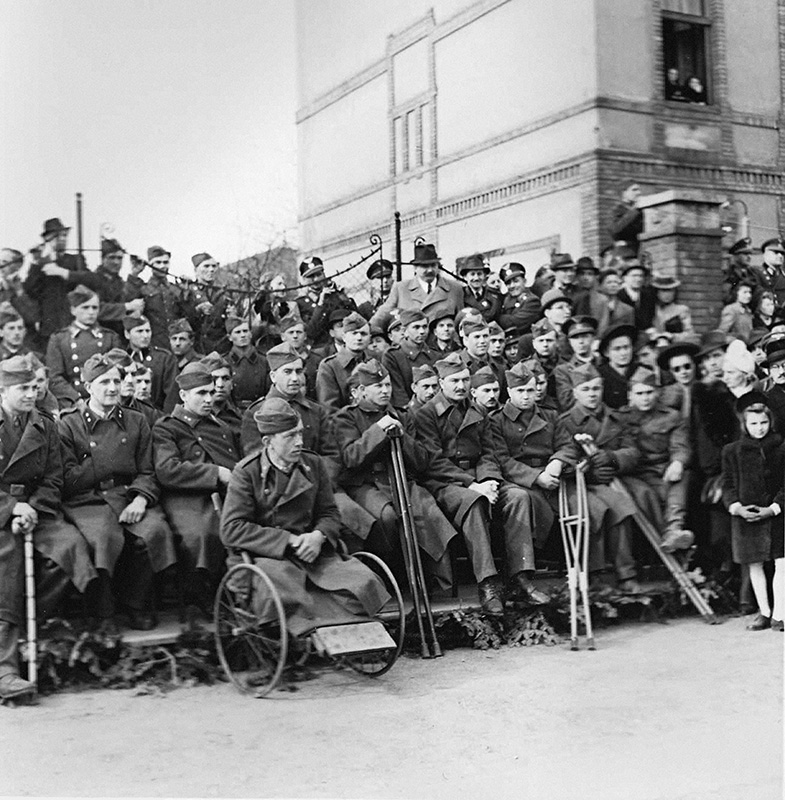](http://www.webumenia.sk/dielo/SVK:TMP.319)

Slovak labourers in Germany had already experienced the air raids on industrial targets first hand. Via London and Moscow radio stations, the Allied representatives repeatedly affirmed their recognition of the [Czechoslovak government-in-exile](https://en.wikipedia.org/wiki/Czechoslovak_government-in-exile). It became widely known that Slovaks were part of the Czechoslovak units stationed in the Soviet Union and Great Britain. The surrender of Italy in September 1943 also resonated in the public consciousness.

By the end of 1943, the populist regime faced a major internal crisis. It was clear that the coming defeat of the Third Reich would signal an end for them too. Many staff members of the security apparatus as well as members of the Slovak Army realized this. The most active and influential was a group of officers surrounding four commanders: Ján Golian, Mikuláš Ferjenčík, Mirko Vesel and Dezider Kišša-Kalina. They wanted to coordinate their insurgency with the leadership in exile - President Edvard Beneš and the Minister of National Defence in London. In February 1944, they sent an optimistic report on unification of resistance to London. President Beneš authorised Ján Golian as the supreme military leader.

The German failures mobilised the previously divided civil resistance in Slovakia and encouraged their cooperation.

The resistance was also supported by a change in opinion of the Communist movement. While before the war, Moscow communists condemned even social democrats as enemies, now they encouraged "national fronts" to unite with all anti-Nazi "bourgeois" forces. By the end of 1943, Slovak communists found a common ground with the representatives of civil resistance surrounding Jozef Lettrich and Ján Ursíny and together they formed the underground Slovak National Council.

Ján Golian was the military leader working on the plan for the uprising. The ideal scenario depended on a deployment of the "Field Army" (composed of 2 divisions) in Eastern Slovakia. These units were supposed to allow the Red Army to cross through the Carpathian passes near Bardejov and Medzilaborce. All other units in Slovakia were supposed to secure Central Slovakia, perform a coup and then contact the Field Army and together with the Soviet forces defeat the Germans. If the Nazi forces would start to occupy Slovakia before this plan was put to action, an emergency plan was in place to start armed resistance immediately, regardless of the state of preparation.

On 16 June 1944, the Apollo Oil Refinery in Bratislava was targeted by an US air raid. "The protective arm of Germany" was simply an empty phrase by then. The war reached the Slovak territory.

[")](http://www.webumenia.sk/dielo/SVK:SNG.UP-DK_4488)

**Pavol Poljak - Bratislava. Apollo Refinery and the Port After the Raid I.- VII.**
{% include 'partials/carousel.html.twig' with {
	'images': [
    	{
        	'title':'I.',
        	'src': 'http://www.webumenia.sk/images/diela/SNG/15/SVK_SNG.UP-DK_2542/SVK_SNG.UP-DK_2542.jpeg',
        	'href': 'http://www.webumenia.sk/dielo/SVK:SNG.UP-DK_2542'
    	},
   	 {
        	'title':'II.',
   		 'src': 'http://www.webumenia.sk/images/diela/SNG/16/SVK_SNG.UP-DK_2543/SVK_SNG.UP-DK_2543.jpeg',
        	'href': 'http://www.webumenia.sk/dielo/SVK:SNG.UP-DK_2543'
    	},
    	{
         	'title':'III.',
        	'src': 'http://www.webumenia.sk/images/diela/SNG/17/SVK_SNG.UP-DK_2544/SVK_SNG.UP-DK_2544.jpeg',
        	'href': 'http://www.webumenia.sk/dielo/SVK:SNG.UP-DK_2544'
    	},
    	{
        	'title':'IV.',
        	'src': 'http://www.webumenia.sk/images/diela/SNG/18/SVK_SNG.UP-DK_2545/SVK_SNG.UP-DK_2545.jpeg',
        	'href': 'http://www.webumenia.sk/dielo/SVK:SNG.UP-DK_2545'
        	},
    	{
        	'title':'V.',
        	'src': 'http://www.webumenia.sk/images/diela/SNG/19/SVK_SNG.UP-DK_2546/SVK_SNG.UP-DK_2546.jpeg',
        	'href': 'http://www.webumenia.sk/dielo/SVK:SNG.UP-DK_2546'
        	},
        	{
          	'title':'VI.',
        	'src': 'http://www.webumenia.sk/images/diela/SNG/20/SVK_SNG.UP-DK_2547/SVK_SNG.UP-DK_2547.jpeg',
        	'href': 'http://www.webumenia.sk/dielo/SVK:SNG.UP-DK_2547'
        	},
    	{
         	'title':'VII.',
        	'src': 'http://www.webumenia.sk/images/diela/SNG/21/SVK_SNG.UP-DK_2548/SVK_SNG.UP-DK_2548.jpeg',
        	'href': 'http://www.webumenia.sk/dielo/SVK:SNG.UP-DK_2548'
    	}
	]
}%}



---

## Slovak National Uprising
### 29. 8. 1944 {.title-date}

[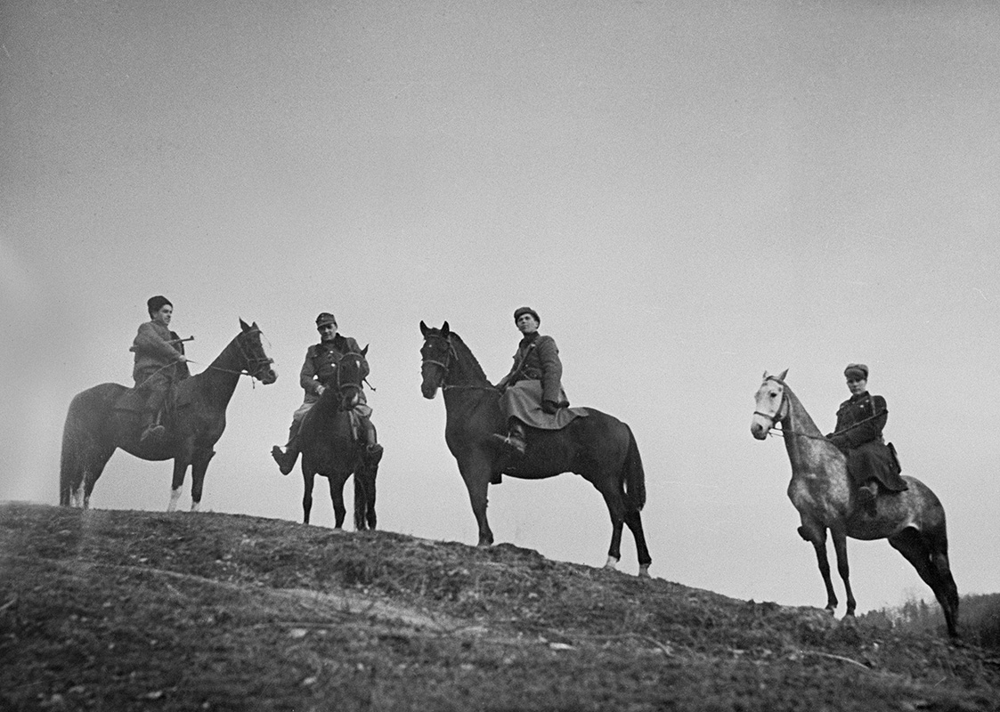](http://www.webumenia.sk/dielo/SVK:TMP.283?collection=88)

One manifestation of spreading opposition sentiments in the Slovak society was the growth of the partisan movement. Among the partisans were the opponents of the regime, persecuted individuals, former soldiers of the Slovak Army as well as soldiers from the Soviet Army who managed to escape from German captivity. The increase of the partisan activities was supported by Soviet airdrops in the summer of 1944.

As late as 6 August, the Deputy Prime Minister Alexander Mach told the Guardsman Newspaper that although there were a "few small foreign groups", they had been "captured or banished" and there was absolutely no need for public concern about "partisan danger here". The government, however, was greatly concerned about the reports of partisan actions, and deployed the army against them on 10 August.

On 11 August 1944, the government declared martial law throughout Slovakia. That allowed them to give stricter sentences, including the death sentence, without a proper trial. The disintegrating regime, however, could not stop the growing partisan movement. By August, there were thousands of partisans in the mountains and their activities were focused on Central Slovakia.

[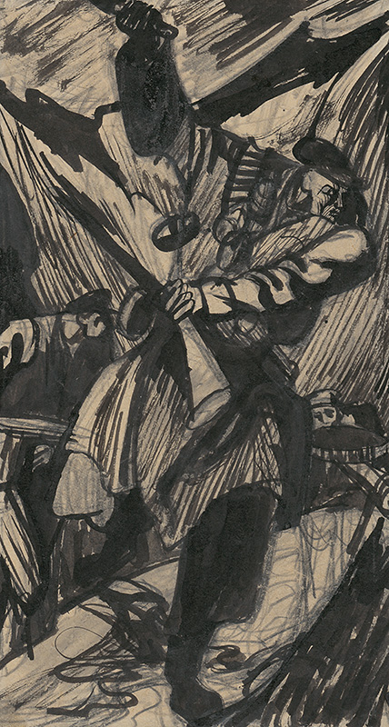](http://www.webumenia.sk/dielo/SVK:SNG.K_4707?collection=88)

The activities of the individual partisan brigades were not yet coordinated with the Military HQ. Partisans led by Soviet officers barred tunnels, looted supply stores and, by the end of the month, did not hesitate to capture several villages. In Sklabiňa, they publicly declared the Czechoslovak Republic on 21 August 1944. Several days later, on 26 August 1944, they liberated political prisoners in Ružomberok and occupied the city.

The resistance reached a boiling point in Central Slovakia. Partisans started openly attacking the civilian population of German nationality, the local populist functionaries as well as German officers. Sometimes, usually under the command of Soviet leaders, soldiers also joined the attacks. On 28 August 1944, a group of captured German soldiers was executed in Martin. The actions of Soviet partisans accelerated the decision of the Third Reich to occupy the Slovak Republic.

Germany, monitoring the partisan activity in Slovakia, decided to act and sent its troops into Slovak territory on 29 August 1944. The resistance was forced to follow the emergency plan and on the same day Ján Golian sent out a coded message to all units to "Begin with evacuation!", which was a call for armed resistance. The next day, the Free Slovak Transmitter in Banská Bystrica also broadcasted the call to mobilisation. Thus, the Slovak National Uprising began.

[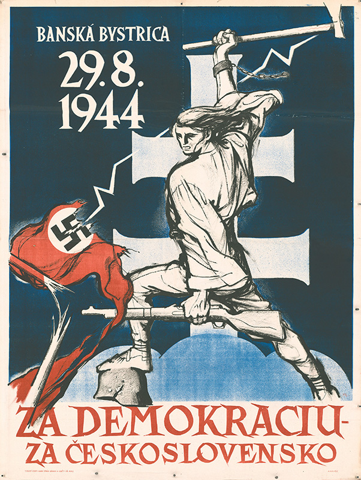](http://www.webumenia.sk/dielo/SVK:TMP.284?collection=88)

The lack of coordination in the resistance soon became apparent and the German forces disarmed two East Slovak divisions as well as the Bratislava unit. The rebels controlled only the area of Central Slovakia with Banská Bystrica as their headquarters. The rebel Slovak National Council prohibited all activities of the HSPP, including the Hlinka Guard and the Hlinka Youth organisations, and also dissolved the German and Hungarian national parties. The Uprising was committed to the idea of a democratic Czechoslovak Republic, and the partisans were part of the Czechoslovak Army.

The rebel army and civilian population were supplied with funds and reserves accumulated in Central Slovakia from June 1944, redirected here under various pretexts by the employees of state organs working for the resistance. One example was the Governor of the Slovak National Bank Imrich Karvaš, who also directed the Highest Supply Authority. Financial support was provided by Baťa factories and some other companies. Significant contributions were also made by large estates and companies in the liberated territory, such as Podbrezová Iron Works and ŽOS Zvolen, who made three armoured trains for the rebels.

[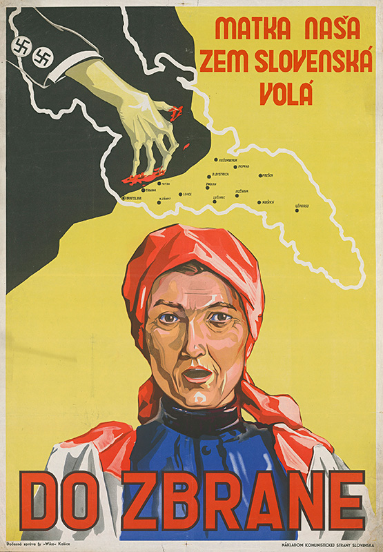](http://www.webumenia.sk/dielo/SVK:TMP.282?collection=88)

The First Czechoslovak Army in Slovakia initially comprised roughly 18,000 soldiers. After the mobilisation on 5 September, this number reached almost 50,000. However, they were badly equipped and the equipment they had was often outdated. On top of that, they lacked combat experience. The first commander in this uneasy situation was General Ján Golian, one of the creators of the rebel military plan of action.

The German units attacked the liberated territory from several directions. There were 9,000 soldiers deployed in the West and a further 15,000 in the East. They were often supported by local German citizens. The insurgent army and partisans managed to deflect the Nazi attacks, but nevertheless suffered substantial losses. The Germans failed despite their own expectations of lightning-fast success.

Fighting alongside the Slovaks and Czechs in the Slovak National Uprising were members of 30 other nations, as well as paratroopers from the Allied forces and fugitives from prisons and concentration camps.

 
On 6 October 1944, General Rudolf Viest flew in and became the official commander of the Uprising. Although the rebel defences were strengthened in September, they were not able to stop the German forces. The 2nd Czechoslovak Airborne Brigade and 1st Czechoslovak Fighter Regiment were sent as help from the USSR. USA also sent material aid.

{% include 'partials/carousel.html.twig' with {
	'images': [
    	{
        	'title':'Štefan Bednár - Death to Nazism!',
        	'src': 'http://www.webumenia.sk/images/diela/TMP/98/SVK_TMP.285/SVK_TMP.285.jpeg',
        	'href': 'http://www.webumenia.sk/dielo/SVK:TMP.285?collection=88'
    	},
   	 {
        	'title':'Štefan Bednár - Banská Bystrica',
   		 'src': 'http://www.webumenia.sk/images/diela/SNG/49/SVK_SNG.G_1851/SVK_SNG.G_1851.jpeg',
        	'href': 'http://www.webumenia.sk/dielo/SVK:SNG.G_1851?collection=88'
    	},
    	{
         	'title':'Štefan Bednár - „Pass“',
        	'src': 'http://www.webumenia.sk/images/diela/TMP/43/SVK_TMP.316/SVK_TMP.316.jpeg',
        	'href': 'http://www.webumenia.sk/dielo/SVK:TMP.316?collection=88'
    	},
	]
}%}

The odds were stacked against the rebels. In October, the German occupying forces started a general offensive and the rebels succumbed to the pressure. On 27 October 1944, General Viest ordered a retreat from Banská Bystrica to Donovaly and shortly thereafter dissolved the rebel army, which joined the partisan groups to escape capture and continue the guerrilla warfare.

In early November 1944, Nazi Einsatzkommando 14 captured the rebel commanders Rudolf Viest, Ján Golian and their entourage.

<figure class="audio" markdown="1">

<figcaption><a href="http://www.memoryofnations.eu/witness/clip/id/5203/clip/14235">Branislav Tvarožek (1925) - Golian's and Viest's Guarding Division, Stories of the 20th Century, Post Bellum SK</a></figcaption>
</figure>

[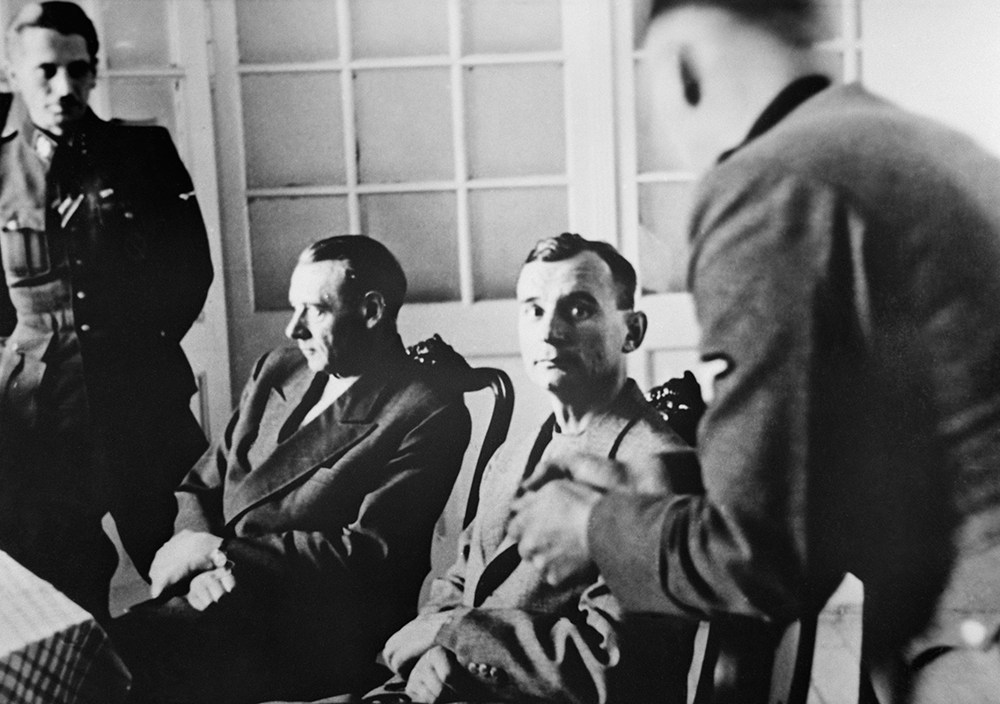](http://www.webumenia.sk/dielo/SVK:TMP.320)

After an interrogation by the Gestapo, Viest and Golian were brought before the Sondergericht and sentenced to death. They were sent to the Flossenbürg concentration camp, where they were most probably executed.



---
## Victims of the German Occupation

Along with the German military forces, units of German security and repressive apparatus arrived to Slovakia. The Einsatzgruppe H of the Security Police (SiPo) and the Security Service (SD) were assigned to Western and Central Slovakia. The general staff resided in Bratislava and the commandos were deployed to the occupied territory.

Eastern Slovakia was occupied by members of Commando zbV 27, controlled by the Commander of the German Security Police and the Security Service in Krakow. The priority of these units was to find and defeat everyone who supported the resistance as well as to deport or eliminate on the spot all Jews who survived in Slovakia. President Tiso and the Slovak Government did not object in any way. On the contrary, they cooperated with the Nazi apparatus.

[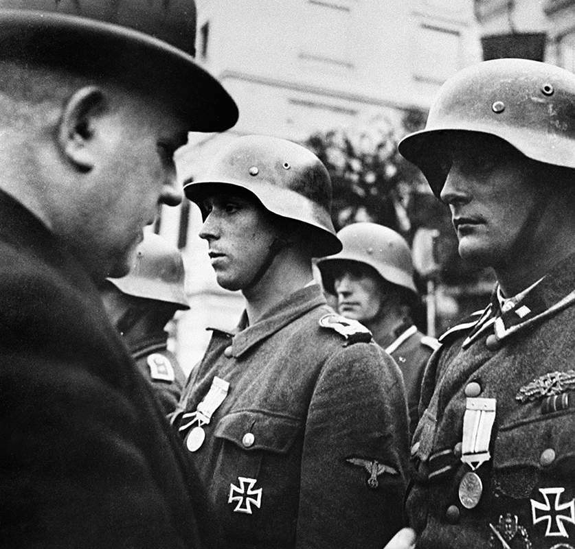](http://www.webumenia.sk/dielo/SVK:TMP.322)

After the de facto disintegration of the Slovak Army, the populist regime created Rapid Units of the [Hlinka Guard](http://senxskutocnost.sng.sk/en/chapters/2/hlinkova-garda) and Field Companies of the Hlinka Guard, which were made available to the commanders of the German forces. They also created Rapid Units of the [Hlinka Youth](http://senxskutocnost.sng.sk/en/chapters/2/hlinkova-mladez).

[")](http://digitalna.kniznica.info/zoom/31090/view?page=35&p=separate&view=0,0,1731,2635)

The Nazis and their Slovak collaborators arrested hundreds of citizens. They imprisoned them in various locations, where they were interrogated, tortured and often executed.

After the military defeat of the Slovak National Uprising, the civil population in Slovakia experienced unprecedented levels of terror. Nevertheless, many Slovaks continued to help the partisans hiding in the mountains.

**František Nový - The Passage of the Partisan Brigade Avenger. Rest on the Road from Magurka to Chabenec.**
{% include 'partials/carousel.html.twig' with {
	'images': [
    	{
        	'src': 'http://www.webumenia.sk/images/diela/TMP/31/SVK_TMP.297/SVK_TMP.297.jpeg',
        	'href': 'http://www.webumenia.sk/dielo/SVK:TMP.297'
    	},
   	 {
   		 'src': 'http://www.webumenia.sk/images/diela/TMP/30/SVK_TMP.296/SVK_TMP.296.jpeg',
        	'href': 'http://www.webumenia.sk/dielo/SVK:TMP.296'
    	},
    	{
        	'src': 'http://www.webumenia.sk/images/diela/TMP/29/SVK_TMP.295/SVK_TMP.295.jpeg',
        	'href': 'http://www.webumenia.sk/dielo/SVK:TMP.295'
    	},
    	{
        	'src': 'http://www.webumenia.sk/images/diela/TMP/28/SVK_TMP.294/SVK_TMP.294.jpeg',
        	'href': 'http://www.webumenia.sk/dielo/SVK:TMP.294'
 }
	]
}%}

The Jews also desperately needed the help of their neighbours and were left with the only option for survival: hiding in various makeshift shelters. Everyone who helped them in any way risked their lives and the lives of their loved ones by doing so. Jews who were still alive in Slovakia in 1944 and got captured by the Nazis were either deported or executed immediately.  

The Germans harshly punished any indication of supporting partisans or Jews. They burned down whole villages and organised mass executions.

[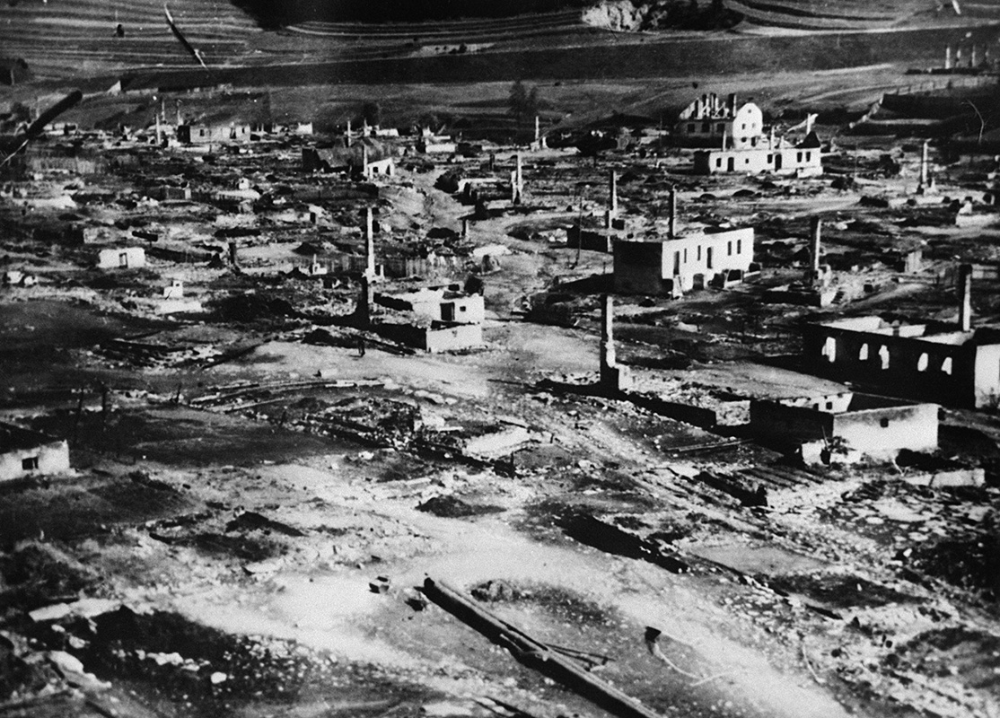](http://www.webumenia.sk/dielo/SVK:TMP.323)

Central Slovakia, where Einsatzkommando 14 was stationed with some Slovak units, saw some of the worst atrocities. Near Kremnička, the Nazis murdered 747 partisans, rebel soldiers, Jews and Romanis, including dozens of children, who were found in mass graves after the war. In Nemecká, the Nazis and their collaborators murdered 400 to 900 people.

[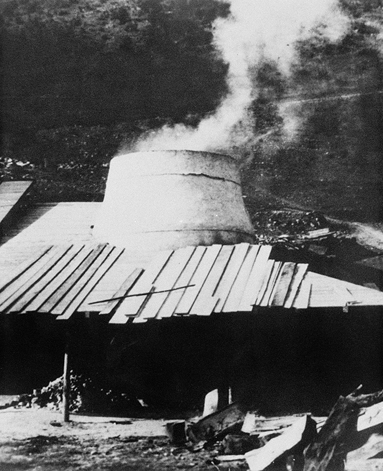](http://www.webumenia.sk/dielo/SVK:TMP.321?collection=88)

By the end of October 1944, the Nazis attacked Miezgovce and subjected dozens of local men to interrogation and torture. On 27 December 1944, just days after Christmas, the Nazis tortured and before the eyes of the local people executed three Slovak and one Soviet partisan in Medzibrod.

[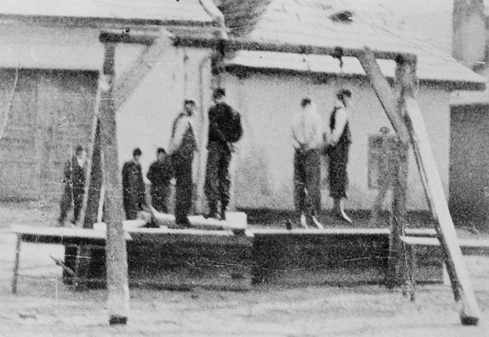](http://www.webumenia.sk/dielo/SVK:TMP.298?collection=88)

In January 1945, the Nazis and their collaborators burned down Ostrý Grúň and Kľak, killing 148 civilians in addition to the few partisans they found. The residents of Skýcov were cast out of their homes while the village was looted and burnt in the middle of March, followed by the village of Kalište.

Also some partisans attacked civilians, specifically German nationals, but also Slovaks who were considered collaborators. One of the largest atrocities committed by the insurgents was a mass execution of more than 180 (German) residents of Sklené in September 1944.

**Nazi records of the captured Slovak soldiers before their execution or deportation to concentration camps**
{% include 'partials/carousel.html.twig' with {
	'images': [
    	{
        	'src': 'http://www.webumenia.sk/images/diela/TMP/6/SVK_TMP.300/SVK_TMP.300.jpeg',
        	'href': 'http://www.webumenia.sk/dielo/SVK:TMP.300'
    	},
   	 {
   		 'src': 'http://www.webumenia.sk/images/diela/TMP/41/SVK_TMP.314/SVK_TMP.314.jpeg',
        	'href': 'http://www.webumenia.sk/dielo/SVK:TMP.314'
    	},
    	{
        	'src': 'http://www.webumenia.sk/images/diela/TMP/40/SVK_TMP.313/SVK_TMP.313.jpeg',
        	'href': 'http://www.webumenia.sk/dielo/SVK:TMP.313?collection=91'
    	},
    	{
        	'src': 'http://www.webumenia.sk/images/diela/TMP/39/SVK_TMP.312/SVK_TMP.312.jpeg',
        	'href': 'http://www.webumenia.sk/dielo/SVK:TMP.312?collection=91'
        	},
    	{
        	'src': 'http://www.webumenia.sk/images/diela/TMP/14/SVK_TMP.308/SVK_TMP.308.jpeg',
        	'href': 'http://www.webumenia.sk/dielo/SVK:TMP.308?collection=91'
          	},
    	{
        	'src': 'http://www.webumenia.sk/images/diela/TMP/38/SVK_TMP.311/SVK_TMP.311.jpeg',
        	'href': 'http://www.webumenia.sk/dielo/SVK:TMP.311?collection=91'
          	},
    	{
        	'src': 'http://www.webumenia.sk/images/diela/TMP/37/SVK_TMP.310/SVK_TMP.310.jpeg',
        	'href': 'http://www.webumenia.sk/dielo/SVK:TMP.310?collection=91'
          	},
    	{
        	'src': 'http://www.webumenia.sk/images/diela/TMP/15/SVK_TMP.309/SVK_TMP.309.jpeg',
        	'href': 'http://www.webumenia.sk/dielo/SVK:TMP.309?collection=91'
          	},
    	{
        	'src': 'http://www.webumenia.sk/images/diela/TMP/10/SVK_TMP.304/SVK_TMP.304.jpeg',
        	'href': 'http://www.webumenia.sk/dielo/SVK:TMP.304?collection=91'
          	},
    	{
        	'src': 'http://www.webumenia.sk/images/diela/TMP/13/SVK_TMP.307/SVK_TMP.307.jpeg',
        	'href': 'http://www.webumenia.sk/dielo/SVK:TMP.307?collection=91'
          	},
    	{
        	'src': 'http://www.webumenia.sk/images/diela/TMP/11/SVK_TMP.305/SVK_TMP.305.jpeg',
        	'href': 'http://www.webumenia.sk/dielo/SVK:TMP.305?collection=91'
          	},
    	{
        	'src': 'http://www.webumenia.sk/images/diela/TMP/12/SVK_TMP.306/SVK_TMP.306.jpeg',
        	'href': 'http://www.webumenia.sk/dielo/SVK:TMP.306?collection=91'
          	},
    	{
        	'src': 'http://www.webumenia.sk/images/diela/TMP/42/SVK_TMP.315/SVK_TMP.315.jpeg',
        	'href': 'http://www.webumenia.sk/dielo/SVK:TMP.315?collection=91'
          	},
    	{
        	'src': 'http://www.webumenia.sk/images/diela/TMP/9/SVK_TMP.303/SVK_TMP.303.jpeg',
        	'href': 'http://www.webumenia.sk/dielo/SVK:TMP.303?collection=91'
          	},
    	{
        	'src': 'http://www.webumenia.sk/images/diela/TMP/8/SVK_TMP.302/SVK_TMP.302.jpeg',
        	'href': 'http://www.webumenia.sk/dielo/SVK:TMP.302?collection=91'
          	},
    	{
        	'src': 'http://www.webumenia.sk/images/diela/TMP/7/SVK_TMP.301/SVK_TMP.301.jpeg',
        	'href': 'http://www.webumenia.sk/dielo/SVK:TMP.301?collection=91'
          	}
	]
}%}

---

## End of War, End of State

[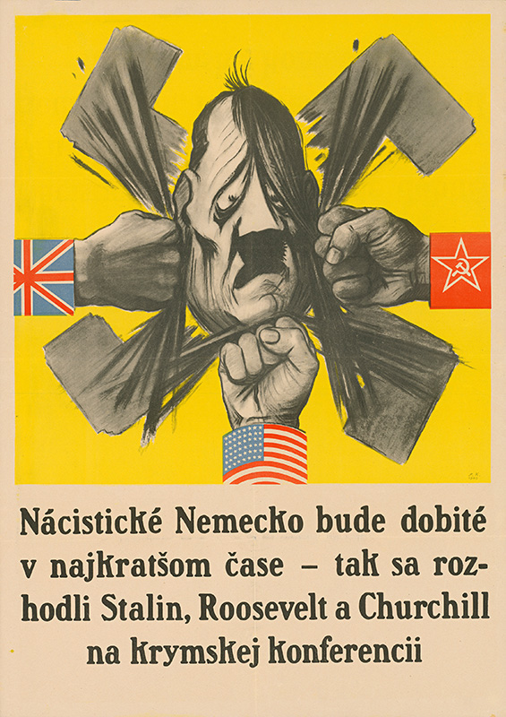](http://www.webumenia.sk/dielo/SVK:TMP.324?collection=88)

The Slovak State found itself totally isolated by the end of the war - the Allies (UK, US and USSR) recognised the [Czechoslovak government-in-exile](https://en.wikipedia.org/wiki/Czechoslovak_government-in-exile) in London. The Red Army continued forcing the Germans and their collaborators to retreat and in July 1943, Mussolini's Fascist regime collapsed.

The representatives of the populist regime who portrayed themselves as "diplomats" abroad, such as the Vatican ambassador Karol Sidor, made some attempts to preserve the notion of Slovak statehood, but these attempts were doomed to fail. The fate of these populists and their state was firmly tied to the fate of Hitler and his Reich.

[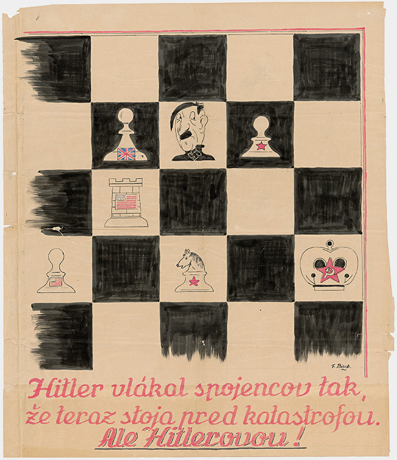](http://www.webumenia.sk/dielo/SVK:TMP.325?collection=88)

Although the Germans formally recognised the Slovak State and its civil organs during the occupation, it was not enough to stop them from plundering the country. The Germans interpreted the formal agreement to supply the German forces and even the term "spoils of war" as it suited them. The "protectors" of the Slovak State appropriated materials worth billions of Slovak crowns by the end of the war.

The Red Army entered Slovakia from multiple sides at once. The units of the 1st Ukrainian Front together with the members of the Czechoslovak Army Corps crossed the Dukla Pass on 6 October 1944. Units of the 2nd Ukrainian Front and the Romanian Army came from the South-East.

<figure class="audio" markdown="1">

<figcaption><a href="http://www.memoryofnations.eu/witness/clip/id/288/clip/4234">Josef Činčala (1921) - Dukla Pass, Stories of 20th Century, Post Bellum SK</a></figcaption>
</figure>

[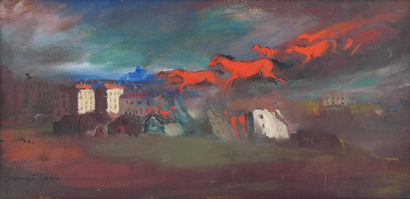](http://www.webumenia.sk/dielo/SVK:SNG.O_1786?collection=88)

The mountainous terrain of Slovakia with numerous rivers made liberation difficult. The fighting on the Slovak territory lasted until the spring of 1945. The majority of the country was finally liberated by driving the Nazi forces out of Bratislava on 4 April 1945, but small pockets of Nazi resistance in North-West lasted until the beginning of May.

<figure class="audio" markdown="1">

<figcaption><a href="http://www.memoryofnations.eu/witness/clip/id/2864/clip/9394">Michal Hlavička (1923) - Liberation of Bratislava, Stories of 20th Century, Post Bellum SK</a></figcaption>
</figure>

[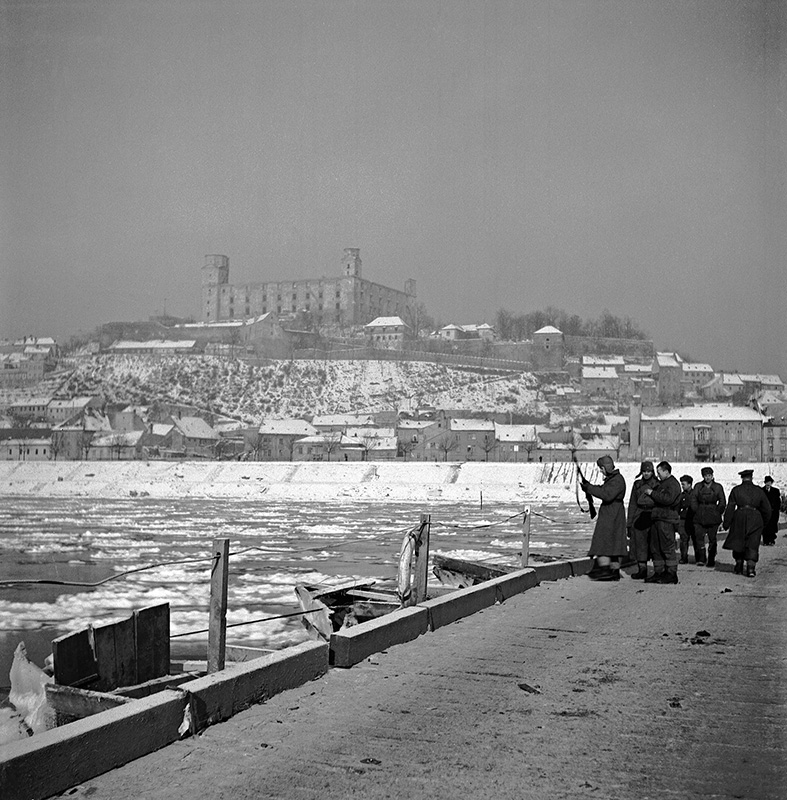](http://www.webumenia.sk/dielo/SVK:TMP.326)

The president and the leader of the party, Jozef Tiso, was evacuated from Bratislava to Holíč together with other functionaries on 1 April 1945 and they left the republic soon after. They hid under the protection of Nazis in Austria and Germany. The day before they left Slovakia, on 31 March, the last transport with Slovak resistance fighters left from Bratislava to Mauthausen.

At the same time, President Edvard Beneš, the leading figure of the Czechoslovak government-in-exile, arrived to Košice. On 5 April 1945, the newly appointed government declared "Košice Government Programme", which defined the role of Slovakia in the Czechoslovak Republic.

The Second World War ended in Europe with the surrender of Germany on 8 May 1945. Outside of Europe, the war continued until the final surrender of Japan on 2 September 1945.

The last act of the populist regime of the fading Slovak Republic was a memorandum of surrender to the US Army, which was submitted on 8 May 1945 in Kremsmünster by the Prime Minister Štefan Tiso and the ministers Mikuláš Pružinský, Aladár Kočiš and Gejza Medrický.

---

## The Fates of the Representatives of the Slovak State

After the Second World War, Europe had to come to terms with the atrocities that were committed by prosecuting individual war criminals. The perpetrators of the most heinous crimes were put on trial in war crime tribunals all over Europe.

{% include 'partials/carousel.html.twig' with {
	'images': [
    	{
        	'title':'Ladislav Guderna - Speechless II.',
        	'src': 'http://www.webumenia.sk/images/diela/GMB/18/SVK_GMB.C_8963/SVK_GMB.C_8963.jpeg',
        	'href': 'http://www.webumenia.sk/dielo/SVK:GMB.C_8963'
    	},
   	 {
        	'title':'Ladislav Guderna - Speechless I.',
   		 'src': 'http://www.webumenia.sk/images/diela/GMB/17/SVK_GMB.C_8962/SVK_GMB.C_8962.jpeg',
        	'href': 'http://www.webumenia.sk/dielo/SVK:GMB.C_8962'
    	},
    	{
         	'title':'Ladislav Guderna - Satirical Drawing 2.',
        	'src': 'http://www.webumenia.sk/images/diela/GMB/78/SVK_GMB.C_15578/SVK_GMB.C_15578.jpeg',
        	'href': 'http://www.webumenia.sk/dielo/SVK:GMB.C_15578'
    	},
    	{
        	'title':'Ladislav Guderna - Satirical Drawing 8.',
        	'src': 'http://www.webumenia.sk/images/diela/GMB/51/SVK_GMB.C_15584/SVK_GMB.C_15584.jpeg',
        	'href': 'http://www.webumenia.sk/dielo/SVK:GMB.C_15584'
        	}
	]
}%}

Czechoslovakia was no exception.,Special local courts, known as People's Courts, were set up to punish the occupants, traitors and collaborators. The majority of the trials against the leading political figures of the Slovak State were held before the National Court.

[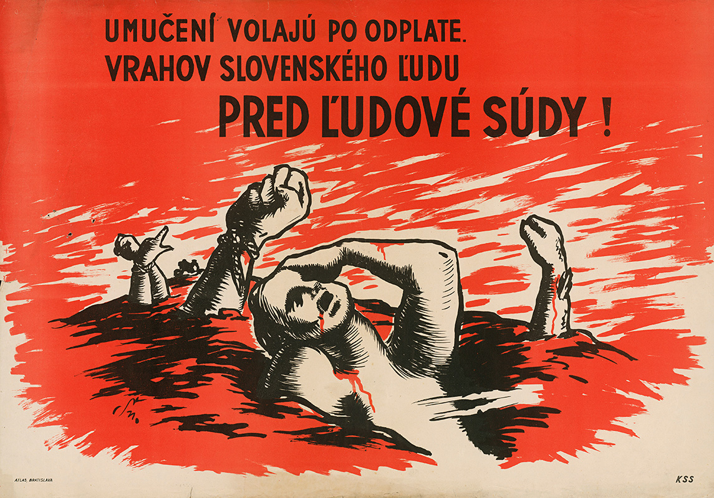](http://www.webumenia.sk/dielo/SVK:TMP.317?collection=88)

[ - Playing Dumb")](http://www.webumenia.sk/dielo/SVK:TMP.318)

**Vojtech Tuka** - Leader of the radical wing of the HSPP, former Prime Minister, and Minister of Foreign Affairs. He was forced to retire because of health reasons in 1944. In 1945, he was sentenced to death and executed.

**Alexander Mach** - The Minister of Interior and Commander of the Hlinka Guard. He was a leading figure of the radical wing of the HSPP, one of the masterminds behind the anti-Semitic agenda in Slovakia. He was tried together with President Tiso and Ferdinand Ďurčanský. The National Court sentenced him to 30 years in prison, later reduced to 25 year. He was granted amnesty and released in 1968.

**Karol Sidor** - Originally one of the radical populists and the first Commander of the Hlinka Guard, former Minister of State and for a short time even the Prime Minister of the autonomous government. In March 1939, because of his reluctance to declare the Slovak State, he fell into disfavour with the Germans and was demoted to an ambassador to the Vatican. He was tried in absentia and sentenced to 20 years in prison, but he never served his sentence and remained abroad until his death.

**Ferdinand Ďurčanský** - Member of the radical wing of the HSPP. In 1938, he was a staunch supporter of disposing of democracy, breaking up Czechoslovakia and declaring Slovak independence. He was also one of the initiators of the anti-Semitic legislation and after the creation of the Slovak State, became the first Minister of Foreign Affairs as well as the Minister of Interior for several months. According to the Germans, he overstepped his bounds and in the summer of 1940 he was removed from his posts. In absentia, he was sentenced to death, but he emigrated to Argentina to avoid capture and later moved to Munich.

**Jozef Tiso** - From the autumn of 1938 to the spring after, he served as the Prime Minister of the autonomous government, later as the Prime Minister of the Slovak Republic. In the autumn of 1939, he was elected President, Commander in Chief and leader of the Hlinka's Slovak People's Party. He was granted the title "Leader" and served as the Supreme Commander of the Hlinka Guard. In April 1947, he was sentenced to death and executed a few days later.

During these trials, 22,278 people were tried in Slovakia by the end of 1948 and approximately 9,000 of them were convicted.

<figure class="audio" markdown="1">

<figcaption><a href="http://www.memoryofnations.eu/witness/clip/id/3642/clip/16053">Oto Šimko (1924) - Amazing Feeling To Be Free, Stories of the 20th century, Post Bellum SK</a></figcaption>
</figure>

[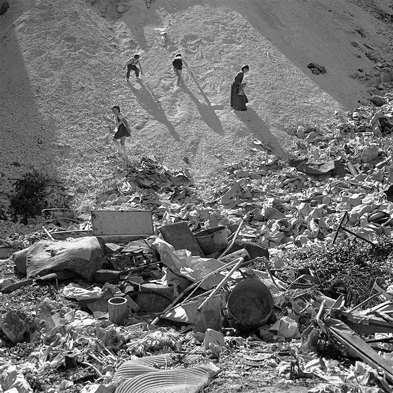](http://www.webumenia.sk/dielo/SVK:TMP.326)

Thanks to the Slovak National Uprising, Slovakia was perceived as a part of the victorious anti-Hitler coalition. The Slovak State remains a tragic remainder of the threat that nationalism, fascism, systematic decay of democracy and the suppression of human rights pose to societies. Nevertheless, many people continue excusing the crimes of the populist regime and forget, ignore and deny the events of the war.

Let’s not allow history to be repeated.

**All artworks in this chapter can also be found in the collection on Web umenia: [Waking Up From a Dream](http://www.webumenia.sk/kolekcia/88 "Waking Up From a Dream Collection")**
