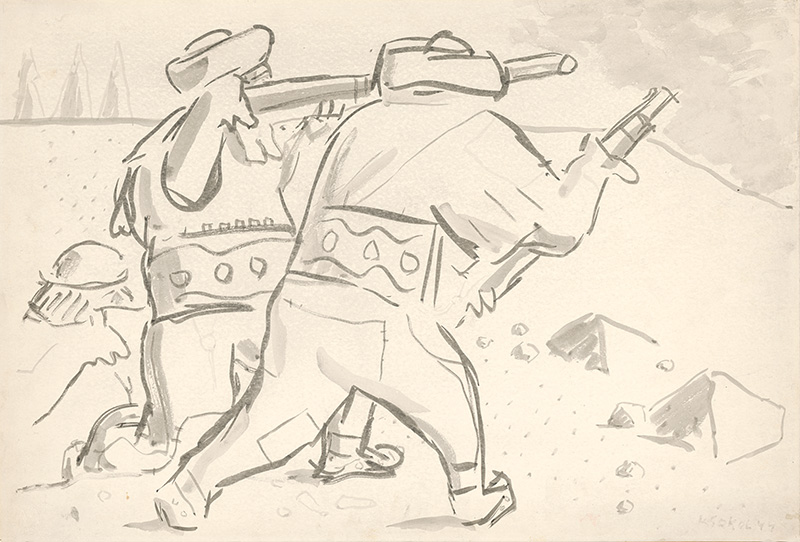

Z   a partizánov označujeme členov polovojenských ozbrojených oddielov, bojujúcich väčšinou v tyle nepriateľa (za bojovými jednotkami, za frontom), príslušníkov organizovaného hnutia odporu. V súvislosti s SNP sa ako partizáni označovali bojovníci, ktorí neboli príslušníkmi riadnej armády, a po potlačení povstania aj tí vojaci, ktorí prešli na partizánsky spôsob boja. 

